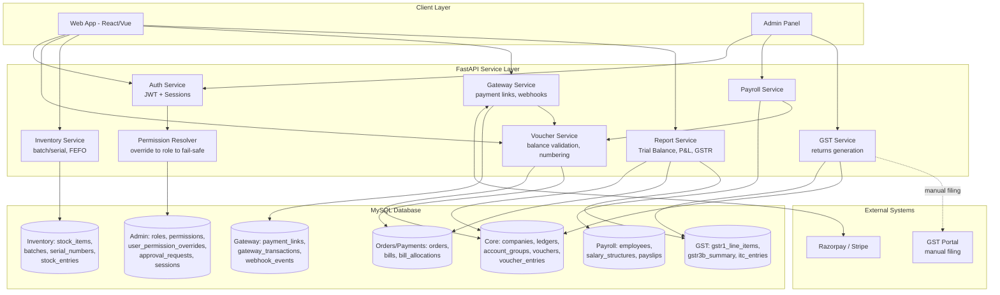
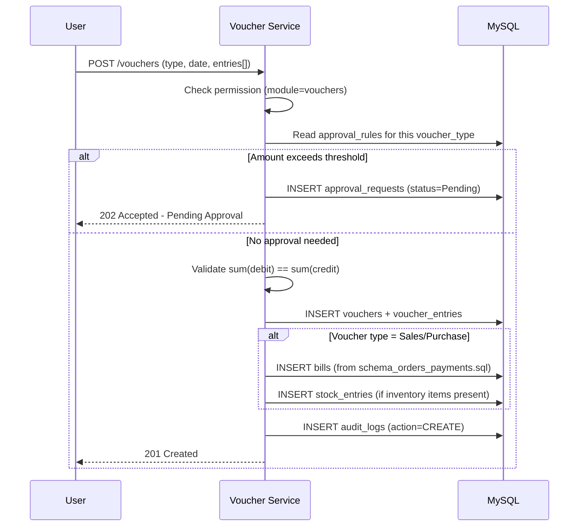
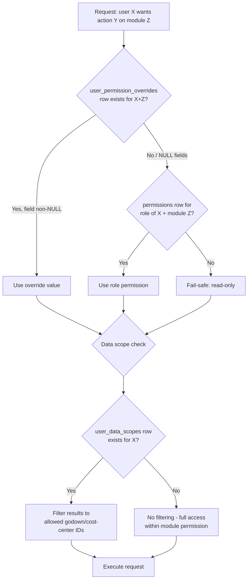
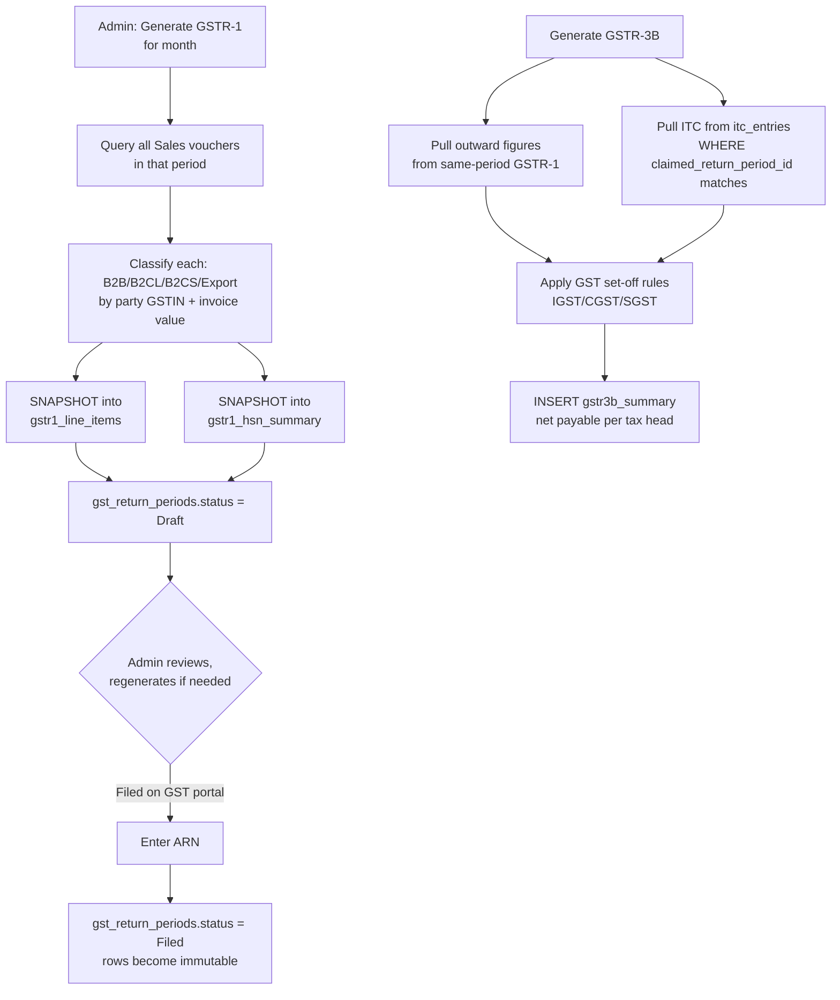
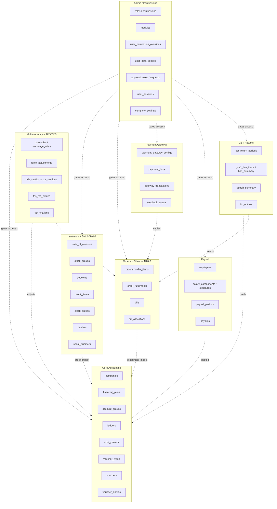

# Open Tally-Clone — Architecture & Workflow

Visual map of how the FastAPI service layer, MySQL tables, and external
systems (payment gateway, GST portal) interconnect across every module
built so far.

---

## 1. High-Level System Architecture

**Reading this:** every write path that touches money ultimately flows
through the **Voucher Service** — payroll, gateway payments, and GST all
*create* vouchers rather than bypassing the ledger. This is deliberate:
it means Trial Balance/P&L never need special-casing per module.

---

## 2. Core Flow: Posting Any Voucher

**Tables touched:** `vouchers`, `voucher_entries`, `approval_rules`,
`approval_requests`, `bills`, `stock_entries`, `audit_logs`.

---

## 3. Order-to-Cash Flow (Sales Order → Payment)

```mermaid
flowchart LR
    A[Sales Order created] -->|orders + order_items| B[Order: Open]
    B -->|Sales Voucher raised| C[order_fulfillments linked]
    C --> D[Sales Voucher posted]
    D -->|auto-creates| E[bills row<br/>status: Open]
    D -->|auto-creates| F[voucher_entries<br/>Dr Debtor / Cr Sales]
    D -->|if inventory item| G[stock_entries<br/>+ batches/serial_numbers]
    E --> H{Payment method?}
    H -->|Manual| I[Receipt Voucher entered]
    H -->|Online| J[payment_links generated]
    J --> K[Customer pays via Razorpay/Stripe]
    K --> L[Webhook received]
    L --> M[webhook_events INSERT<br/>idempotency check]
    M --> N[gateway_transactions<br/>status: Captured]
    N --> O[Auto-create Receipt Voucher]
    I --> P[bill_allocations<br/>type: Against Ref]
    O --> P
    P --> Q[bills.settled_amount updated]
    Q --> R{Fully settled?}
    R -->|Yes| S[bills.status = Settled]
    R -->|No| T[bills.status = Partially Settled]
```

**Tables touched (in order):** `orders` → `order_items` →
`order_fulfillments` → `vouchers`/`voucher_entries` → `bills` →
`stock_entries`/`batches`/`serial_numbers` → `payment_links` →
`webhook_events` → `gateway_transactions` → new `vouchers` (Receipt) →
`bill_allocations` → `bills` (updated).

---

## 4. Permission Resolution (every protected request)

**Tables touched:** `user_permission_overrides`, `permissions`, `roles`,
`user_data_scopes`, `modules`.

---

## 5. Payroll Processing Flow

```mermaid
flowchart LR
    A[Admin: Process Payroll<br/>for period] --> B[Fetch active employees<br/>from employees table]
    B --> C[Resolve active salary_structure<br/>as of period date]
    C --> D[Apply attendance<br/>days_present / days_in_period]
    D --> E[INSERT payslips<br/>+ payslip_components]
    E --> F[Aggregate ALL employees'<br/>components into ONE Journal voucher]
    F --> G[vouchers + voucher_entries<br/>Dr Salary Expense / Cr Salaries Payable]
    G --> H[payroll_periods.status = Processed]
    H --> I[Admin: Disburse salaries]
    I --> J[Payment voucher per bank batch<br/>Dr Salaries Payable / Cr Bank]
    J --> K[payslips.payment_voucher_id set]
    K --> L[payroll_periods.status = Paid]
```

**Tables touched:** `employees`, `salary_structures`,
`salary_structure_components`, `payroll_periods`, `payslips`,
`payslip_components`, `vouchers`, `voucher_entries`.

---

## 6. GST Return Generation Flow

**Tables touched:** `gst_return_periods`, `gstr1_line_items`,
`gstr1_hsn_summary`, `itc_entries`, `gstr3b_summary`, `vouchers`
(read-only source).

---

## 7. Module → Table Ownership Map

**The one rule that holds everywhere:** every module either *posts to*
`vouchers`/`voucher_entries` (Core) or *reads from* it for reporting.
Nothing maintains a parallel balance. That's what keeps Trial Balance,
P&L, and Balance Sheet accurate regardless of which module generated
the underlying transaction.

---

## Next step
This diagram set maps cleanly onto the FastAPI `routers/` and `services/`
folders proposed earlier — each subgraph in section 7 becomes one router
+ one service module. Ready to scaffold that whenever you are.
