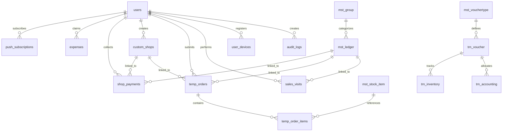

# Sneh Distributors - Database Schema & Data Flow Documentation

This document provides a comprehensive technical overview of the MySQL database schema, tables, Entity Relationships (ERD), Data Flow Diagrams (DFD), and field-level purposes.

---

## 1. System Architecture & Database Layers

The application operates on a **hybrid database model** designed to merge accounting data from TallyPrime with custom web-application operations:

```
                  ┌──────────────────────────────────────────────┐
                  │                 TallyPrime                   │
                  └──────────────────────┬───────────────────────┘
                                         │
                                         │ (XML/ODBC Sync Script)
                                         ▼
                  ┌──────────────────────────────────────────────┐
                  │         Tally Master & Transaction Sync      │
                  │   - Read-Only from the Web App Context       │
                  │   - Holds master ledgers, items, vouchers    │
                  └──────────────────────────────────────────────┘
                                         ▲
                                         │ (Reference Links)
                                         ▼
                  ┌──────────────────────────────────────────────┐
                  │      Standalone Application Custom Tables    │
                  │   - Write/Read from the Web App Context     │
                  │   - Holds Users, Check-Ins, Orders, Claims  │
                  └──────────────────────────────────────────────┘
```

1. **Tally Core Sync Layer (Prefix: `mst_` / `trn_`)**:
   - Built to mirror Tally XML/ODBC schemas exactly.
   - Updated periodically via external sync scripts. 
   - Treated as **read-only** by the Next.js application to preserve bookkeeping integrity.
2. **Application Standalone Layer**:
   - Custom tables managing mobile features, device constraints, notifications, collections, and expense claims.
   - Operated with complete read/write access.
   - Integrates with Tally masters via text-based reference pointers (e.g., matching a Tally ledger name or item GUID) without altering Tally database records.

---

## 2. Entity Relationship Diagram (ERD)

The following Mermaid diagram shows the primary relationships, key connections, and foreign keys:



---

## 3. Data Flow Diagram (DFD) - Level 1

This diagram outlines how data flows between external systems, application entities, processes, and tables:

```mermaid
graph TD
    %% External Entities
    Tally[TallyPrime System]
    Salesperson[Salesperson Client App]
    Admin[Admin/Finance Dashboard]

    %% Processes
    P1[1. Tally XML Sync Parser]
    P2[2. User Authentication & Authorization]
    P3[3. Shop Check-In Log]
    P4[4. Temporary Order Booking]
    P5[5. Payments Collection]
    P6[6. Expense Claims Submission]
    P7[7. Review & Audit Panel]

    %% Data Stores
    subgraph Tally Sync Tables
        DB_Mst[Tally Master Data <br/> mst_ledger, mst_stock_item...]
        DB_Trn[Tally Transactions <br/> trn_voucher, trn_accounting...]
    end

    subgraph App Custom Tables
        DB_User[users & user_devices]
        DB_Visits[sales_visits]
        DB_Orders[temp_orders & temp_order_items]
        DB_Payments[shop_payments]
        DB_Expenses[expenses]
        DB_Logs[audit_logs]
    end

    %% Data Flows
    Tally -->|XML Batch Data| P1
    P1 -->|Insert/Update Masters| DB_Mst
    P1 -->|Insert Transactions| DB_Trn

    Salesperson -->|Login Credentials| P2
    P2 -->|Query/Validate| DB_User
    P2 -->|Session Authenticated| Salesperson

    Salesperson -->|GPS, Photos, Comments| P3
    P3 -->|Link Master Ledger| DB_Mst
    P3 -->|Save Check-In| DB_Visits

    Salesperson -->|Order Items & Details| P4
    P4 -->|Validate Stock Items| DB_Mst
    P4 -->|Create Pending Order| DB_Orders

    Salesperson -->|Cash/Cheque Amount, Receipt Images| P5
    P5 -->|Check Customer Ledger| DB_Mst
    P5 -->|Save Collection Record| DB_Payments

    Salesperson -->|Claim Narration, Bill Photos| P6
    P6 -->|Save Pending Claim| DB_Expenses

    Admin -->|Review & Action| P7
    P7 -->|Verify Device / Update Access| DB_User
    P7 -->|Approve/Reject Collections| DB_Payments
    P7 -->|Approve/Reject Expenses| DB_Expenses
    P7 -->|Log Action| DB_Logs
```



---

## 4. Tables Purpose & Description

### 4.1. Application Custom Tables (Core Web System)

| Table Name | Primary Key | Purpose | Key Relationships |
| :--- | :--- | :--- | :--- |
| **`users`** | `id` (Serial) | Stores system logins, hashed credentials, roles, and granular module access flags (Sales Ledgers, Purchase Ledgers, Receipts, Payments, Stocks, Reports, Orders, Check-in, Expenses). | Referenced by all custom transaction tables. |
| **`user_devices`** | `id` (Serial) | Stores unique device identifiers, status (blocked/active), and fingerprints to secure logins and prevent multi-device sales logins. | Foreign Key: `userId` $\to$ `users.id` |
| **`audit_logs`** | `id` (Serial) | Records crucial administrator events (permission modifications, status toggles, claims rejection/approvals). | Foreign Key: `userId` $\to$ `users.id` |
| **`sales_visits`** | `id` (Serial) | Tracks check-ins of salespeople at customer outlets, logging GPS coordinates, verifying photos, IP addresses, and salesperson notes. | Foreign Key: `userId` $\to$ `users.id`<br/>Reference Key: `ledgerGuid` $\to$ `mst_ledger.guid` |
| **`custom_shops`** | `id` (Serial) | Holds temporary/unregistered customers logged by salespeople before they are officially created in TallyPrime. | Foreign Key: `userId` $\to$ `users.id` |
| **`temp_orders`** | `id` (Serial) | Holds pending customer orders drafted by salespeople, matching either a registered Tally ledger or an unregistered custom shop. | Foreign Key: `userId` $\to$ `users.id`<br/>Foreign Key: `customShopId` $\to$ `custom_shops.id`<br/>Reference Key: `ledgerGuid` $\to$ `mst_ledger.guid` |
| **`temp_order_items`** | `id` (Serial) | Sub-items representing products, quantities, prices, and tax selections within a temporary order. | Foreign Key: `orderId` $\to$ `temp_orders.id`<br/>Reference Key: `stockItemGuid` $\to$ `mst_stock_item.guid` |
| **`shop_payments`** | `id` (Serial) | Payments collected by salespeople from merchants (Cash, Cheque, Online transfers) awaiting admin approval. | Foreign Key: `userId` $\to$ `users.id`<br/>Foreign Key: `customShopId` $\to$ `custom_shops.id`<br/>Reference Key: `ledgerGuid` $\to$ `mst_ledger.guid` |
| **`expenses`** | `id` (Serial) | Out-of-pocket business expenses claimed by salespeople (Salary, Travel, Transport, Rent, Food) containing ImageKit receipt photo urls, status, and reject reasons. | Foreign Key: `userId` $\to$ `users.id` |
| **`push_subscriptions`** | `id` (Serial) | Stores Web Push API subscriptions for sending notifications directly to users' mobile screens. | Foreign Key: `userId` $\to$ `users.id` |
| **`config`** | `name` (Varchar) | Generic key-value store for application config settings. | Standalone. |

### 4.2. Tally Master Sync Tables (Read-Only)

| Table Name | Primary Key | Purpose | Key Relationships |
| :--- | :--- | :--- | :--- |
| **`mst_group`** | `guid` | Tally Account Groups hierarchy (e.g. Current Assets, Sundry Debtors). | Self-referencing (`parent`). |
| **`mst_ledger`** | `guid` | Accounts ledger details containing Tally opening/closing balances, addresses, email, phone, bank info, credit periods, and GST details. | Reference Key: `parent` $\to$ matching `mst_group.name`. |
| **`mst_stock_group`** | `guid` | Categorization group structure for inventory stocks. | Self-referencing (`parent`). |
| **`mst_stock_item`** | `guid` | Individual stock items including opening/closing quantity rates, values, conversion parameters, unit-of-measure (UOM), and GST rates/codes. | Reference Key: `parent` $\to$ matching `mst_stock_group.name`. |
| **`mst_godown`** | `guid` | Warehouse or storage location profiles. | Self-referencing (`parent`). |
| **`mst_uom`** | `guid` | Units of Measure conversions (e.g. Box to Pcs). | Standalone. |
| **`mst_vouchertype`** | `guid` | Accounting, inventory, and order voucher types definition in Tally. | Standalone. |
| **`mst_cost_centre`** / **`mst_cost_category`** | `guid` | Cost allocation divisions synced from Tally. | Self-referencing. |

### 4.3. Tally Transaction Sync Tables (Read-Only)

| Table Name | Primary Key / Index | Purpose | Key Relationships |
| :--- | :--- | :--- | :--- |
| **`trn_voucher`** | `guid` | Core voucher records synced from Tally (Sales, Purchase, Receipts, Payments, Orders) with invoice numbers, narration, party names, and dates. | Reference Key: `voucherType` $\to$ `mst_vouchertype.name`. |
| **`trn_accounting`** | Index: `guid` | Accounting ledger debit/credit breakdowns for each voucher. | Foreign Key: `guid` $\to$ `trn_voucher.guid`<br/>Reference Key: `ledger` $\to$ `mst_ledger.name`. |
| **`trn_inventory`** | Index: `guid` | Inventory item movements (quantity, rates, discounts, godowns, tracking numbers) linked to vouchers. | Foreign Key: `guid` $\to$ `trn_voucher.guid`<br/>Reference Key: `item` $\to$ `mst_stock_item.name`. |
| **`trn_bill`** | Index: `guid` | Bill allocations and credit terms linked to account transactions. | Foreign Key: `guid` $\to$ `trn_voucher.guid` |
| **`trn_bank`** | Index: `guid` | Bank transactions (clearing dates, cheque numbers, instrument dates) linked to vouchers. | Foreign Key: `guid` $\to$ `trn_voucher.guid` |
| **`trn_batch`** | Index: `guid` | Batch inventory tracking metrics linked to stock vouchers. | Foreign Key: `guid` $\to$ `trn_voucher.guid` |

---

## 5. Standard Data Flows & Pipelines

### 5.1. Payments Collection Cycle
1. A salesperson collects a payment from a shop and logs details via the UI.
2. A new record is inserted into `shop_payments` with `status = 'pending'` and a unique ImageKit `photoUrl`.
3. The Admin opens the admin panel. When they approve the payment, the application updates `status = 'success'` in `shop_payments` and records an event in `audit_logs`.
4. *Important constraint*: The Tally ledger balances (`mst_ledger.closingBalance`) are **never** directly modified by this approval. The sync script on TallyPrime reads these approvals (or they are recorded offline) and updates Tally Prime. The updated values are then pushed back to `mst_ledger` during the next synchronization pass.

### 5.2. Expense Logging Lifecycle
1. A salesperson selects a category (e.g. `Transport/E-Rickshaw`, `Salary`) and logs a claim.
2. The claim is inserted into `expenses` with `status = 'pending'`.
3. Admin/Finance reviews the claim in the expenses tab.
4. If approved, `status` becomes `'approved'`. If rejected, `status` becomes `'rejected'` and the `cancelReason` field is populated with the rejection details. All updates are logged in `audit_logs`.

---

## 6. Database DDL Schema for Tally Sync Tables

The following DDL schemas represent the exact table structures for Tally Master Sync and Tally Transaction Sync tables, generated directly from database introspection:

### 6.1. Master Sync Tables DDL

```sql
-- Global Configuration
CREATE TABLE "config" (
	"name" varchar(64) PRIMARY KEY NOT NULL,
	"value" varchar(1024)
);

-- Account Groups
CREATE TABLE "mst_group" (
	"guid" varchar(64) PRIMARY KEY NOT NULL,
	"name" varchar(1024),
	"parent" varchar(1024),
	"primary_group" varchar(1024),
	"is_revenue" smallint,
	"is_deemedpositive" smallint,
	"is_reserved" smallint,
	"affects_gross_profit" smallint,
	"sort_position" integer
);

-- Accounts Ledger Master
CREATE TABLE "mst_ledger" (
	"guid" varchar(64) PRIMARY KEY NOT NULL,
	"name" varchar(1024),
	"parent" varchar(1024),
	"alias" varchar(256),
	"description" varchar(64),
	"notes" varchar(64),
	"is_revenue" smallint,
	"is_deemedpositive" smallint,
	"opening_balance" numeric(17, 2),
	"closing_balance" numeric(17, 2),
	"mailing_name" varchar(256),
	"mailing_address" varchar(1024),
	"mailing_state" varchar(256),
	"mailing_country" varchar(256),
	"mailing_pincode" varchar(64),
	"email" varchar(256),
	"mobile" varchar(32),
	"it_pan" varchar(64),
	"gstn" varchar(64),
	"gst_registration_type" varchar(64),
	"gst_supply_type" varchar(64),
	"gst_duty_head" varchar(16),
	"bank_account_holder" varchar(256),
	"bank_account_number" varchar(64),
	"bank_ifsc" varchar(64),
	"bank_swift" varchar(64),
	"bank_name" varchar(64),
	"bank_branch" varchar(64),
	"bill_credit_period" integer
);

-- Voucher Types Configuration
CREATE TABLE "mst_vouchertype" (
	"guid" varchar(64) PRIMARY KEY NOT NULL,
	"name" varchar(1024),
	"parent" varchar(1024),
	"numbering_method" varchar(64),
	"is_deemedpositive" smallint,
	"affects_stock" smallint
);

-- Units of Measure (UOM)
CREATE TABLE "mst_uom" (
	"guid" varchar(64) PRIMARY KEY NOT NULL,
	"name" varchar(1024),
	"formalname" varchar(256),
	"is_simple_unit" smallint,
	"base_units" varchar(1024),
	"additional_units" varchar(1024),
	"conversion" numeric(15, 4)
);

-- Warehouse / Godown Locations
CREATE TABLE "mst_godown" (
	"guid" varchar(64) PRIMARY KEY NOT NULL,
	"name" varchar(1024),
	"parent" varchar(1024),
	"address" varchar(1024)
);

-- Stock Category Profiles
CREATE TABLE "mst_stock_category" (
	"guid" varchar(64) PRIMARY KEY NOT NULL,
	"name" varchar(1024),
	"parent" varchar(1024)
);

-- Stock Group Categorization
CREATE TABLE "mst_stock_group" (
	"guid" varchar(64) PRIMARY KEY NOT NULL,
	"name" varchar(1024),
	"parent" varchar(1024)
);

-- Inventory Stock Items
CREATE TABLE "mst_stock_item" (
	"guid" varchar(64) PRIMARY KEY NOT NULL,
	"name" varchar(1024),
	"parent" varchar(1024),
	"category" varchar(1024),
	"alias" varchar(256),
	"description" varchar(64),
	"notes" varchar(64),
	"part_number" varchar(256),
	"uom" varchar(32),
	"alternate_uom" varchar(32),
	"conversion" numeric(15, 4),
	"opening_balance" numeric(15, 4),
	"opening_rate" numeric(15, 4),
	"opening_value" numeric(17, 2),
	"closing_balance" numeric(15, 4),
	"closing_rate" numeric(15, 4),
	"closing_value" numeric(17, 2),
	"costing_method" varchar(32),
	"gst_type_of_supply" varchar(32),
	"gst_hsn_code" varchar(64),
	"gst_hsn_description" varchar(256),
	"gst_rate" numeric(9, 4),
	"gst_taxability" varchar(32)
);

-- Cost Center Category
CREATE TABLE "mst_cost_category" (
	"guid" varchar(64) PRIMARY KEY NOT NULL,
	"name" varchar(1024),
	"allocate_revenue" smallint,
	"allocate_non_revenue" smallint
);

-- Cost Center Profiles
CREATE TABLE "mst_cost_centre" (
	"guid" varchar(64) PRIMARY KEY NOT NULL,
	"name" varchar(1024),
	"parent" varchar(1024),
	"category" varchar(1024)
);

-- Employee Master Profiles
CREATE TABLE "mst_employee" (
	"guid" varchar(64) PRIMARY KEY NOT NULL,
	"name" varchar(1024),
	"parent" varchar(1024),
	"id_number" varchar(256),
	"date_of_joining" date,
	"date_of_release" date,
	"designation" varchar(64),
	"function_role" varchar(64),
	"location" varchar(256),
	"gender" varchar(32),
	"date_of_birth" date,
	"blood_group" varchar(32),
	"father_mother_name" varchar(256),
	"spouse_name" varchar(256),
	"address" varchar(256),
	"mobile" varchar(32),
	"email" varchar(64),
	"pan" varchar(32),
	"aadhar" varchar(32),
	"uan" varchar(32),
	"pf_number" varchar(32),
	"pf_joining_date" date,
	"pf_relieving_date" date,
	"pr_account_number" varchar(32)
);

-- Payhead Configuration
CREATE TABLE "mst_payhead" (
	"guid" varchar(64) PRIMARY KEY NOT NULL,
	"name" varchar(1024),
	"parent" varchar(1024),
	"payslip_name" varchar(1024),
	"pay_type" varchar(64),
	"income_type" varchar(64),
	"calculation_type" varchar(32),
	"leave_type" varchar(64),
	"calculation_period" varchar(32)
);

-- GST Rates Configuration
CREATE TABLE "mst_gst_effective_rate" (
	"item" varchar(1024),
	"applicable_from" date,
	"hsn_description" varchar(256),
	"hsn_code" varchar(64),
	"duty_head" varchar(64),
	"rate" numeric(9, 4),
	"rate_per_unit" numeric(9, 4),
	"valuation_type" varchar(64),
	"is_rcm_applicable" smallint,
	"nature_of_transaction" varchar(64),
	"nature_of_goods" varchar(64),
	"supply_type" varchar(64),
	"taxability" varchar(64)
);

-- Opening Batch Allocation
CREATE TABLE "mst_opening_batch_allocation" (
	"name" varchar(1024),
	"item" varchar(1024),
	"opening_balance" numeric(15, 4),
	"opening_rate" numeric(15, 4),
	"opening_value" numeric(17, 2),
	"godown" varchar(1024),
	"manufactured_on" date
);

-- Opening Bill Allocations
CREATE TABLE "mst_opening_bill_allocation" (
	"ledger" varchar(1024),
	"opening_balance" numeric(17, 4),
	"bill_date" date,
	"name" varchar(1024),
	"bill_credit_period" integer,
	"is_advance" smallint
);

-- Stock Standard Costs
CREATE TABLE "mst_stockitem_standard_cost" (
	"item" varchar(1024),
	"date" date,
	"rate" numeric(15, 4)
);

-- Stock Standard Selling Prices
CREATE TABLE "mst_stockitem_standard_price" (
	"item" varchar(1024),
	"date" date,
	"rate" numeric(15, 4)
);

-- Attendance Types Master
CREATE TABLE "mst_attendance_type" (
	"guid" varchar(64) PRIMARY KEY NOT NULL,
	"name" varchar(1024),
	"parent" varchar(1024),
	"uom" varchar(32),
	"attendance_type" varchar(64),
	"attendance_period" varchar(64)
);
```

### 6.2. Transaction Sync Tables DDL

```sql
-- Inventory Closing Stock Values
CREATE TABLE "trn_closingstock_ledger" (
	"ledger" varchar(1024),
	"stock_date" date,
	"stock_value" numeric(17, 2)
);

-- Core Vouchers Transaction Logs
CREATE TABLE "trn_voucher" (
	"guid" varchar(64) PRIMARY KEY NOT NULL,
	"date" date,
	"voucher_type" varchar(1024),
	"voucher_number" varchar(64),
	"reference_number" varchar(64),
	"reference_date" date,
	"narration" varchar(4000),
	"party_name" varchar(256),
	"place_of_supply" varchar(256),
	"is_invoice" smallint,
	"is_accounting_voucher" smallint,
	"is_inventory_voucher" smallint,
	"is_order_voucher" smallint
);

-- Voucher Accounting Splits (Debrits/Credits)
CREATE TABLE "trn_accounting" (
	"guid" varchar(64),
	"ledger" varchar(1024),
	"amount" numeric(17, 2),
	"amount_forex" numeric(17, 2),
	"currency" varchar(16)
);

-- Voucher Inventory Splits (Items In/Out)
CREATE TABLE "trn_inventory" (
	"guid" varchar(64),
	"item" varchar(1024),
	"quantity" numeric(15, 4),
	"rate" numeric(15, 4),
	"amount" numeric(17, 2),
	"additional_amount" numeric(17, 2),
	"discount_amount" numeric(17, 2),
	"godown" varchar(1024),
	"tracking_number" varchar(256),
	"order_number" varchar(256),
	"order_duedate" date
);

-- Voucher Cost Center Distribution
CREATE TABLE "trn_cost_centre" (
	"guid" varchar(64),
	"ledger" varchar(1024),
	"costcentre" varchar(1024),
	"amount" numeric(17, 2)
);

-- Voucher Cost Category Centre splits
CREATE TABLE "trn_cost_category_centre" (
	"guid" varchar(64),
	"ledger" varchar(1024),
	"costcategory" varchar(1024),
	"costcentre" varchar(1024),
	"amount" numeric(17, 2)
);

-- Voucher Cost Inventory Category Centre allocations
CREATE TABLE "trn_cost_inventory_category_centre" (
	"guid" varchar(64),
	"ledger" varchar(1024),
	"item" varchar(1024),
	"costcategory" varchar(1024),
	"costcentre" varchar(1024),
	"amount" numeric(17, 2)
);

-- Voucher Bill Allocations
CREATE TABLE "trn_bill" (
	"guid" varchar(64),
	"ledger" varchar(1024),
	"name" varchar(1024),
	"amount" numeric(17, 2),
	"billtype" varchar(256),
	"bill_credit_period" integer
);

-- Voucher Bank Allocations (Deposits/Cheques)
CREATE TABLE "trn_bank" (
	"guid" varchar(64),
	"ledger" varchar(1024),
	"transaction_type" varchar(32),
	"instrument_date" date,
	"instrument_number" varchar(1024),
	"bank_name" varchar(64),
	"amount" numeric(17, 2),
	"bankers_date" date
);

-- Voucher Batch Inventory Tracking
CREATE TABLE "trn_batch" (
	"guid" varchar(64),
	"item" varchar(1024),
	"name" varchar(1024),
	"quantity" numeric(15, 4),
	"amount" numeric(17, 2),
	"godown" varchar(1024),
	"destination_godown" varchar(1024),
	"tracking_number" varchar(1024)
);

-- Voucher Payhead Allocations
CREATE TABLE "trn_payhead" (
	"guid" varchar(64),
	"category" varchar(1024),
	"employee_name" varchar(1024),
	"employee_sort_order" integer,
	"payhead_name" varchar(1024),
	"payhead_sort_order" integer,
	"amount" numeric(17, 2)
);

-- Voucher Inventory Additional Costs
CREATE TABLE "trn_inventory_additional_cost" (
	"guid" varchar(64),
	"ledger" varchar(1024),
	"amount" numeric(17, 2),
	"additional_allocation_type" varchar(32),
	"rate_of_invoice_tax" numeric(9, 4)
);

-- Voucher Employee Allocations
CREATE TABLE "trn_employee" (
	"guid" varchar(64),
	"category" varchar(1024),
	"employee_name" varchar(1024),
	"amount" numeric(17, 2),
	"employee_sort_order" integer
);

-- Voucher Attendance Allocations
CREATE TABLE "trn_attendance" (
	"guid" varchar(64),
	"employee_name" varchar(1024),
	"attendancetype_name" varchar(1024),
	"time_value" numeric(17, 2),
	"type_value" numeric(17, 2)
);
```
