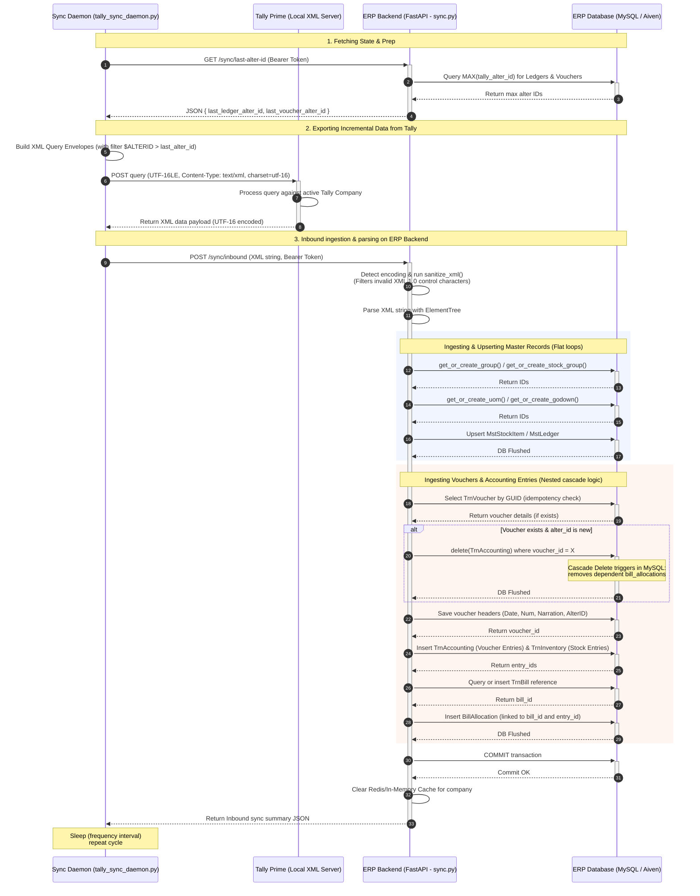

# Tally Synchronization Architecture

This document maps out the end-to-end flow of how data is fetched from Tally Prime by the sync daemon, transmitted to the FastAPI backend, and parsed and stored in the database.

## Synchronization Flow

---

## Detailed Inbound Processing Breakdown

When a raw XML document is sent to the ERP Backend's `/sync/inbound` endpoint:

### 1. Decoding & Sanitization
* **Encoding Detection**: The backend checks for the byte-order mark (`BOM`) to see if the file is `UTF-16` (standard Tally export format) or `UTF-8` and decodes it accordingly.
* **Sanitization**: Raw XML from Tally can contain invalid Unicode control characters (like `\x00-\x08`, `\x0B-\x0C`, `\x0E-\x1F`) which violate the XML 1.0 specification and crash standard parsers. The backend runs regex patterns to clean these characters out before calling `ElementTree`.

### 2. Hierarchical Parsing Order
To respect foreign key constraints, the XML is parsed in a strict dependency order:
1. **Account Groups & Stock Groups**: Loaded/created first because ledgers and stock items depend on them.
2. **Units, Godowns & Stock Categories**: Supporting masters.
3. **Stock Items**: Parsed next, referencing their corresponding units and groups.
4. **Ledgers**: Parsed next, referencing account groups.
5. **Vouchers (Transactions)**: Parsed last, referencing ledgers and stock items.

### 3. Voucher Update & Cascading Deletion
* When a voucher is modified in Tally, it is exported with a higher `ALTERID`.
* If the backend detects the voucher GUID already exists in the database, it must overwrite it.
* Instead of doing clean deletes and inserts of the voucher itself, it keeps the voucher header and resets the entries:
  1. It triggers a delete query on `voucher_entries` for that voucher.
  2. Because the `voucher_entry_id` foreign key on the `bill_allocations` table has `ON DELETE CASCADE` configured, deleting the entries automatically cleans up the allocations in a single database step.
  3. The entries and allocations are then parsed fresh from the new XML and re-inserted.
