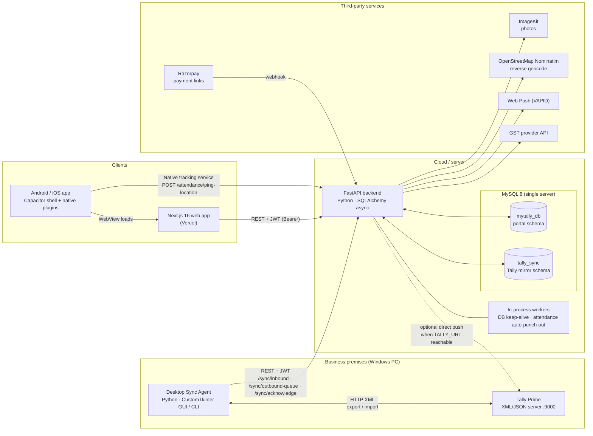
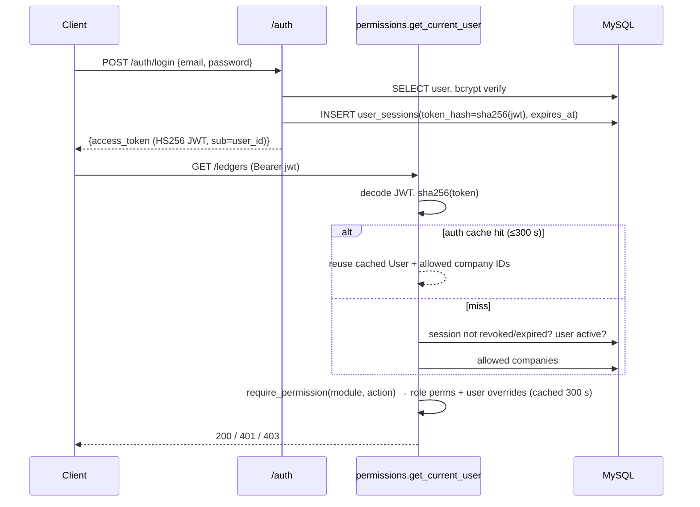
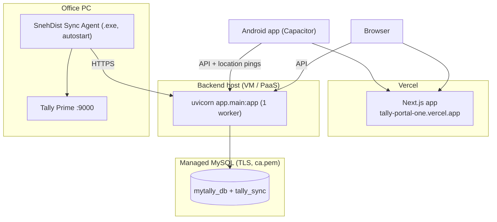

# MyTally — Architecture & Systems

This document explains how MyTally works end to end: the deployable parts, how they talk to each other, how data moves, and why each technology was chosen. Read [`README.md`](README.md) first for setup.

---

## 1. High-level architecture

MyTally is a **hub-and-spoke** system. The FastAPI backend and its MySQL server are the hub. Tally Prime is the external system of record for accounting. The other parts are clients that either read and write portal data or move data between Tally and the hub.



### Components

| # | Component | Location | Runtime | Responsibility |
|---|---|---|---|---|
| 1 | **Tally Prime** | Customer's Windows PC | Tally's built-in HTTP server on `:9000` | System of record for accounting. Accepts XML (and some JSON) import/export envelopes |
| 2 | **Desktop Sync Agent** | `desktop-sync-agent/` | Python 3 on Windows. GUI (`gui_app.py`) or headless (`agent.py`). Ships as a PyInstaller `.exe` | Bridges a LAN-only Tally to the internet-facing backend. Polls both sides, translates nothing: it relays the XML the backend builds and the XML Tally exports |
| 3 | **Backend API** | `backend/app/` | FastAPI on Uvicorn, a single async process | Auth/RBAC, all business logic, Tally XML parsing (inbound) and building (outbound), reporting, integrations |
| 4 | **Backup module** | `backend/backup_module/` | Mounted into the main app at `/backup` (can also run standalone) | Pulls Tally masters/vouchers via fixed XML queries into local zip archives, and restores them |
| 5 | **MySQL 8** | Docker locally; managed MySQL (e.g. Aiven) in production | One server, **two schemas** | `mytally_db` holds portal-owned data. `tally_sync` holds the Tally mirror plus portal-created accounting records waiting to sync |
| 6 | **Web app** | `frontend-nextjs/` | Next.js 16 App Router, client components, deployed to Vercel | UI for every role. Talks only to the backend REST API |
| 7 | **Mobile app** | `frontend-nextjs/android`, `ios` | Capacitor 8 shell whose WebView loads the deployed web app (`server.url`) | Same UI plus native capabilities: camera, GPS, a background **NativeTrackingService** (Android foreground service), push, file sharing |

---

## 2. Component interactions

### 2.1 Interaction matrix

| From → To | Protocol | Auth | Endpoints / mechanism |
|---|---|---|---|
| Web/Mobile → Backend | HTTPS REST/JSON | `Authorization: Bearer <JWT>` and optional `X-Company-ID` | ~25 routers: `/auth`, `/ledgers`, `/vouchers`, `/inventory`, `/reports`, `/gst`, `/attendance`, `/orders`, `/payments`, `/sync`, `/admin`, ... |
| Android native service → Backend | HTTPS POST | Bearer JWT copied into SharedPreferences at shift start | `/attendance/ping-location` every movement, or a 5-minute heartbeat |
| Agent → Backend | HTTPS REST | Bearer JWT from `/auth/login` with saved (encrypted) credentials. Re-auths on 401 | `GET /sync/last-alter-id`, `POST /sync/inbound` (raw XML body), `GET /sync/outbound-queue`, `POST /sync/acknowledge` |
| Agent → Tally | HTTP (localhost) | none (Tally has no auth) | XML `Export` collections filtered by `ALTERID`, and XML `Import` envelopes |
| Backend → Tally (optional) | HTTP | none | `try_push_*_realtime()` in `routers/sync.py`, executed via `asyncio.to_thread` |
| Backend → MySQL | MySQL protocol (TLS optional) | DB user | `aiomysql` pool (10 + 20 overflow, `pool_pre_ping`, 300 s recycle). Session TZ forced to IST |
| Razorpay → Backend | HTTPS webhook | HMAC-SHA256 `X-Razorpay-Signature` | `/gateways/webhooks/razorpay` |
| Backend → ImageKit / Nominatim / Web Push / GST provider | HTTPS | API keys / VAPID | Service modules in `app/services/` and `routers/notifications.py` |

### 2.2 Shared data, not shared services

There are no message brokers. **Coordination happens through database tables:**

- **`SyncQueue`** (portal schema) is the outbound work queue. Any router that creates, edits or deletes a Tally-owned record (ledger, voucher, stock item, group, voucher type, ...) inserts a row (`record_type`, `record_id`, `action`, `is_processed=false`). The agent drains it.
- **`SyncTrafficLog`**, **`DeletedRecordAudit`** and voucher sync-status columns record every push attempt with request/response bodies and a reproducible `curl` command, for the Sync screen's diagnostics.
- **Cross-schema SQL.** Reports join `tally_sync.*` (ledgers, vouchers, entries) with `mytally_db.*` (users, companies) in single queries, which is why both schemas must live on the same MySQL server.

### 2.3 Multi-tenancy

- Every Tally-mirrored row carries `company_id`. A `Company` maps to one Tally company, matched by `tally_guid` or by name.
- `User.company_id` is the user's active company. `UserCompanyAccess` lists what else they may switch to (Admins see all companies).
- A request can target another allowed company with the `X-Company-ID` header. `PUT /auth/me/active-company` switches the default persistently.

### 2.4 Auth & authorization



- **Sessions are server-side and revocable.** The JWT alone isn't enough: its SHA-256 hash must match a live `user_sessions` row. Logout sets `revoked_at` and evicts the cache entry.
- **RBAC** = `Role → Permission(module, can_create/read/update/delete)`, plus `UserPermissionOverride` per module, plus `UserDataScope` (allowed voucher types, ledger/stock group restrictions). `GET /auth/me` returns the resolved toggles and capabilities that the frontend's `AuthContext.can()` uses to show or hide UI. **The backend re-checks on every endpoint through `require_permission`.**

---

## 3. Data flow

### 3.1 Primary journey: field order → Tally voucher → back to the dashboard

```mermaid
sequenceDiagram
    autonumber
    participant U as Field user (mobile)
    participant API as FastAPI
    participant DB as MySQL
    participant AG as Desktop Agent
    participant T as Tally Prime

    U->>API: POST /vouchers (Sales, entries[], inventory[])
    API->>API: require_permission("vouchers","create") + voucher-type scope
    API->>API: Validate Dr = Cr, allocate number from voucher type
    API->>DB: INSERT tally_sync.vouchers / entries / stock_entries
    API->>DB: Maker-checker rule? → status "optional" (needs approval)
    API->>DB: INSERT SyncQueue(record_type="Voucher", action="Create")
    opt TALLY_URL reachable
        API->>T: try_push_voucher_realtime (XML Import)
    end
    API-->>U: 201 voucher

    loop every 5 s
        AG->>API: GET /sync/outbound-queue
        API->>DB: SELECT unprocessed SyncQueue for company
        API-->>AG: [{sync_id, xml_payload}]
        AG->>T: POST XML Import (SVCURRENTCOMPANY set)
        T-->>AG: <CREATED>1</CREATED> / errors
        AG->>API: POST /sync/acknowledge [sync_ids that succeeded]
        API->>DB: SyncQueue.is_processed = true
    end

    loop every 60 s
        AG->>API: GET /sync/last-alter-id
        AG->>T: Export collections WHERE ALTERID > last
        T-->>AG: XML (masters, vouchers incl. the new one with Tally GUID/AlterID)
        AG->>API: POST /sync/inbound (raw XML, X-Company-Name)
        API->>API: sync_lock → import_tally_xml(): upsert by GUID/name, recompute balances
        API->>DB: UPSERT tally_sync.*; clear company response cache
    end

    U->>API: GET /reports/dashboard
    API->>DB: cross-schema aggregates (cached per company, 2 h TTL)
    API-->>U: KPIs including the new sale
```

**Key properties:**

- **At-least-once delivery outbound.** Items stay in the queue until acknowledged, so a crash between Tally accepting an item and the ack causes a redelivery. Tally GUID matching on the next inbound import is what prevents duplicates.
- **Incremental inbound.** The watermark is `MAX(tally_alter_id)` across mirrored tables (see Risks).
- **Tally wins on inbound.** Imports overwrite mirrored fields. Conflicts can be inspected under `/sync/vouchers/{id}/compare-tally` and resolved with `/resolve-conflict`.

### 3.2 Attendance & location trail

1. **Punch in** (`POST /attendance/punch`). The app sends GPS and accuracy (plus an optional selfie via ImageKit). The backend checks the geofence against the office location, reverse-geocodes through Nominatim, and stores the `portal_attendance` row plus the first breadcrumb.
2. **Tracking.** On Android, `NativeTrackingPlugin.startTracking({token, apiBase})` starts `NativeTrackingService`, a foreground service with a sticky notification that survives WebView suspension. It POSTs `/attendance/ping-location` when the device moves, or every 5 minutes as a heartbeat. The web fallback is `AttendanceLocationTracker` with `@capacitor-community/background-geolocation`. `BootReceiver` restarts tracking after a reboot during an active shift.
3. **Server.** The ping updates `last_known_*` and appends to `portal_attendance_locations` (one row per breadcrumb) and to `movement_trail` (JSON on the attendance row). Admins see the trail on a Leaflet map (`AttendanceTrailMap`).
4. **Auto punch-out.** `attendance_auto_checkout_worker` runs every 60 s. It warns at 8 h 55 m and closes shifts at 9 h, or at 23:58 IST, using the last known location.

### 3.3 Payment collection

A field user records a receipt with a photo proof (`/payments`). For online payments, an admin first registers a Razorpay config (`POST /gateways/config`) with a webhook secret and a **settlement ledger** (the bank/cash ledger to debit), then creates payment links (`/gateways/payment-links`). When Razorpay calls `/gateways/webhooks/razorpay`, the backend:

1. resolves the payment link from the payload, and through it the company and that company's gateway config;
2. verifies `X-Razorpay-Signature` with **that config's** secret. It rejects the call (503) if no secret is set and (400) if the signature is missing or wrong;
3. de-duplicates on the `X-Razorpay-Event-Id` header and on the Razorpay payment ID;
4. posts a Receipt in the link's company (Dr settlement ledger, Cr the bill's party, allocated against the bill), and inserts a `SyncQueue` row so the Desktop Agent pushes it to Tally.

If the setup is incomplete (for example no settlement ledger), it records the error on the `webhook_events` row and returns 503 so Razorpay retries after the fix.

---

## 4. Tech stack

| Layer | Technology | Why it was chosen |
|---|---|---|
| Backend framework | **FastAPI** (Starlette, Pydantic v2) | Async I/O suits a workload dominated by DB queries and slow Tally/HTTP calls. Typed request models and free OpenAPI docs |
| ORM / DB driver | **SQLAlchemy 2 async** + **aiomysql** | Mature ORM with async sessions. Raw `text()` is still available for heavy reports |
| Database | **MySQL 8** | Managed hosting is widely available (Aiven) and cross-schema joins are cheap. Familiar to the Tally/Indian SMB ecosystem |
| Auth | **PyJWT (HS256)** + **bcrypt** + DB sessions | Simple bearer tokens that the WebView, native service and agent can all carry, with revocation through the sessions table |
| Rate limiting | **slowapi** | Drop-in limits for login/register |
| Tally integration | Tally **XML over HTTP** (Export/Import envelopes, TDL collections), some JSON | The only integration surface Tally Prime exposes. `xml.etree` parsing in `tally_xml_importer.py` |
| Push notifications | **pywebpush** (VAPID) | Works for the PWA and the WebView without Firebase |
| Images | **ImageKit** | CDN and transformation for selfies and receipt proofs, without hosting object storage |
| Geocoding | **Nominatim** (OSM) | Free reverse geocoding for place names on attendance |
| Frontend | **Next.js 16**, **React 19**, **TypeScript** | App Router file-based routing for ~45 screens. Deploys on Vercel |
| UI | **Tailwind CSS 4**, **shadcn/ui** (Radix, Base UI), **lucide-react**, **sonner** | Fast, consistent component building with accessible primitives |
| Charts / maps / PDF | **Recharts**, **Leaflet**, **jsPDF** | Dashboards, location trails, invoices and receipts generated client-side |
| Mobile | **Capacitor 8** (+ custom Java plugin) | Reuses the whole web app. Native code only where the web can't go (background GPS, boot receiver) |
| Desktop agent | **Python**, **CustomTkinter**, **pystray**, **cryptography (Fernet)**, **PyInstaller** | Same language as the backend, a single-file Windows `.exe`, and a tray-resident GUI that non-technical users can operate |

---

## 5. Code organization (backend)

```text
app/main.py          lifespan: create DBs → create_all → auto-add missing columns → seed RBAC → start workers
app/core/            config · database (engine, auto schema sync) · permissions (auth + RBAC + caches)
                     cache (per-company TTL cache) · rate_limiter · logging_config (request IDs) · seed
app/models/          portal_core.py (mytally_db) · tally_core.py (tally_sync)
app/routers/         HTTP layer + much of the domain logic (sync.py ≈ 4.5k lines, customers/reports/gst ≈ 2.3k each)
app/services/        tally_xml_importer (inbound parser/upserter) · tally_xml_builder (escaped XML)
                     gst/, geo, imagekit, customer_health, attendance_worker
```

**Schema management.** There are no migrations. On every boot, `Base.metadata.create_all()` creates missing tables and `auto_sync_all_model_schemas()` adds missing columns or widens `VARCHAR`s. It never drops, renames or retypes anything. Treat model changes as additive only.

---

## 6. Scaling constraints & known risks

These are deliberate simplifications today. Keep them in mind before you scale or deploy differently.

| Constraint | Where | Consequence if violated | Path forward |
|---|---|---|---|
| **Single process** | `core/cache.py`, `core/permissions.py` caches, `sync_lock` (`asyncio.Lock`), slowapi memory storage, lifespan workers | With N workers or replicas: logout/permission changes lag up to 5 min on other workers, imports run concurrently, rate limits multiply by N, and auto-punch-out and notifications fire N times | Move caches, rate limits and locks to Redis (`redis` is already a dependency). Run workers as a separate process or use a DB advisory lock (`GET_LOCK`) |
| **Boot-time schema sync** | `core/database.py` | Concurrent boots race on `ALTER TABLE`. Type changes are silently ignored | Adopt Alembic (already in `requirements.txt`) |
| **Agent identity = a user account** | `desktop-sync-agent/cloud_client.py` | The agent has whatever that user can do. Inbound import only needs `ledgers:create` | Dedicated `sync_agent` role or a scoped machine token |
| **Inline realtime Tally push** | `try_push_*_realtime` awaited inside create handlers | If `TALLY_URL` is set but unreachable, each write waits up to the 5–10 s timeout | Push from a background task and rely on the queue |
| **AlterID watermark derived from data** | `GET /sync/last-alter-id` | A failed collection import can be skipped if a later collection advanced the max AlterID | Store an explicit per-company checkpoint, committed only after the whole cycle succeeds |
| **Both schemas on one server** | Raw SQL in `routers/reports.py` (hardcodes `tally_sync.`) | Can't split the databases. Renaming `TALLY_DATABASE_NAME` breaks reports | Use `settings.TALLY_DATABASE_NAME` everywhere |

---

## 7. Deployment topology (current)



CORS in `app/main.py` allows `localhost`, private LAN ranges and `tally-portal-one*.vercel.app`. Add new frontend origins there.
