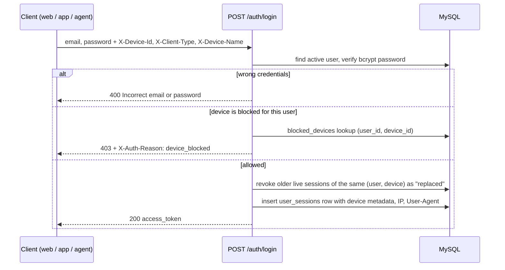
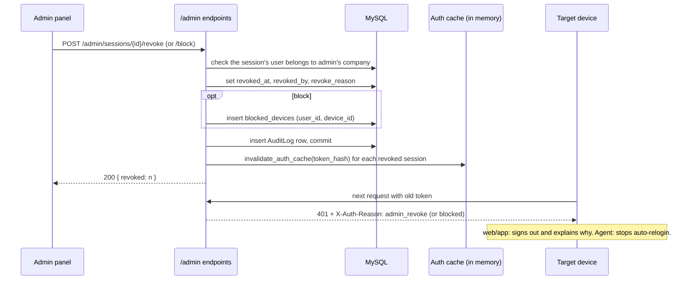

MyTally · Feature plan for review

# Device Session Control

See every device a user is signed in on, sign out any one of them from the admin panel, and block a device from signing in again.

Repo: `tally-portal` (backend · frontend-nextjs · desktop-sync-agent) Status: proposal v2 (merged with a second plan), nothing implemented Prepared: 4 Oct 2026

#### Contents

- [v2What changed in this version](#changes)
- [1Summary and current state](#summary)
- [2Findings that shape the plan](#findings)
- [3Scope and non-goals](#scope)
- [4Design: data, identity, flows](#design)
- [P0Make logout real](#phase0)
- [P1Session tracking and revoke API](#phase1)
- [P2Devices UI, sessions tab, My devices](#phase2)
- [P3Device blocking and Sync Agent](#phase3)
- [P4Alerts, limits, cleanup](#phase4)
- [5API reference](#api)
- [6Rollout and migration](#rollout)
- [7Testing plan](#testing)
- [8Risks and limitations](#risks)
- [9Decisions needed](#decisions)
- [10Checklist for comparing plans](#compare)

## What changed in v2

This version merges the useful parts of a second plan for the same feature. The phase structure and the fixes for logout, blocking, the 401 handler, the Sync Agent, company scoping and audit are unchanged; the second plan did not cover them.

| Change | Where | Source |
| --- | --- | --- |
| Devices badge and button on each **user card**; v1 wrongly assumed a users table | Phase 2 | Second plan, confirmed in `admin/page.tsx` |
| Company-wide **Active Devices** tab with summary counts and filters, moved up from optional Phase 4 | Phases 1 and 2 | Second plan |
| New `device_type` column (mobile, tablet, desktop) for icons, alongside `client_type` | Section 4.1 | Second plan |
| "Active now" indicator | Phase 2 | Second plan |
| **My devices** (self-service) is now core scope, using `/auth/me/sessions` to match existing `/auth/me/…` routes | Phases 1 and 2 | Second plan |
| Tests committed to the repo: `backend/tests/test_device_sessions.py` with the device A / device B revoke scenario | Section 7 | Second plan |
| `user_agent` widened to VARCHAR(500); the startup schema sync widens it, no migration script needed | Section 4.1 | Second plan |
| Field names settled: `last_active_at`, `os_name`, `browser_name` | Section 4.1 | Merge decision |
| Phase 4 now holds only alerts, device limit and cleanup; decisions renumbered | Phase 4, section 9 | Follows from the above |

**Not taken from the second plan:** an `is_blocked` flag on the session row (a revoked session is already dead, so the flag blocks nothing; blocking needs a device id and a check at login), and a separate column migration script (the startup sync already adds columns; the one-time step that's actually needed is creating indexes).

## 1. Summary and current state

Most of the groundwork exists: every login creates a row in `user_sessions`, and every API call rejects a token whose row is revoked or expired. What's missing is device information on those rows, a way for an admin to revoke specific rows, and a way to stop a device from simply logging in again.

| Area | Today | Gap |
| --- | --- | --- |
| `user_sessions` table | session_id, user_id, token_hash, ip_address, user_agent, created_at, expires_at, revoked_at | `ip_address` and `user_agent` are never filled in. No device id, device name, last activity, or who revoked it. |
| Session check | `get_current_user` rejects revoked or expired sessions | Results are cached in memory for 300 s, so a revoke only takes effect after the cache entry expires. |
| Logout | `POST /auth/logout` exists and revokes the current session | The web app never calls it; Logout only clears `localStorage`. The token stays valid on the server for 30 days. |
| Admin panel | Users list, edit, activate or deactivate, reset password | No view of a user's devices; no sign-out or block actions. |
| Clients after a revoke | Android tracking service stops on 401 | The web app only reacts to 401 on page load. The Sync Agent logs straight back in with its saved password. |

**Production today (read-only check, 4 Oct 2026):** 289 session rows, of which 21 are still live. One admin account has 14 live sessions, almost all left behind by logouts that never revoked anything. Without Phase 0, a device list would mostly show these abandoned sessions.

## 2. Findings that shape the plan

Each finding was checked against the code. Several of these are missed by a plan that only adds columns and revoke endpoints.

### F1. Logout doesn't end the session

security bug

`AuthContext.logout()` (frontend-nextjs/src/context/AuthContext.tsx) only clears local storage. Anyone who copied the token keeps access for 30 days after the user "logs out". Fixed in Phase 0.

### F2. A revoke takes up to 5 minutes to apply

must handle

`get_current_user` (backend/app/core/permissions.py) serves cached sessions for `AUTH_CACHE_TTL_SECONDS = 300`. Every revoke must also call `invalidate_auth_cache(token_hash=…)`. The cache is per process, so this is only immediate with a single backend worker.

### F3. Signing a device out doesn't stop it signing back in

design driver

A person can log in again right away. The Desktop Sync Agent does it automatically: `CloudClient.reauthenticate()` retries with the saved password on any 401. Stopping a device needs a device identity plus a block list checked at login (Phase 3).

### F4. The web app doesn't notice it was signed out

UX gap

About 60 files call `fetch` directly, with no shared 401 handling. After a revoke the UI stays "logged in" while every request fails. Phase 2 adds one interceptor that signs the user out and explains why.

### F5. "Last active" isn't recorded anywhere

needed for UI

Cached requests never touch the database. Admins need last activity to tell a phone in use from a forgotten browser, so Phase 1 adds `last_active_at`, written at most once every 5 minutes per session.

### F6. Tenant scoping, audit and IP source

consistency

Existing admin endpoints only act on users of the admin's company (`User.company_id == admin.company_id`); the new ones must do the same. Revokes and blocks are written to the existing `AuditLog`. The IP comes from `get_client_ip()` in rate_limiter.py, which already reads proxy headers.

## 3. Scope and non-goals

#### In scope

- Record device, platform, IP and last activity for every session.
- Admins: list a user's devices, see all signed-in devices across the company, sign out one device or all devices, block and unblock a device.
- All clients react correctly to being signed out or blocked: web, Android/iOS app, Sync Agent.
- Users: see their own devices and sign out any of them, including "all other devices" for a lost phone.
- Optional policies: new-device alerts, per-role device limit, cleanup of old sessions.

#### Not in scope

- Moving tokens out of `localStorage` into httpOnly cookies, or shortening the 30-day token life. Worth doing, but it's a separate change.
- Hardware-level device attestation. Device ids come from the client and can be reset (see Risks).
- IP geolocation or maps of login locations.
- Making the auth cache work across several backend workers (needs Redis; noted under Risks).

## 4. Design

### 4.1 Data model

New columns on `user_sessions` are added automatically by the startup schema sync (`auto_sync_all_model_schemas`), which adds missing columns but **not indexes**. The indexes are a one-time SQL step (section 6).

| Column on `user_sessions` | Type | Purpose |
| --- | --- | --- |
| `device_id` | VARCHAR(64) NULL | Stable id sent by the client; used for "same device" and blocking |
| `client_type` | VARCHAR(20) NULL | Which app: `web` · `android` · `ios` · `sync-agent` · `api` |
| `device_type` | VARCHAR(20) NULL | What kind of device, for icons and counts: `mobile` · `tablet` · `desktop` |
| `device_name` | VARCHAR(120) NULL | Readable label, e.g. "Chrome on macOS", "Samsung SM-A515F", "SNEH-PC" |
| `os_name`, `browser_name`, `app_version` | VARCHAR(60/60/30) NULL | Parsed from the User-Agent or sent by the native app, e.g. "Android 14", "Chrome 129" |
| `ip_address` | existing, now filled | IP at login, via `get_client_ip()` |
| `user_agent` | existing, widened to VARCHAR(500), now filled | Raw User-Agent; the startup schema sync widens the column automatically |
| `last_active_at` | DATETIME NULL | Last authenticated request, written at most every 5 minutes. Set at login. |
| `revoked_by_user_id` | INT NULL → users | Admin who signed the device out (NULL for self logout or system) |
| `revoke_reason` | VARCHAR(30) NULL | `logout` · `admin_revoke` · `admin_revoke_all` · `blocked` · `password_change` · `deactivated` · `replaced` · `device_limit` · `self_revoke` |

| New table `blocked_devices` | Type | Notes |
| --- | --- | --- |
| `blocked_device_id` | INT PK |  |
| `company_id`, `user_id` | INT | A block applies to one user on one device |
| `device_id` | VARCHAR(64) | Unique together with `user_id` |
| `device_name`, `client_type`, `device_type` | copied at block time | So the blocked list stays readable after sessions are purged |
| `reason` | VARCHAR(255) NULL | Shown to admins, never to the blocked user |
| `blocked_by_user_id`, `created_at` |  | Also recorded in `AuditLog` |

### 4.2 How each client identifies itself

Clients send these headers to `/auth/login`. Requests without them still work; the session is then recorded as an unknown device that can be signed out but not blocked.

| Client | `X-Device-Id` | `X-Client-Type` | `X-Device-Name` | `device_type` |
| --- | --- | --- | --- | --- |
| Web browser | UUID created once and kept in `localStorage["mytally_device_id"]` | `web` | not sent; derived from User-Agent | From User-Agent: "Mobile" → mobile, iPad or Android without "Mobile" → tablet, else desktop |
| Android / iOS app | `Device.getId()` from `@capacitor/device` (already installed) | `android` / `ios` | Manufacturer, model and OS version from `Device.getInfo()` | App sends `X-Device-Type`: tablet when the shorter screen side is 600 dp or more, else mobile |
| Desktop Sync Agent | SHA-256 of the machine identifier already built in `security.py`, first 32 hex chars | `sync-agent` | Windows host name; plus User-Agent `SnehDistSyncAgent/<version>` | desktop |
| Swagger / scripts | none | none → stored as `api` |  | from User-Agent, often empty |

The server only accepts a `device_id` matching `^[A-Za-z0-9._:-]{8,64}$` and trims `device_name` to 120 characters; anything else is ignored.

### 4.3 Login with device capture and block check



The block check runs only after the password is verified, so the "blocked" response doesn't reveal anything to someone without the password. Replacing older sessions of the same device keeps the device list to one row per device.

### 4.4 Admin signs out or blocks a device



### 4.5 Why the client gets a reason

When a session check fails because the row was revoked, `get_current_user` looks up `revoke_reason` (one query, only on failure) and returns it in an `X-Auth-Reason` response header. The JSON `detail` stays a plain string because existing frontend code reads `data.detail` as text.

PHASE 0

## Make logout real

Size: XSFrontend onlyShip first

Fixes finding F1 on its own, and stops new stale sessions from piling up before the device list exists.

#### Changes

- `AuthContext.logout()` calls `POST /auth/logout` with the current token (`keepalive: true`, errors ignored), then clears local state as today.
- On the native app, logout also calls `NativeTracking.stopTracking()` so the background service drops its copy of the token.
- Logout clears the "shift active" flags in `localStorage` so the next user on the same phone doesn't inherit them.

frontend-nextjs/src/context/AuthContext.tsx · src/lib/capacitor-native-tracking.ts

#### Done when

- Logging out in the browser sets `revoked_at` on that session row.
- Reusing the old token after logout returns 401.
- Logging out in the Android app stops location pings.
- Logout still completes when the server is unreachable.

PHASE 1

## Session tracking and revoke API

Size: M–LBackend onlyBackward compatible

After this phase admins and users can list and sign out devices through the API, and every new session carries device information. Clients that don't send device headers keep working.

#### Backend

- **Model:** new columns on `UserSession` (section 4.1) in `models/portal_core.py`.
- **New module `app/core/sessions.py`:**
  - `parse_device(request)`: reads the device headers, IP via `get_client_ip()`, User-Agent, and derives `os_name`, `browser_name`, `device_type` and a readable name with a small built-in parser (no new dependency).
  - `create_user_session(db, user, request)`: replaces the duplicated code in `/auth/login` and `/auth/swagger-login`; revokes older live sessions of the same device as `replaced`.
  - `revoke_sessions(db, *, session_ids=None, user_id=None, by_user=None, reason)`: one place that sets `revoked_at`, `revoked_by_user_id`, `revoke_reason` and returns the token hashes so the caller clears the cache after commit.
- **Existing callers move to the helper:** `revoke_all_user_sessions` (password reset, deactivation) records `password_change` / `deactivated`; `/auth/logout` records `logout`.
- **`get_current_user`:** on a failed session check, reads `revoke_reason` and sets `X-Auth-Reason`. Writes `last_active_at` at most once every 5 minutes per token, from a short separate DB session so it never commits the request's own work.
- **Admin endpoints** in `routers/admin.py`, all behind `require_admin` and limited to users of the admin's company:
  - `GET /admin/users/{id}/sessions`
  - `POST /admin/sessions/{id}/revoke`
  - `POST /admin/users/{id}/sessions/revoke-all`
  - `GET /admin/sessions`: every signed-in device in the company, with filters (`user_id`, `client_type`, `device_type`, `q` for name or IP) and a `summary` block (total, mobile, tablet, desktop, sync agents, active now)
- **Self-service endpoints** in `routers/auth.py`: `GET /auth/me/sessions` (current device flagged), `POST /auth/me/sessions/{id}/revoke`, `POST /auth/me/sessions/revoke-others`. Users can only act on their own sessions.
- **Users list:** `GET /admin/users` gains `active_devices` (count) and `last_active_at` per user, from one grouped query.
- **Audit:** every admin revoke writes an `AuditLog` row (`action="SESSION_REVOKE"`, entity `UserSession`).
- **Tests in the repo:** `backend/tests/conftest.py` (SQLite harness with both schemas attached) and `backend/tests/test_device_sessions.py`, run with `pytest`. Adds `pytest`, `pytest-asyncio` and `aiosqlite` to a new `requirements-dev.txt`.

backend/app/models/portal_core.py · app/core/sessions.py (new) · app/core/permissions.py · app/routers/auth.py · app/routers/admin.py · tests/conftest.py (new) · tests/test_device_sessions.py (new) · requirements-dev.txt (new)

#### Done when

- A new login stores device id, type, name, os, browser, IP and User-Agent.
- Logging in again from the same device leaves one live row for that device.
- After an admin revoke, the very next request from that token returns 401, even if the token was cached a second earlier.
- The 401 carries `X-Auth-Reason: admin_revoke`.
- An admin of company A gets 404 for users and sessions of company B, and `GET /admin/sessions` only returns company A's devices.
- A user can list and revoke their own sessions and gets 404 for anyone else's; "revoke others" keeps the current session.
- Revoke-all signs out every device of that user; with `keep_current=true` the admin's own session survives when they target themselves.
- `last_active_at` moves forward during use and is written at most once per 5 minutes per session.
- Each revoke creates an AuditLog row.

#### Response shape: one session

```
{
  "session_id": 412,
  "device_id": "a1b2c3d4-…",
  "client_type": "android",
  "device_type": "mobile",
  "device_name": "Samsung SM-A515F",
  "os_name": "Android 13",
  "browser_name": "Chrome WebView 129",
  "app_version": "1.0",
  "ip_address": "49.36.…",
  "created_at": "2026-10-02T09:14:00+05:30",
  "last_active_at": "2026-10-04T16:41:00+05:30",
  "is_active_now": true,
  "expires_at": "2026-11-01T09:14:00+05:30",
  "revoked_at": null,
  "revoke_reason": null,
  "is_current": false,
  "is_blocked": false,
  "legacy": false
}
```

`legacy: true` marks sessions created before Phase 1, which have no device information. `is_active_now` is true when `last_active_at` is under 10 minutes old; the threshold is twice the 5-minute write interval so a device in steady use never flickers to "inactive".

PHASE 2

## Devices UI, sessions tab, My devices

Size: LFrontend + AndroidNeeds Phase 1

This is the feature as you described it: an admin opens a user, sees their devices and signs any of them out; admins can also see every signed-in device in the company in one place, and users can manage their own devices. Signed-out devices notice straight away.

#### Shared frontend pieces

- **New `src/lib/device.ts`:** `getDeviceHeaders()` returns the headers from section 4.2 (Capacitor `Device` on native, the stored UUID on web), including `X-Device-Type` on native.
- **Login calls send device headers:** `app/login/page.tsx` (two calls) and `app/companies/new/page.tsx`.
- **Session-ended handling:** a fetch interceptor installed once in `AuthContext` watches responses from `API_BASE`. On 401 it signs out locally and shows a message based on `X-Auth-Reason`:
  - `admin_revoke`: "An administrator signed you out of this device."
  - `blocked`: "This device has been blocked. Contact your administrator."
  - `password_change`: "Your password was changed. Sign in again."

  This covers the \~60 existing `fetch` call sites without editing each one.
- **New `components/DeviceList.tsx`:** one device list used by all three screens below. Icon by `device_type` (`Smartphone`, `Tablet`, `Laptop`, `Monitor` for the Sync Agent), name, OS and browser, IP, signed in, last active, an **Active now** dot, and a "This device" badge. Legacy rows show as "Unknown device (signed in before tracking)".

#### Admin → Users (cards)

- Each user card in `app/admin/page.tsx` gets a badge such as "2 active devices" and a **Devices** button in the card footer next to Edit, Permissions and Companies. The badge opens the same dialog.
- New `components/admin/DeviceSessionsModal.tsx`: the user's devices with **Sign out** per row and **Sign out all devices** in the header, each with a confirmation step in the dialog; a "Show history" toggle for revoked sessions with reason and who did it.

#### Admin → new Active Devices tab

- New tab `tab === 'sessions'` beside Users, Roles, Logs, Cache and Sync.
- Summary counts at the top: total signed-in devices, active now, mobile, tablet, desktop, Sync Agents.
- Search by user, device name or IP; filter by device type and app.
- Each row shows the user and the device, with **Sign out** (and **Block** once Phase 3 ships).

#### My devices (every user)

- New page `app/account/devices/page.tsx`, linked from the user menu in `GlobalHeader`.
- "This device" first, then other devices with **Sign out**, and **Sign out all other devices** for a lost phone.

#### Android

- No native code change needed: `NativeTrackingService` already stops itself on 401.

src/lib/device.ts (new) · src/components/DeviceList.tsx (new) · src/components/admin/DeviceSessionsModal.tsx (new) · src/app/account/devices/page.tsx (new) · src/context/AuthContext.tsx · src/app/login/page.tsx · src/app/companies/new/page.tsx · src/app/admin/page.tsx · src/components/GlobalHeader.tsx

#### Done when

- Admin opens a user card and sees each device they're signed in on, with readable names and icons.
- Card badges match the number of live devices, and stale pre-Phase-0 sessions don't inflate them after the one-time cleanup (Decision 4).
- The Active Devices tab lists only this company's devices; counts match the rows; search and filters work.
- Signing out a browser session: that browser shows the message and returns to login on its next request.
- Signing out the Android app: the app returns to login and location tracking stops.
- "Sign out all devices" works, and the admin's own session stays when they use it on themselves.
- A user can sign out their other devices from My devices without losing the current one.
- "Active now" shows for a device used in the last 10 minutes.
- Network errors (offline, timeouts) never sign anyone out; only 401 does.
- All three screens work at phone width and in dark mode.
- `tsc` and ESLint pass for the new and changed files.

#### User card mock-up

**vishal.garg**2 active devices

Sales · last active 2 min ago

EditPermissionsCompaniesDevices

#### Device list mock-up

| Device | Last active |  |
| --- | --- | --- |
| **Samsung SM-A515F** Android app · mobile · 49.36.x.x | Active now | Sign out · Block |
| **Chrome on Windows** Web · desktop · 103.21.x.x | 3 days ago | Sign out · Block |
| **Unknown device** Signed in before tracking | — | Sign out |

#### Active Devices tab mock-up

Signed in: 9Active now: 3Mobile: 5Tablet: 0Desktop: 3Sync Agents: 1

Mock-ups with example values, not real data.

PHASE 3

## Device blocking and Sync Agent

Size: MBackend + UI + agentDecision 1

Stops a specific phone, browser or PC from signing in again for that user. Also makes "Sign out" mean something for the Sync Agent.

#### Backend

- New `BlockedDevice` model and table (section 4.1).
- `create_user_session` refuses a blocked `(user, device_id)` after the password check: 403 with `X-Auth-Reason: device_blocked`.
- Endpoints:
  - `POST /admin/sessions/{id}/block`: revokes every live session of that user on that device, then adds the block. Returns 409 for legacy sessions without a device id; those can only be signed out.
  - `GET /admin/users/{id}/blocked-devices`
  - `DELETE /admin/blocked-devices/{id}` to unblock.
- Audit actions `DEVICE_BLOCK` and `DEVICE_UNBLOCK`.

#### Frontend

- "Block" on each device row in the user dialog and the Active Devices tab (with an optional reason), and a "Blocked devices" section with Unblock in the user dialog.
- The login page shows the blocked message for a 403 with `device_blocked`.

#### Desktop Sync Agent

- Sends device headers and a `SnehDistSyncAgent/<version>` User-Agent on every request.
- If a 401 carries `admin_revoke`, `blocked` or `password_change`, it does **not** log back in automatically. It pauses and the GUI asks for credentials again.
- If login returns `device_blocked`, it stops retrying and the GUI and tray show "This PC was blocked by an administrator".
- Ship the rebuilt `.exe` to each office PC. Old agents keep working but can't be blocked by device.

backend: models/portal_core.py · core/sessions.py · routers/admin.py · tests/test_device_blocking.py (new) — frontend: DeviceList.tsx · DeviceSessionsModal.tsx · app/login/page.tsx — agent: cloud_client.py · agent.py · gui_app.py · tests/test_auth_reasons.py (new)

#### Done when

- Blocking a phone signs it out, and logging in again from that phone fails with the blocked message.
- The same user can still log in from a different device.
- Another user can still log in from the blocked device (blocks are per user).
- Unblocking lets the device log in again.
- An admin "Sign out" of the agent's session pauses the agent until someone re-enters the password.
- A blocked agent stops retrying and shows the blocked state.
- Each block and unblock is in the AuditLog.

**Blocking is a soft control.** The device id comes from the device itself, so clearing the app's data or using another browser produces a new id. To lock a person out completely, deactivate the user or reset their password; both already revoke every session.

PHASE 4

## Alerts, limits, cleanup

Size: S eachIndependent itemsDecisions 2–3

Each item can ship on its own, in any order, after Phase 1. Self-service and the company-wide view moved into Phases 1–2 in v2.

| Item | What it does | Main changes |
| --- | --- | --- |
| **4a. New-device alert** | When a user signs in from a device id never seen for them, admins get a notification (and optionally the user). | In `create_user_session`: check for an earlier session with the same `(user, device_id)`; call the existing `notify_admins(…, type="security")`. |
| **4b. Device limit** | Cap active devices per role, e.g. one phone for Sales. Over the limit, either refuse the new login or sign out the oldest device. | New nullable `max_active_devices` on `roles` plus a company-level policy setting; enforced in `create_user_session`; reason `device_limit`. |
| **4c. Session cleanup** | Delete sessions that expired more than 30 days ago or were revoked more than 90 days ago, so history stays useful and the table stays small. | Daily background task in `main.py` lifespan, same pattern as the attendance worker. |

## 5. API reference

All admin endpoints use `require_admin` and return 404 for users or sessions outside the admin's company.

| Phase | Method and path | Who | Body / query | Returns |
| --- | --- | --- | --- | --- |
| P1 | `POST /auth/login` (changed) | anyone | same body; optional device headers | token; 403 `device_blocked` from P3 |
| P1 | `GET /admin/users` (changed) | admin | — | adds `active_devices` (count for the card badge) and `last_active_at` |
| P1 | `GET /admin/users/{user_id}/sessions` | admin | `?status=active\|all`, `limit` | list of sessions (shape in Phase 1) |
| P1 | `POST /admin/sessions/{session_id}/revoke` | admin | `{ "note": "…" }` optional | `{ "revoked": 1 }` |
| P1 | `POST /admin/users/{user_id}/sessions/revoke-all` | admin | `{ "keep_current": true }` | `{ "revoked": n }` |
| P1 | `GET /admin/sessions` | admin | `?user_id`, `client_type`, `device_type`, `q`, `active_now`, `limit`, `offset` | `{ "summary": { total, active_now, mobile, tablet, desktop, sync_agent }, "sessions": [ … ] }`, each session also carrying `user_id` and `username` |
| P1 | `GET /auth/me/sessions` | any user | — | own live sessions, current one flagged |
| P1 | `POST /auth/me/sessions/{session_id}/revoke` | any user | — | own sessions only, else 404 |
| P1 | `POST /auth/me/sessions/revoke-others` | any user | — | `{ "revoked": n }` |
| P3 | `POST /admin/sessions/{session_id}/block` | admin | `{ "reason": "…" }` | `{ "revoked": n, "blocked_device_id": id }`; 409 for legacy sessions |
| P3 | `GET /admin/users/{user_id}/blocked-devices` | admin | — | list of blocks |
| P3 | `DELETE /admin/blocked-devices/{id}` | admin | — | 204 |

### Auth error contract

| Situation | Status | `X-Auth-Reason` | Client behaviour |
| --- | --- | --- | --- |
| Token expired | 401 | `expired` | Web/app: back to login. Agent: log in again automatically. |
| Signed out by user | 401 | `logout` / `self_revoke` | Back to login. |
| Signed out by admin | 401 | `admin_revoke` / `admin_revoke_all` | Message + login. Agent pauses and asks for credentials. |
| Password changed / user deactivated | 401 | `password_change` / `deactivated` | Message + login. Agent pauses. |
| Device blocked | 401 on existing session, 403 on login | `blocked` / `device_blocked` | Message; no retry. Agent shows the blocked state. |
| Replaced by a newer login on the same device | 401 | `replaced` | Back to login (rare: two tabs racing). |

## 6. Rollout and migration

**P0**Frontend deploy. No backend change.

**P1**Backend deploy + one-time SQL. Old clients keep working.

**P2**Frontend deploy: user cards, Active Devices tab, My devices. Android picks it up through the WebView.

**P3**Backend + frontend, then rebuild and ship the agent .exe.

**P4**Item by item, each behind its own setting.

### One-time database step with Phase 1

The startup schema sync adds the new columns but not indexes on an existing table. Run once on MySQL:

```
CREATE INDEX ix_user_sessions_token   ON mytally_db.user_sessions (token_hash);
CREATE INDEX ix_user_sessions_active  ON mytally_db.user_sessions (user_id, revoked_at, expires_at);
CREATE INDEX ix_user_sessions_device  ON mytally_db.user_sessions (user_id, device_id);
```

`token_hash` is looked up on every uncached request and has no index today, so the first index helps even without this feature.

### Existing sessions

- They appear as "Unknown device (signed in before tracking)" until they expire, up to 30 days.
- Optional clean start (Decision 4): sign everyone out once when Phase 1 ships, so the device list starts accurate. Each person logs in again once; field users should be told in advance because attendance tracking pauses until they do.

### Single backend worker

Immediate revocation relies on the in-memory auth cache being cleared in the process that served the revoke. Keep running one Uvicorn worker (current setup). With more workers, a revoke can take up to 5 minutes to reach the others until the cache moves to Redis.

## 7. Testing plan

#### Automated (committed to the repo)

`backend/tests/conftest.py` holds the SQLite harness used for the earlier fixes (real models, both schemas attached); run with `pytest backend/tests`.

**`test_device_sessions.py`** (Phase 1), headline scenario: device A (Android) and device B (Chrome) sign in; the admin list shows both with correct details; revoke A → A's next call is 401 while B still gets 200; revoke-all → B is 401 too.

- Login stores device fields; a second login from the same device replaces the first.
- **Revoke is immediate on a cache hit**: warm the cache, revoke, next request returns 401.
- `X-Auth-Reason` matches each revoke path.
- Cross-company access returns 404 for list, revoke, block.
- Revoke-all with and without `keep_current`.
- Block: same user + same device refused; other device allowed; other user on same device allowed; unblock restores.
- Block on a legacy session returns 409.
- `last_active_at` written at most once per 5 minutes.
- Self-service endpoints can't touch other users' sessions.
- AuditLog rows for revoke, block, unblock.
- `GET /admin/sessions`: summary counts match the rows; filters work; other companies' devices never appear.
- `is_active_now` flips at the 10-minute mark.
- **`test_device_blocking.py`** (Phase 3): the block cases above.
- **`desktop-sync-agent/tests/test_auth_reasons.py`** (Phase 3): fake cloud returns each `X-Auth-Reason`; the agent re-logs in only for `expired`.

#### Manual QA matrix

| Client | Sign out | Block |
| --- | --- | --- |
| Chrome, desktop | Message, then login | Login refused |
| Safari, iPhone | Message, then login | Login refused |
| Android app, active shift | Login screen, tracking stops | Login refused |
| Sync Agent (Windows) | Pauses, asks for password | Shows blocked, stops |
| Swagger | 401 | n/a (no device id) |

#### Frontend checks

- `npx tsc --noEmit` and ESLint clean on new and changed files.
- Offline / timeout never triggers sign-out.
- Device modal at 400px width and in dark mode.

## 8. Risks and limitations

| Risk | Impact | Mitigation |
| --- | --- | --- |
| Device ids can be reset by clearing app data or switching browser | A blocked person can get a new device id | Treat blocking as device hygiene; for people, deactivate the user or reset the password. Optional per-role device limit (4c) makes new devices visible. |
| Multiple backend workers | Revoke may take up to 5 min on other workers | Keep one worker; move auth cache to Redis before scaling out. |
| Agent account shared with an admin | "Sign out all devices" on that admin also stops Tally sync | Use a dedicated agent account with only the `sync` permission; the modal labels agent sessions clearly. |
| `X-Forwarded-For` can be spoofed if the backend isn't behind a proxy | Shown IP may be wrong | IP is informational only and never used for decisions. |
| IP and device data are personal data | Privacy expectations | Visible to admins and the user only; purged with sessions (4d). |
| Fetch interceptor signs users out too eagerly | Unexpected logouts | Only 401 responses from `API_BASE` trigger it; network errors and 403 permission errors don't. |
| Old Sync Agent builds | Can't be blocked by device; still auto-relogin after sign-out | Roll out the new `.exe` with Phase 3; until then, reset that account's password to stop an old agent. |

## 9. Decisions needed

| # | Question | Options | Recommendation |
| --- | --- | --- | --- |
| 1 | Do we need device blocking (Phase 3)? | Yes · No, sign-out plus deactivate is enough | **Yes.** It's the only way "Sign out" stops the Sync Agent and a lost phone from coming straight back. |
| 2 | Device limit per role (4b)? | None · Refuse new login · Sign out the oldest | **Off by default**; if used for field staff, sign out the oldest so a replaced phone just works. |
| 3 | New-device alerts (4a)? | Off · Admins · Admins and the user | **Admins**, for non-admin users. |
| 4 | Sign everyone out once when Phase 1 ships? | Yes · No, let old sessions expire | **Yes**, after telling field staff. It clears the 21 stale sessions so card badges start accurate. |
| 5 | Should the agent stop auto-relogin after an admin sign-out? | Yes · No, only on block | **Yes.** Otherwise "Sign out" has no visible effect on agents. |

### Settled in v2

- **Self-service:** included (Phases 1–2).
- **Company-wide view:** included as the Active Devices tab (Phases 1–2).
- **Field names:** `last_active_at`, `os_name`, `browser_name`, `client_type` plus `device_type`.
- **Route naming:** `/auth/me/sessions`, matching the existing `/auth/me` routes.

## 10. Checklist for comparing plans

Questions any plan for this feature should answer. Use them to compare this plan with your other one.

- Does Logout in the web app actually revoke the session on the server?
- Does a revoke take effect on the next request, despite the 300-second auth cache?
- Does an admin sign-out stop the Sync Agent, which logs itself back in on 401?
- How does the web app notice it was signed out, given \~60 direct `fetch` calls?
- Where does "last active" come from when cached requests don't touch the database?
- Are admin endpoints limited to the admin's own company?
- Are revokes and blocks written to the audit log?
- How is a device identified on web, Android/iOS and the agent, and what happens without an id?
- Does logging in again from the same device create duplicate rows?
- Is the block check done after the password check?
- What happens to the 289 existing session rows and 21 stale live ones?
- Are indexes added, given that startup schema sync doesn't create them?
- Is it clear that device blocking can be bypassed and what to use instead?
- Does the plan keep old clients (older app builds, old agent .exe) working?
- Does "Block" stop the device from logging in again, or only end the current session?
- Do card badges and company-wide counts stay accurate, given stale sessions and repeat logins on the same device?

Version 2, 4 Oct 2026: merges the useful parts of a second plan (see "What changed in v2"). Based on the code in `tally-portal` as of that date, including a read-only check of the production `user_sessions` table. Nothing in this plan has been implemented.