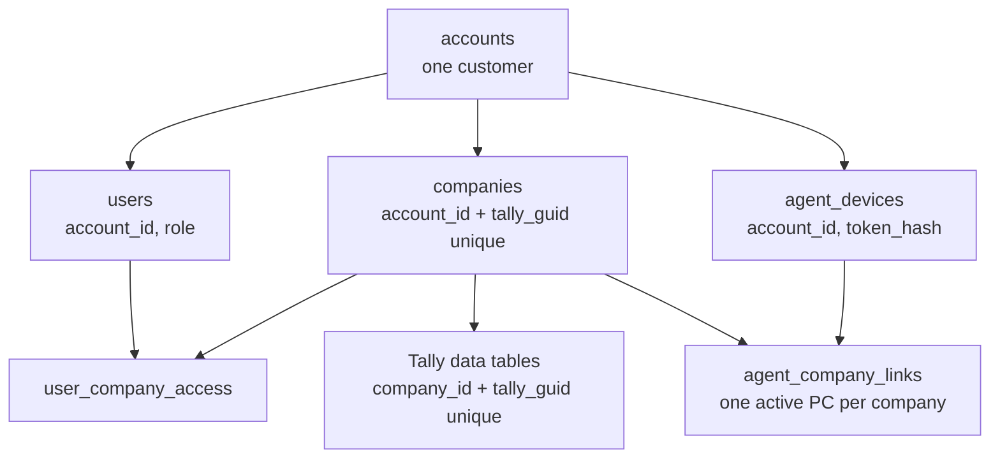

# Multi-Tenant and Multi-Company Working Plan

Last updated: 10 Oct 2026

This is the single document to work from. The steps to run by hand at rollout are in `Multi-Tenant Rollout Runbook.md`. It merges and supersedes:

- `Multi-Company Sync Strategy Livekeeping Benchmark.md` (strategy, UI, agent architecture, first roadmap)
- `Multi-Tenant Design Migration, Onboarding, Isolation.md` (schema, onboarding, migration)

Where the two disagreed or a later decision changed them, this document is right. Changes since those exports are marked **(changed)**.

## 1. Status

| Item | State |
| --- | --- |
| Phase 0: explicit sync company, accounts table, account-scoped Admin | Code complete, in PR [Akashkansal065/tally-portal#67](https://github.com/Akashkansal065/tally-portal/pull/67). Not merged, not deployed. |
| Step 1: expand the schema | Code complete, in the same pull request (tally-portal#67). Not run against MySQL. |
| Step 2: migrate production into one account | Script written and tested on the test database (`scripts/migrate_to_account.py`), in the same pull request. Not run against MySQL or production. |
| Tests | Backend 212 passed, agent 23 passed, frontend type-check clean. Not run against real Tally or MySQL. |
| Production today | One company, several users, all rows without an account. The agent shares its login with a web user. |
| Stopgap until Phase 0 is deployed | Do not switch company in the web app on the login the agent uses. |

## 2. Decisions

All decided on 10 Oct 2026 unless noted.

| # | Decision |
| --- | --- |
| D1 | Shared tables stay. Data is separated by `company_id`, companies by `account_id`. No database or schema per customer. |
| D2 | Several customers share one server. The `accounts` table is required. |
| D3 | No combined or consolidated view across companies, now or later. |
| D4 | A company is identified by (`account_id`, Tally GUID), never by name. |
| D5 | The same Tally GUID in two accounts is allowed: two separate, isolated companies. The GUID is unique inside an account, not across the service. |
| D6 | Companies are created only by linking from the Desktop Sync Agent. The web "new company" page and `POST /companies` are removed once linking ships. |
| D7 | Sign-up exists only in the agent and creates a new account with its first admin. Everyone else is invited from the web or mobile app. |
| D8 | Sign-in is email or username plus password. **(changed)** Sign-up verifies the email with a 6-digit code sent through the existing Gmail SMTP setup. No SMS OTP in the first release; the phone number is stored unverified. |
| D9 | **(changed)** An account can have several admins (users with the Admin role). Agent sign-up creates the first. There is no separate owner flag. In the production migration, every user who holds the Admin role today stays an admin of the one account. |
| D10 | **(changed)** Agent access is decided by one permission, "Manage sync agent". Being an admin is not enough: only admins who hold that permission can sign in to the agent. The person who signs up in the agent gets it automatically; other admins get it when an admin who has it grants it. |
| D11 | An admin sees only the companies of their own account. No role widens access beyond the account. |
| D12 | Support access is a separate platform-operator role: granted per account, time-limited, audited. Never a standing super-admin. |
| D13 | One agent per PC talking to one Tally port. Several PCs per account. Each company is synced by exactly one PC at a time. The Tally address is stored on each company link so a second port can be added later. |
| D14 | The agent processes companies one at a time, never in parallel against Tally. |
| D15 | Pricing stays open (per user, per company, flat). `accounts` carries `plan`, `max_users`, `max_companies`, `max_devices`; empty means unlimited. |
| D16 | The mobile apps are the Next.js app wrapped with Capacitor, so one switcher implementation serves web and mobile. |
| D17 | Switching company is per device, not per account. |
| D18 | SMS OTP is dropped for now, not just deferred to a provider choice. Revisit only if customers ask. |
| D19 | `Tally_API_Audit_Log.md` is committed to the repository as it is. |
| D20 | Attendance is per account: one record per person per day, visible from every company of the account. The office location's company is shown for reference. |
| D21 | In the production migration every admin gets "Manage sync agent". An admin who holds it can remove it from another admin afterwards. |

Standing project rules that apply throughout: every write and every Tally push is repeat-safe, and deletes that reach Tally confirm the target by content and address it by master id or stored REMOTEID only.

## 3. Target design

### 3.1 Ownership chain



Every row reaches an account through one chain. The two join tables each sit under two parents, and both parents must be in the same account.

### 3.2 Schema

| Table | Status | Key columns | Constraints |
| --- | --- | --- | --- |
| `accounts` | Exists after Phase 0; extend | `account_id`, `name`, `status`, `created_by_user_id`, `plan`, `max_users`, `max_companies`, `max_devices`, `created_at` | **(changed)** no single owner; admins are users with the Admin role |
| `users` | Extend | `account_id`, `email`, `username`, `phone`, `email_verified_at`, `role_id`, `company_id` (last active) | `account_id` not null; `email` unique across the service; at least one active admin per account (checked in code and by the nightly audit) |
| `companies` | Extend | `account_id`, `tally_guid`, `name`, `tally_fingerprint` | `account_id` not null; unique (`account_id`, `tally_guid`); no uniqueness on `name` |
| `user_company_access` | Extend | `user_id`, `company_id` | Unique (`user_id`, `company_id`); user and company share an account |
| `agent_devices` | New | `device_id`, `account_id`, `registered_by_user_id`, `machine_id`, `name`, `token_hash`, `last_seen_at`, `revoked_at` | Unique (`account_id`, `machine_id`); token stored hashed only |
| `agent_company_links` | New | `link_id`, `device_id`, `company_id`, `tally_url`, `linked_at`, `unlinked_at` | One active link per company |
| `company_sync_state` | New | `company_id`, `device_id`, `state`, `last_success_at`, `last_attempt_at`, `last_error`, master and voucher watermarks, pending count | One row per company |
| `user_invites` | New | `invite_id`, `account_id`, `email`, `phone`, `role_id`, `company_ids`, `token_hash`, `expires_at`, `accepted_at`, `invited_by_user_id` | One open invite per (`account_id`, `email`) |
| `signup_verifications` | New **(changed)** | `email`, `code_hash`, `payload` (pending sign-up), `expires_at`, `attempts` | One open row per email; expires in 10 minutes; 5 attempts |
| Tally data tables and their children | Extend | `company_id`, `tally_guid`, `tally_alter_id` | `company_id` not null on every table; unique (`company_id`, `tally_guid`) |
| `sync_queue`, `sync_traffic_log`, `deleted_record_audit` | Keep | `company_id` | Already scoped by company |

Rules:

- `account_id` is copied onto users and companies only. Data tables carry `company_id`; the account is one join away.
- Admin is the Admin role. "Manage sync agent" is a separate permission on top of it.
- An account must always keep at least one active admin, and at least one who holds "Manage sync agent". Removing or deactivating the last of either is refused.
- Composite indexes lead with the tenant key: (`company_id`, `tally_guid`), (`company_id`, `tally_alter_id`), (`account_id`, `tally_guid`).
- Closing an account sets `status = closed` first; a separate audited job removes its data later.

### 3.3 Name collisions

| Case | Outcome |
| --- | --- |
| Same name, different accounts | Two companies. No interaction. |
| Same name, same account, different GUIDs | Two companies. The switcher tells them apart by GSTIN, financial year and city. |
| Same GUID, same account, linked again | The existing company; linking is repeat-safe. |
| Same GUID, different accounts (accountant's copy, shared backup) | Two separate companies, one per account. Neither can detect the other. |
| Same name, same account, GUID changed (restored or re-created in Tally) | Not matched by name. The agent says so and the admin chooses: link as new, or re-point after a fingerprint check. |
| Company renamed in Tally | Same GUID, same company; the name updates on the next sync. |

Defence in depth:

1. Tokens carry the account. A device token also carries its linked company ids. The server never trusts an account or company id from a request body.
2. One scoping helper adds the `company_id` predicate and verifies the company's account. A test fails any router that bypasses it.
3. Fetching by id always includes the company. A wrong-tenant id returns 404, the same as a missing one.
4. Cache keys, background jobs, push notifications, backups and exports each carry a `company_id`.
5. A cross-tenant test suite: two accounts, each with a company named "ABC Corp"; every endpoint is called with the other account's ids and must return 403 or 404.

### 3.4 Agent-first onboarding

Sign-up captures: full name, email (verified by emailed code), username (optional), mobile number (unverified), password, business name, acceptance of terms. The agent adds device name and machine id, and reads the Tally serial number and GSTIN when available.

Sign-up flow:

1. The agent has no stored credential and shows **Create account** and **Sign in**.
2. Create account posts the details to `POST /agent/signup`. The server stores a pending sign-up and emails a 6-digit code through Gmail SMTP.
3. The user enters the code. `POST /agent/signup/verify` runs one transaction: create the account, create the user as its first admin with "Manage sync agent", register the device, issue a device token.
4. The agent stores the device token in the OS credential store and discards the password.
5. The agent lists the companies open in Tally. The admin ticks the ones to link; each becomes a company in the account by GUID.
6. First sync runs. The agent shows a QR code and link to the app.

The verify call is repeat-safe: sent twice with the same code, it returns the same account and device.

| Attempt | Result |
| --- | --- |
| Sign up in the agent with a new email | New account; this user is its first admin and can use the agent |
| Sign up with an email that already exists | Refused: "You already have an account. Sign in." |
| Employee signs up in the agent to join their company | They get a separate, empty account. The screen says "Joining an existing business? Ask your admin for an invite." |
| Any user, admin or not, signs in to the agent | Refused unless they hold "Manage sync agent" |
| Admin adds an employee | Invite created in the app; the user is created with the inviter's `account_id` |
| Admin gives another admin "Manage sync agent" | Allowed only for an admin who holds it, inside the same account, confirmed by password |
| Old `/auth/register`, web "new company" page | Removed once agent sign-up and linking ship |

Other details: an admin with "Manage sync agent" signs in (not up) on a second PC to add a device; devices are listed in the app and can be revoked; password reset goes by email link; invites are single use, expire after 7 days, and carry the role and the companies the user will see.

### 3.5 Agent authentication and sync

The agent authenticates as a device, not as a person.

On every sync call the agent sends the device token and the Tally company GUID. The server loads the device by token hash (401 if revoked or unknown), resolves the GUID inside the device's account (409 if not linked), checks an active link ties this device to that company (403 if not), and runs the handler with that `company_id`.

One cycle:

1. **Discover.** Ask Tally for its open companies with name and GUID.
2. **Match.** Each linked company is open, closed or ambiguous (two open companies share its name).
3. **Push.** For each open company in turn: fetch its queue, verify each payload's GUID, address it to the name Tally shows now, send, read back, acknowledge.
4. **Pull.** For each open company in turn: export changes above that company's own master and voucher watermarks and upload them tagged with its GUID.
5. **Report.** Post state and last-success time for every linked company, closed ones included.

Fairness: pushes for every company come before any pull; a first full sync is cut into voucher date ranges with a resumable cursor and a per-company time slice; a timeout marks that company and the loop moves on; uploads to the cloud may overlap with the next Tally export; the GUI's test buttons share the same lock on the Tally port.

| Endpoint | Caller | Purpose |
| --- | --- | --- |
| `POST /agent/signup`, `/agent/signup/verify` | Agent, no token | Create account, first admin and device |
| `POST /agent/signin` | Agent, no token | Add this PC as a device of an existing account |
| `POST /agent/token/refresh` | Device | Rotate the device token |
| `GET /agent/companies` | Device | Companies of the account and which device each is linked to |
| `POST /agent/companies/link`, `/unlink` | Device | Link or unlink a Tally company by GUID |
| `/sync/outbound-queue`, `/acknowledge`, `/voucher-identities`, `/last-alter-id`, `/inbound` | Device | Existing sync calls, authorised by device and link |
| `POST /sync/state` | Device | Per-company state for "Last synced" |

| Situation | Agent does | User sees |
| --- | --- | --- |
| Device revoked | Stops, clears the token | "This PC was signed out by your admin. Sign in again." |
| Company unlinked in the app | Stops syncing that company only | "ABC Corp is no longer synced from this PC." |
| Company closed in Tally | Skips it, reports "closed" | "Open this company in Tally to sync" |
| Two open companies share a linked name | Pauses both | "Two companies named ABC Corp are open. Close one." |
| Server unreachable | Retries with backoff; writes nothing to Tally | "Cloud offline" |
| Tally timeout on a push | Looks the record up by REMOTEID before resending | Nothing, unless it keeps failing |

### 3.6 App experience

- A persistent company chip in the header with a freshness dot; the only entry point to switching.
- A searchable switcher sheet. Each row shows name, GSTIN or city, financial year and last synced.
- The chosen company is stored per device and sent as `X-Company-ID` on every request.
- A hard reset on switch: cached lists cleared, forms closed, back to the dashboard, with a guard for unsaved input.
- The company name repeated on voucher forms, delete confirmations and share sheets.
- Deep links and notifications carry the company.
- A "My companies" page with a card per company: last synced, pending pushes, open issues, devices.

"Last synced" is the time the agent last completed a full cycle for that company with no errors.

| State | Rule | What the user sees |
| --- | --- | --- |
| Live | Last success under 5 minutes ago | Green dot, "Synced 3 min ago" |
| Syncing | A cycle is running | Spinner, "Syncing vouchers…" |
| Behind | Last success older than 15 minutes, agent online | Amber dot, "Synced 42 min ago" |
| Company closed | Agent online, company not open in Tally | Grey dot, "Open this company in Tally to sync. Last synced today 11:20" |
| Agent offline | No agent heartbeat for 3 minutes | Grey dot, "Sync agent offline since 10:05" |
| Needs attention | Last cycle ended with errors | Red dot, "3 items failed to sync" |

Thresholds are starting values. Data freshness and pending pushes are shown as two separate facts. Reports and ledgers show "Data as of 11:20" whenever the state is not Live.

### 3.7 Sales-side and app-only tables

Evaluated 10 Oct 2026 by reading every table definition and the routers that query them; this had not been looked at before. The Tally mirror and the sync tables carry `company_id`. The field-sales tables do not, and that is the largest gap left in the design.

**Rows that follow the user, not the company.** Six tables have a `user_id` and no `company_id`:

| Table | What it holds | How it is scoped today |
| --- | --- | --- |
| `temp_orders` (and `temp_order_items`) | Orders taken by salespeople | Joined to `users`, filtered on the user's active company |
| `sales_visits` | Shop check-ins | Same |
| `shop_payments` | Payments collected in the field | Same |
| `expenses` | Expense claims | Same |
| `portal_attendance`, `portal_attendance_locations` | Attendance and location trail | Same |

The filter is `User.company_id == current_user.company_id`: "rows whose owner currently has the same active company as me". The row itself does not record which company it was made for. With one company in production this is harmless. With two it breaks in three ways:

- **History moves when a user switches.** A salesperson with access to companies A and B takes an order in A, then switches to B. `users.company_id` is now B, so that order appears in B's lists and vanishes from A's.
- **Per-device switching (D17) makes it inconsistent.** `X-Company-ID` re-targets only the caller for one request; the joined owner rows still carry their stored active company. Two people looking at the same list from different companies can each see part of it.
- **Orders, visits and payments point at a ledger.** The ledger belongs to one company, so the true company of the row is knowable; it is just not what the query uses. Expenses and attendance have no such link at all.

Fix: add `company_id` to all six tables, set at creation from the caller's company for that request, and scope every query on the row's own `company_id`. Attendance is the exception (D20): it is per account, so `portal_attendance` and `portal_attendance_locations` get `account_id` instead and are scoped on that.

**Tables shared by every customer on the server.**

| Table | Problem | Fix |
| --- | --- | --- |
| `roles` (name unique across the server), `permissions` | Any admin can create, edit or delete roles and change their permissions through `/admin/roles`. One customer editing "Salesman" changes it for every customer. | Add `account_id` to `roles`; unique (`account_id`, `name`); seed the default roles per account at sign-up; keep the built-in set as read-only templates |
| `app_settings` (key, value) | One global key/value store; a setting changed by one customer applies to all | Split into platform settings (operator only) and per-account settings |
| `modules`, `currencies`, `gst_registration_types`, `pincode_cities`, `bank_transaction_types` | Reference data, the same for everyone | Leave shared; make them read-only to customers |

**Child tables with no company of their own.** About 40 tables in the Tally mirror and 15 in the portal database reach a company only through a parent (voucher entries, stock entries, bill allocations, order items, payslips, GSTR line items). That is safe as long as the parent is always checked. The earlier plan to add `company_id` to "child tables" applies to the ones that are queried directly; the inventory in Step 1 decides which.

**Eleven Tally-side tables with neither a company nor a parent** (`trn_employee`, `trn_payhead`, `trn_attendance`, `trn_cost_centre`, `mst_gst_effective_rate` and similar). They look like leftovers from an earlier import design. Step 1 confirms whether anything still reads or writes them; if so they need `company_id`, if not they are dropped.

**Per-user tables that are fine as they are:** `user_sessions`, `device_push_tokens`, `notification_preferences`, `user_permission_overrides`, `user_data_scopes`. They belong to a person, and a person belongs to one account.

## 4. Work plan

One sequence, replacing the earlier Phases 0 to 4 and migration Stages A to D. Each step ends in a gate.

### Step 0: Ship Phase 0

- [x] Agent sends `X-Tally-Company-GUID`; refuses payloads for another company or with no company
- [x] Sync endpoints use the named company; importer resolves by GUID
- [x] `accounts` table, `account_id` on companies and users, account-scoped Admin
- [x] Web app sends `X-Company-ID` on every request
- [x] Pull request opened (tally-portal#67)
- [ ] Review and merge the pull request
- [ ] Back up both databases and record row counts per table
- [ ] Deploy the backend, then the agent
- [ ] Check on the real setup: two companies open in Tally, switch company in the web app while the agent runs

**Gate:** switching company in the web app changes nothing the agent receives.

### Step 1: Expand the schema (no behaviour change)

Code complete on the Phase 0 branch, in the same pull request. Nothing below has run against production yet.

- [x] Indexes for the owner columns, created at startup through `ensure_table_indexes` (the `index=True` flags Phase 0 used are not built on existing tables)
- [x] `accounts`: `status`, `created_by_user_id`, `plan`, `max_users`, `max_companies`, `max_devices`
- [x] `users`: `phone`, `email_verified_at`
- [x] `companies`: `tally_fingerprint`; index on (`account_id`, `tally_guid`)
- [x] New tables: `agent_devices`, `agent_company_links`, `company_sync_state`, `user_invites`, `signup_verifications`
- [x] `company_id` on `temp_orders`, `sales_visits`, `shop_payments`, `expenses`; `account_id` on `portal_attendance`, `portal_attendance_locations` (nullable, not read yet)
- [x] `account_id` on `roles` (nullable, not read yet)
- [x] Child tables: none needs its own `company_id` now. The two that are queried directly, `trn_attendance` and `trn_payhead`, are always reached through their voucher.
- [x] The parentless Tally-side tables: eleven are not read or written by any code (listed in `app/services/tenant_inventory.py`); the inventory reports their row counts so they can be dropped if empty
- [x] Read-only ownership inventory (`app/services/tenant_inventory.py`), shown by the Step 2 script
- [ ] Deploy, so startup creates the new tables, columns and indexes

The foreign keys and the inventory are no longer separate scripts: both are part of the one Step 2 script.

Two details of the new tables: "one active link per company" and "one open invite per email" are enforced with a flag that is true on the current row and empty on ended ones, because MySQL has no partial unique index.

**Gate:** startup runs clean on a copy of production; the old code paths behave as before.

### Step 2: Migrate production into one account

One script does the whole step: `backend/scripts/migrate_to_account.py`. It connects with the database settings in `backend/.env` (the ones the backend already runs on), creates no user and deletes nothing. Code complete; not yet run on production.

```
python scripts/migrate_to_account.py            # shows what is there and what would change; saves nothing
python scripts/migrate_to_account.py --apply    # does it
```

What `--apply` does, in order:

- [x] Creates one account, named after the first company (or `--name "..."`)
- [x] Sets `account_id` on every company, user and role
- [x] Keeps every Admin-role user as an admin and gives each "Manage sync agent" (D9, D21), recorded as a permission on a new `sync_agent` module
- [x] Sets `company_id` on orders, visits and shop payments from their ledger, and on expenses and ledger-less rows from their owner's company
- [x] Sets `account_id` on attendance and its location trail
- [x] Checks that no company, user, role or field-sales row is left without an owner; if any is, nothing is saved
- [x] Adds the foreign keys for the new owner columns (MySQL only; a column holding a value its parent lacks is reported and skipped)
- [x] Lists what is still open for later steps: companies with no Tally GUID, duplicate (`company_id`, `tally_guid`) rows

Without `--apply` it runs the same changes in a transaction and rolls them back, so the numbers it prints are exactly what `--apply` would do. Running it twice is safe: rows that already carry the account are left alone. It refuses to run if more than one account already exists, or if no active admin exists.

Left out on purpose:

- **Duplicate rows are reported, not merged.** Merging means deleting rows, and deletes in this app can reach Tally. That needs a look at the real duplicates first; it blocks only the unique keys in Step 6.
- **The agent's device row is created in Step 3,** when the agent signs in and sends its machine id. With one PC there is nothing to save by guessing it now.

To do on production:

- [ ] Run without `--apply` and read the output
- [ ] Run with `--apply`
- [ ] If a company shows no Tally GUID, run one full sync from the agent

**Gate:** the script reports every row owned and the foreign keys added.

### Step 3: Agent-first onboarding and device tokens

- [ ] Backend: `/agent/signup` and `/agent/signup/verify` with the emailed code
- [ ] Backend: `/agent/signin`, `/agent/token/refresh`, device-token authentication for the sync endpoints
- [ ] Backend: `/agent/companies`, `/agent/companies/link`, `/unlink`
- [ ] Backend: invites (`user_invites`, accept-invite endpoint), "Manage sync agent" permission and its grant rule
- [ ] Agent: Create account and Sign in screens; device token in the OS credential store
- [ ] Agent: Companies screen with Link / Unlink and a status line per company
- [ ] App: accept-invite page; device list with revoke; invite users
- [ ] One release in which the old user login (with the GUID header) and device tokens both work

**Gate:** a new customer can sign up in the agent, link a company and sign in to the app without touching the database; an invited user cannot sign in to the agent.

### Step 4: Multi-company agent

- [ ] Replace `company_name` / `company_guid` in `config.py` with a `companies` list; migrate the existing pin on first start
- [ ] Key retry floors and watermarks by GUID
- [ ] Sales-side routers (`orders.py`, `visits.py`, `expenses.py`, `attendance.py`, shop payments) write `company_id` on create and filter on the row's own `company_id` (attendance: `account_id`). This must ship before a second company is linked in any account.
- [ ] Per-cycle resolver: each linked company is open, closed or ambiguous
- [ ] Cycle: discover, push each, pull each, report state; one lock around all Tally calls
- [ ] Full sync chunked by voucher date range with a resumable cursor and a time slice
- [ ] `POST /sync/state` and the `company_sync_state` writes
- [ ] Agent tests: two open companies, same-name companies, close mid-cycle, timeout in one company

**Gate:** two companies open in Tally sync for a day with independent watermarks; closing one pauses only that one; a voucher pushed for A never appears in B.

### Step 5: App experience

- [ ] Header chip with freshness dot; switcher sheet with search and last synced (`GlobalHeader.tsx`)
- [ ] Active company stored per device; data layer keyed by `company_id`; unsaved-form guard (`AuthContext.tsx`)
- [ ] `/auth/me/active-company` becomes the default for a new device only
- [ ] "My companies" page
- [ ] "Data as of" line on reports and ledgers; company name on write and delete confirmations
- [ ] `/sync/health` returns `state`, `last_success_at`, `agent_online`

**Gate:** a tester with three companies can say which one they are in and how fresh it is from any screen, and switching never shows the previous company's data.

### Step 6: Enforce and harden

- [ ] Constraints: `account_id` not null, unique (`account_id`, `tally_guid`), unique (`company_id`, `tally_guid`), foreign keys
- [ ] Delete the "no account matches no account" rule in `same_account_as_user()`
- [ ] Refuse the old user login for sync, with an upgrade message
- [ ] Remove `/auth/register`, `POST /companies` and the web "new company" page
- [ ] Remove the name and first-company fallbacks from the importer
- [ ] One scoping helper adopted across routers; cross-tenant test suite in CI
- [ ] Per-company realtime push target replaces the global `TALLY_URL`
- [ ] Roles per account: unique (`account_id`, `name`), default roles seeded at sign-up, built-in templates read-only
- [ ] `app_settings` split into platform and per-account settings
- [ ] `company_id` not null on the sales-side tables; `account_id` not null on the attendance tables
- [ ] Plan limits checked on invite acceptance, company link and device sign-in
- [ ] Platform-operator role with per-account, time-limited, audited access
- [ ] Alerts: 409 "not linked", refused cross-account requests, a company not synced for a day while its agent is online

**Gate:** the cross-tenant suite passes for user and device tokens, and an agent on the previous version is refused with a clear message.

### Rollback

| Step | How to undo |
| --- | --- |
| 1 | Nothing to undo: nullable columns and empty tables are ignored by the old code |
| 2 | Clear `account_id` and the new `company_id` columns, empty the new tables, restore deleted orphans and duplicates from the exported files |
| 3 to 5 | Feature releases; the previous agent and app keep working during the overlap release |
| 6 | Drop the constraints and restore the shared-group rule |

## 5. Risks

| Risk | Effect | Mitigation |
| --- | --- | --- |
| A copied or restored company carries the same GUID as its original inside one account | Two data sets merge into one company | Record a second fingerprint on link (books-from date, company number) and pause on mismatch. Needs a test with a real restored copy. |
| A company must be open in Tally to sync | Rarely opened companies go stale | The "Company closed" state says so; no remote opening in the first release |
| Existing rows violate the new unique keys | Step 6 constraints fail | Step 1 inventory and Step 2 duplicate resolution come first |
| A full sync of a large company monopolises Tally | Operator's Tally freezes; other companies wait | Date-range chunks and time slices; first sync outside working hours |
| Old agents in the field | They keep using the implicit company | One release of compatibility with a warning, then refuse |
| Two PCs link the same company | Competing watermarks and double pushes | One active link per company; a second link asks to take over |
| Sales-side rows are scoped by the owner's active company, not the row's (section 3.7) | Orders, visits, expenses and attendance jump between companies when a user switches | `company_id` on the rows and in every query, before any account links a second company |
| Roles and app settings are shared by every customer | One customer's change affects all | Roles and settings per account, before a second customer is onboarded |
| Gmail SMTP sending limits or spam filtering | Sign-up codes arrive late or not at all | Resend button, 10-minute expiry, and a provider interface so the sender can be swapped |
| Several admins | Any of them can invite users or change roles; those with "Manage sync agent" can also revoke devices | Admin actions are written to the audit log; the last admin, and the last holder of "Manage sync agent", cannot be removed |

## 6. Open items

- [ ] **Livekeeping trial walkthrough.** Their switcher and last-synced screens were not seen directly. Owner: Akash, with two companies linked in a trial account.

Closed on 10 Oct 2026: admin and agent access (D9, D10, D21), SMS OTP (D18), the audit log (D19), attendance (D20).

## 7. Sources

- [Livekeeping website](https://www.livekeeping.com/), home page, read 10 Oct 2026
- [How to Set Up LiveKeeping Data Connector for Tally on mobile](https://www.youtube.com/watch?v=vxHrjts289E), title, description and chapters only
- OTP pricing: [Authgear comparison](https://www.authgear.com/post/best-otp-service-providers/), [Fast2SMS](https://www.fast2sms.com/otp), [Twilio trial](https://www.twilio.com/docs/usage/trials)
- MyTally code: `backend/app/routers/sync.py`, `backend/app/core/permissions.py`, `backend/app/services/tally_xml_importer.py`, `backend/app/models/`, `desktop-sync-agent/`, `frontend-nextjs/src/`
