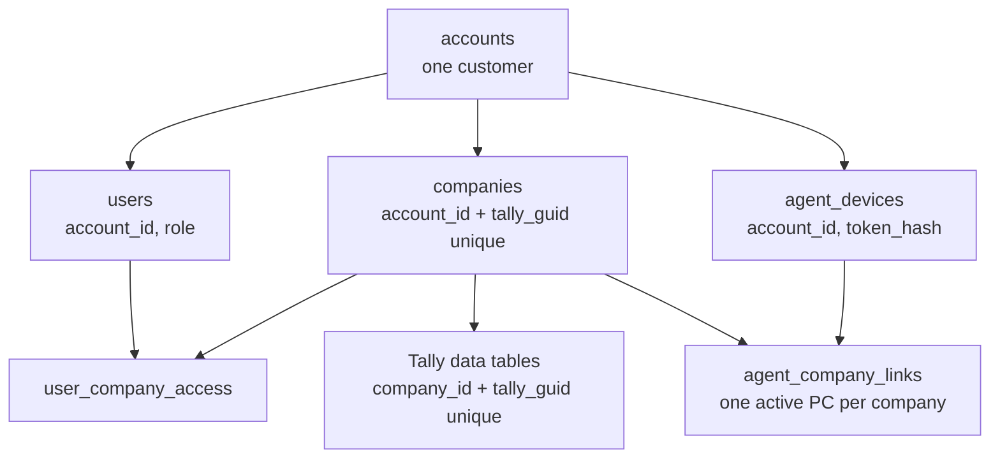

# Multi-Tenant and Multi-Company Working Plan

Last updated: 10 Oct 2026

This is the single document to work from. The steps to run by hand at rollout are in `Multi-Tenant Rollout Runbook.md`. It merges and supersedes:

- `Multi-Company Sync Strategy Livekeeping Benchmark.md` (strategy, UI, agent architecture, first roadmap)
- `Multi-Tenant Design Migration, Onboarding, Isolation.md` (schema, onboarding, migration)

Where the two disagreed or a later decision changed them, this document is right. Changes since those exports are marked **(changed)**.

## 1. Status

All six steps are in PR [Akashkansal065/tally-portal#67](https://github.com/Akashkansal065/tally-portal/pull/67), not merged. A full test round was run on 10 Oct 2026 (section 6). Everything still pending is listed once, in section 7.

| Item | State |
| --- | --- |
| Phase 0: explicit sync company, accounts table, account-scoped Admin | Code complete. Running on the development setup (backend on the Mac, agent on the Windows PC with Tally). |
| Step 1: expand the schema | Code complete. Startup created the tables, columns and indexes on MySQL, on the development database and on an empty one. |
| Step 2: migrate existing data into one account | Run with `--apply` on the development database. Not run on production. |
| Step 3: agent sign-up, device tokens, invitations | Code complete and tested end to end on MySQL. The agent's Setup sign-in was done on a real PC; its Create account window was not. |
| Step 4: multi-company agent, company-owned sales rows | Code complete except chunked full sync. The agent's Companies window has not been used with two companies open in Tally. |
| Step 5: company switcher, last synced, Companies page | Code complete and opened in a browser. Not checked on a phone. |
| Step 6: enforce and harden | Enforcement stage run for real on a throwaway MySQL database, with both switches on afterwards. Not run on the development or production database. Operator role, alerts and the all-routers scoping helper are not built. |
| Tests | Backend 246 passed, agent 34 passed, frontend type-check clean, 63 + 15 end-to-end checks on MySQL passed. |
| Development database today | One account, one company with its Tally GUID, one signed-in PC syncing it. |
| Production | Not deployed. One company, several users, no accounts. |
| Stopgap until Phase 0 is deployed to production | Do not switch company in the web app on the login the agent uses. |

## 2. Decisions

All decided on 10 Oct 2026 unless noted.

| # | Decision |
| --- | --- |
| D1 | Shared tables stay. Data is separated by `company_id`, companies by `account_id`. No database or schema per customer. |
| D2 | Several customers share one server. The `accounts` table is required. |
| D3 | No combined or consolidated view across companies, now or later. |
| D4 | A company is identified by (`account_id`, Tally GUID), never by name. |
| D5 | The same Tally GUID in two accounts is allowed: two separate, isolated companies. The GUID is unique inside an account, not across the service. |
| D6 | Companies are created only by linking from the Desktop Sync Agent. The web "new company" page and `POST /companies` are removed once linking ships. |
| D7 | Sign-up exists only in the agent and creates a new account with its first admin. Everyone else is invited from the web or mobile app. |
| D8 | Sign-in is email or username plus password. **(changed)** Sign-up verifies the email with a 6-digit code sent through the existing Gmail SMTP setup. No SMS OTP in the first release; the phone number is stored unverified. |
| D9 | **(changed)** An account can have several admins (users with the Admin role). Agent sign-up creates the first. There is no separate owner flag. In the production migration, every user who holds the Admin role today stays an admin of the one account. |
| D10 | **(changed)** Agent access is decided by one permission, "Manage sync agent". Being an admin is not enough: only admins who hold that permission can sign in to the agent. The person who signs up in the agent gets it automatically; other admins get it when an admin who has it grants it. |
| D11 | An admin sees only the companies of their own account. No role widens access beyond the account. |
| D12 | Support access is a separate platform-operator role: granted per account, time-limited, audited. Never a standing super-admin. |
| D13 | One agent per PC talking to one Tally port. Several PCs per account. Each company is synced by exactly one PC at a time. The Tally address is stored on each company link so a second port can be added later. |
| D14 | The agent processes companies one at a time, never in parallel against Tally. |
| D15 | Pricing stays open (per user, per company, flat). `accounts` carries `plan`, `max_users`, `max_companies`, `max_devices`; empty means unlimited. |
| D16 | The mobile apps are the Next.js app wrapped with Capacitor, so one switcher implementation serves web and mobile. |
| D17 | Switching company is per device, not per account. |
| D18 | SMS OTP is dropped for now, not just deferred to a provider choice. Revisit only if customers ask. |
| D19 | `Tally_API_Audit_Log.md` is committed to the repository as it is. |
| D20 | Attendance is per account: one record per person per day, visible from every company of the account. The office location's company is shown for reference. |
| D21 | In the production migration every admin gets "Manage sync agent". An admin who holds it can remove it from another admin afterwards. |

Standing project rules that apply throughout: every write and every Tally push is repeat-safe, and deletes that reach Tally confirm the target by content and address it by master id or stored REMOTEID only.

## 3. Target design

### 3.1 Ownership chain



Every row reaches an account through one chain. The two join tables each sit under two parents, and both parents must be in the same account.

### 3.2 Schema

| Table | Status | Key columns | Constraints |
| --- | --- | --- | --- |
| `accounts` | Exists after Phase 0; extend | `account_id`, `name`, `status`, `created_by_user_id`, `plan`, `max_users`, `max_companies`, `max_devices`, `created_at` | **(changed)** no single owner; admins are users with the Admin role |
| `users` | Extend | `account_id`, `email`, `username`, `phone`, `email_verified_at`, `role_id`, `company_id` (last active) | `account_id` not null; `email` unique across the service; at least one active admin per account (checked in code and by the nightly audit) |
| `companies` | Extend | `account_id`, `tally_guid`, `name`, `tally_fingerprint` | `account_id` not null; unique (`account_id`, `tally_guid`); no uniqueness on `name` |
| `user_company_access` | Extend | `user_id`, `company_id` | Unique (`user_id`, `company_id`); user and company share an account |
| `agent_devices` | New | `device_id`, `account_id`, `registered_by_user_id`, `machine_id`, `name`, `token_hash`, `last_seen_at`, `revoked_at` | Unique (`account_id`, `machine_id`); token stored hashed only |
| `agent_company_links` | New | `link_id`, `device_id`, `company_id`, `tally_url`, `linked_at`, `unlinked_at` | One active link per company |
| `company_sync_state` | New | `company_id`, `device_id`, `state`, `last_success_at`, `last_attempt_at`, `last_error`, master and voucher watermarks, pending count | One row per company |
| `user_invites` | New | `invite_id`, `account_id`, `email`, `phone`, `role_id`, `company_ids`, `token_hash`, `expires_at`, `accepted_at`, `invited_by_user_id` | One open invite per (`account_id`, `email`) |
| `signup_verifications` | New **(changed)** | `email`, `code_hash`, `payload` (pending sign-up), `expires_at`, `attempts` | One open row per email; expires in 10 minutes; 5 attempts |
| Tally data tables and their children | Extend | `company_id`, `tally_guid`, `tally_alter_id` | `company_id` not null on every table; unique (`company_id`, `tally_guid`) |
| `sync_queue`, `sync_traffic_log`, `deleted_record_audit` | Keep | `company_id` | Already scoped by company |

Rules:

- `account_id` is copied onto users and companies only. Data tables carry `company_id`; the account is one join away.
- Admin is the Admin role. "Manage sync agent" is a separate permission on top of it.
- An account must always keep at least one active admin, and at least one who holds "Manage sync agent". Removing or deactivating the last of either is refused.
- Composite indexes lead with the tenant key: (`company_id`, `tally_guid`), (`company_id`, `tally_alter_id`), (`account_id`, `tally_guid`).
- Closing an account sets `status = closed` first; a separate audited job removes its data later.

### 3.3 Name collisions

| Case | Outcome |
| --- | --- |
| Same name, different accounts | Two companies. No interaction. |
| Same name, same account, different GUIDs | Two companies. The switcher tells them apart by GSTIN, financial year and city. |
| Same GUID, same account, linked again | The existing company; linking is repeat-safe. |
| Same GUID, different accounts (accountant's copy, shared backup) | Two separate companies, one per account. Neither can detect the other. |
| Same name, same account, GUID changed (restored or re-created in Tally) | Not matched by name. The agent says so and the admin chooses: link as new, or re-point after a fingerprint check. |
| Company renamed in Tally | Same GUID, same company; the name updates on the next sync. |

Defence in depth:

1. Tokens carry the account. A device token also carries its linked company ids. The server never trusts an account or company id from a request body.
2. One scoping helper adds the `company_id` predicate and verifies the company's account. A test fails any router that bypasses it.
3. Fetching by id always includes the company. A wrong-tenant id returns 404, the same as a missing one.
4. Cache keys, background jobs, push notifications, backups and exports each carry a `company_id`.
5. A cross-tenant test suite: two accounts, each with a company named "ABC Corp"; every endpoint is called with the other account's ids and must return 403 or 404.

### 3.4 Agent-first onboarding

Sign-up captures: full name, email (verified by emailed code), username (optional), mobile number (unverified), password, business name, acceptance of terms. The agent adds device name and machine id, and reads the Tally serial number and GSTIN when available.

Sign-up flow:

1. The agent has no stored credential and shows **Create account** and **Sign in**.
2. Create account posts the details to `POST /agent/signup`. The server stores a pending sign-up and emails a 6-digit code through Gmail SMTP.
3. The user enters the code. `POST /agent/signup/verify` runs one transaction: create the account, create the user as its first admin with "Manage sync agent", register the device, issue a device token.
4. The agent stores the device token in the OS credential store and discards the password.
5. The agent lists the companies open in Tally. The admin ticks the ones to link; each becomes a company in the account by GUID.
6. First sync runs. The agent shows a QR code and link to the app.

The verify call is repeat-safe: sent twice with the same code, it returns the same account and device.

| Attempt | Result |
| --- | --- |
| Sign up in the agent with a new email | New account; this user is its first admin and can use the agent |
| Sign up with an email that already exists | Refused: "You already have an account. Sign in." |
| Employee signs up in the agent to join their company | They get a separate, empty account. The screen says "Joining an existing business? Ask your admin for an invite." |
| Any user, admin or not, signs in to the agent | Refused unless they hold "Manage sync agent" |
| Admin adds an employee | Invite created in the app; the user is created with the inviter's `account_id` |
| Admin gives another admin "Manage sync agent" | Allowed only for an admin who holds it, inside the same account, confirmed by password |
| Old `/auth/register`, web "new company" page | Removed once agent sign-up and linking ship |

Other details: an admin with "Manage sync agent" signs in (not up) on a second PC to add a device; devices are listed in the app and can be revoked; password reset goes by email link; invites are single use, expire after 7 days, and carry the role and the companies the user will see.

### 3.5 Agent authentication and sync

The agent authenticates as a device, not as a person.

On every sync call the agent sends the device token and the Tally company GUID. The server loads the device by token hash (401 if revoked or unknown), resolves the GUID inside the device's account (409 if not linked), checks an active link ties this device to that company (403 if not), and runs the handler with that `company_id`.

One cycle:

1. **Discover.** Ask Tally for its open companies with name and GUID.
2. **Match.** Each linked company is open, closed or ambiguous (two open companies share its name).
3. **Push.** For each open company in turn: fetch its queue, verify each payload's GUID, address it to the name Tally shows now, send, read back, acknowledge.
4. **Pull.** For each open company in turn: export changes above that company's own master and voucher watermarks and upload them tagged with its GUID.
5. **Report.** Post state and last-success time for every linked company, closed ones included.

Fairness: pushes for every company come before any pull; a first full sync is cut into voucher date ranges with a resumable cursor and a per-company time slice; a timeout marks that company and the loop moves on; uploads to the cloud may overlap with the next Tally export; the GUI's test buttons share the same lock on the Tally port.

| Endpoint | Caller | Purpose |
| --- | --- | --- |
| `POST /agent/signup`, `/agent/signup/verify` | Agent, no token | Create account, first admin and device |
| `POST /agent/signin` | Agent, no token | Add this PC as a device of an existing account |
| `POST /agent/token/refresh` | Device | Rotate the device token |
| `GET /agent/companies` | Device | Companies of the account and which device each is linked to |
| `POST /agent/companies/link`, `/unlink` | Device | Link or unlink a Tally company by GUID |
| `/sync/outbound-queue`, `/acknowledge`, `/voucher-identities`, `/last-alter-id`, `/inbound` | Device | Existing sync calls, authorised by device and link |
| `POST /sync/state` | Device | Per-company state for "Last synced" |

| Situation | Agent does | User sees |
| --- | --- | --- |
| Device revoked | Stops, clears the token | "This PC was signed out by your admin. Sign in again." |
| Company unlinked in the app | Stops syncing that company only | "ABC Corp is no longer synced from this PC." |
| Company closed in Tally | Skips it, reports "closed" | "Open this company in Tally to sync" |
| Two open companies share a linked name | Pauses both | "Two companies named ABC Corp are open. Close one." |
| Server unreachable | Retries with backoff; writes nothing to Tally | "Cloud offline" |
| Tally timeout on a push | Looks the record up by REMOTEID before resending | Nothing, unless it keeps failing |

### 3.6 App experience

- A persistent company chip in the header with a freshness dot; the only entry point to switching.
- A searchable switcher sheet. Each row shows name, GSTIN or city, financial year and last synced.
- The chosen company is stored per device and sent as `X-Company-ID` on every request.
- A hard reset on switch: cached lists cleared, forms closed, back to the dashboard, with a guard for unsaved input.
- The company name repeated on voucher forms, delete confirmations and share sheets.
- Deep links and notifications carry the company.
- A "My companies" page with a card per company: last synced, pending pushes, open issues, devices.

"Last synced" is the time the agent last completed a full cycle for that company with no errors.

| State | Rule | What the user sees |
| --- | --- | --- |
| Live | Last success under 5 minutes ago | Green dot, "Synced 3 min ago" |
| Syncing | A cycle is running | Spinner, "Syncing vouchers…" |
| Behind | Last success older than 15 minutes, agent online | Amber dot, "Synced 42 min ago" |
| Company closed | Agent online, company not open in Tally | Grey dot, "Open this company in Tally to sync. Last synced today 11:20" |
| Agent offline | No agent heartbeat for 3 minutes | Grey dot, "Sync agent offline since 10:05" |
| Needs attention | Last cycle ended with errors | Red dot, "3 items failed to sync" |

Thresholds are starting values. Data freshness and pending pushes are shown as two separate facts. Reports and ledgers show "Data as of 11:20" whenever the state is not Live.

### 3.7 Sales-side and app-only tables

Evaluated 10 Oct 2026 by reading every table definition and the routers that query them; this had not been looked at before. The Tally mirror and the sync tables carry `company_id`. The field-sales tables do not, and that is the largest gap left in the design.

**Rows that follow the user, not the company.** Six tables have a `user_id` and no `company_id`:

| Table | What it holds | How it is scoped today |
| --- | --- | --- |
| `temp_orders` (and `temp_order_items`) | Orders taken by salespeople | Joined to `users`, filtered on the user's active company |
| `sales_visits` | Shop check-ins | Same |
| `shop_payments` | Payments collected in the field | Same |
| `expenses` | Expense claims | Same |
| `portal_attendance`, `portal_attendance_locations` | Attendance and location trail | Same |

The filter is `User.company_id == current_user.company_id`: "rows whose owner currently has the same active company as me". The row itself does not record which company it was made for. With one company in production this is harmless. With two it breaks in three ways:

- **History moves when a user switches.** A salesperson with access to companies A and B takes an order in A, then switches to B. `users.company_id` is now B, so that order appears in B's lists and vanishes from A's.
- **Per-device switching (D17) makes it inconsistent.** `X-Company-ID` re-targets only the caller for one request; the joined owner rows still carry their stored active company. Two people looking at the same list from different companies can each see part of it.
- **Orders, visits and payments point at a ledger.** The ledger belongs to one company, so the true company of the row is knowable; it is just not what the query uses. Expenses and attendance have no such link at all.

Fix: add `company_id` to all six tables, set at creation from the caller's company for that request, and scope every query on the row's own `company_id`. Attendance is the exception (D20): it is per account, so `portal_attendance` and `portal_attendance_locations` get `account_id` instead and are scoped on that.

**Tables shared by every customer on the server.**

| Table | Problem | Fix |
| --- | --- | --- |
| `roles` (name unique across the server), `permissions` | Any admin can create, edit or delete roles and change their permissions through `/admin/roles`. One customer editing "Salesman" changes it for every customer. | Add `account_id` to `roles`; unique (`account_id`, `name`); seed the default roles per account at sign-up; keep the built-in set as read-only templates |
| `app_settings` (key, value) | One global key/value store; a setting changed by one customer applies to all | Split into platform settings (operator only) and per-account settings |
| `modules`, `currencies`, `gst_registration_types`, `pincode_cities`, `bank_transaction_types` | Reference data, the same for everyone | Leave shared; make them read-only to customers |

**Child tables with no company of their own.** About 40 tables in the Tally mirror and 15 in the portal database reach a company only through a parent (voucher entries, stock entries, bill allocations, order items, payslips, GSTR line items). That is safe as long as the parent is always checked. The earlier plan to add `company_id` to "child tables" applies to the ones that are queried directly; the inventory in Step 1 decides which.

**Eleven Tally-side tables with neither a company nor a parent** (`trn_employee`, `trn_payhead`, `trn_attendance`, `trn_cost_centre`, `mst_gst_effective_rate` and similar). They look like leftovers from an earlier import design. Step 1 confirms whether anything still reads or writes them; if so they need `company_id`, if not they are dropped.

**Per-user tables that are fine as they are:** `user_sessions`, `device_push_tokens`, `notification_preferences`, `user_permission_overrides`, `user_data_scopes`. They belong to a person, and a person belongs to one account.

## 4. Work plan

One sequence, replacing the earlier Phases 0 to 4 and migration Stages A to D. Each step ends in a gate.

### Step 0: Ship Phase 0

- [x] Agent sends `X-Tally-Company-GUID`; refuses payloads for another company or with no company
- [x] Sync endpoints use the named company; importer resolves by GUID
- [x] `accounts` table, `account_id` on companies and users, account-scoped Admin
- [x] Web app sends `X-Company-ID` on every request
- [x] Pull request opened (tally-portal#67)
- [ ] Review and merge the pull request
- [ ] Back up both databases and record row counts per table
- [ ] Deploy the backend, then the agent (done on the development setup, 10 Oct 2026; production not yet)
- [ ] Check on the real setup: two companies open in Tally, switch company in the web app while the agent runs

**Gate:** switching company in the web app changes nothing the agent receives.

### Step 1: Expand the schema (no behaviour change)

Code complete on the Phase 0 branch, in the same pull request. Nothing below has run against production yet.

- [x] Indexes for the owner columns, created at startup through `ensure_table_indexes` (the `index=True` flags Phase 0 used are not built on existing tables)
- [x] `accounts`: `status`, `created_by_user_id`, `plan`, `max_users`, `max_companies`, `max_devices`
- [x] `users`: `phone`, `email_verified_at`
- [x] `companies`: `tally_fingerprint`; index on (`account_id`, `tally_guid`)
- [x] New tables: `agent_devices`, `agent_company_links`, `company_sync_state`, `user_invites`, `signup_verifications`
- [x] `company_id` on `temp_orders`, `sales_visits`, `shop_payments`, `expenses`; `account_id` on `portal_attendance`, `portal_attendance_locations` (nullable, not read yet)
- [x] `account_id` on `roles` (nullable, not read yet)
- [x] Child tables: none needs its own `company_id` now. The two that are queried directly, `trn_attendance` and `trn_payhead`, are always reached through their voucher.
- [x] The parentless Tally-side tables: eleven are not read or written by any code (listed in `app/services/tenant_inventory.py`); the inventory reports their row counts so they can be dropped if empty
- [x] Read-only ownership inventory (`app/services/tenant_inventory.py`), shown by the Step 2 script
- [ ] Deploy, so startup creates the new tables, columns and indexes (done on the development MySQL; production not yet)

The foreign keys and the inventory are no longer separate scripts: both are part of the one Step 2 script.

Two details of the new tables: "one active link per company" and "one open invite per email" are enforced with a flag that is true on the current row and empty on ended ones, because MySQL has no partial unique index.

**Gate:** startup runs clean on a copy of production; the old code paths behave as before.

### Step 2: Migrate production into one account

One script does the whole step: `backend/scripts/migrate_to_account.py`. It connects with the database settings in `backend/.env` (the ones the backend already runs on), creates no user and deletes nothing. Code complete; not yet run on production.

```
python scripts/migrate_to_account.py            # shows what is there and what would change; saves nothing
python scripts/migrate_to_account.py --apply    # does it
```

What `--apply` does, in order:

- [x] Creates one account, named after the first company (or `--name "..."`)
- [x] Sets `account_id` on every company, user and role
- [x] Keeps every Admin-role user as an admin and gives each "Manage sync agent" (D9, D21), recorded as a permission on a new `sync_agent` module
- [x] Sets `company_id` on orders, visits and shop payments from their ledger, and on expenses and ledger-less rows from their owner's company
- [x] Sets `account_id` on attendance and its location trail
- [x] Checks that no company, user, role or field-sales row is left without an owner; if any is, nothing is saved
- [x] Adds the foreign keys for the new owner columns (MySQL only; a column holding a value its parent lacks is reported and skipped)
- [x] Lists what is still open for later steps: companies with no Tally GUID, duplicate (`company_id`, `tally_guid`) rows

Without `--apply` it runs the same changes in a transaction and rolls them back, so the numbers it prints are exactly what `--apply` would do. Running it twice is safe: rows that already carry the account are left alone. It refuses to run if more than one account already exists, or if no active admin exists.

Left out on purpose:

- **Duplicate rows are reported, not merged.** Merging means deleting rows, and deletes in this app can reach Tally. That needs a look at the real duplicates first; it blocks only the unique keys in Step 6.
- **The agent's device row is created in Step 3,** when the agent signs in and sends its machine id. With one PC there is nothing to save by guessing it now.
- **The company's Tally GUID is filled in by the first link,** not by this script. A company from before accounts has no GUID; when a PC first links a Tally company of the same name, the server gives that company the GUID instead of making a second one (**changed** 10 Oct 2026, after the test round found it making a second one). This is the one place a name decides anything, and only for a company that has no GUID.

To do on production:

- [ ] Run without `--apply` and read the output (done on the development database; production not yet)
- [ ] Run with `--apply` (done on the development database; production not yet)
- [ ] If a company shows no Tally GUID, run one full sync from the agent

**Gate:** the script reports every row owned and the foreign keys added.

### Step 3: Agent-first onboarding and device tokens

Code complete, in the Phase 0 pull request. Backend and agent logic are tested; the agent's new screens and the web pages are type-checked or compiled but have not been opened and clicked through.

- [x] Backend: `/agent/signup` and `/agent/signup/verify` with the emailed code
- [x] Backend: `/agent/signin`, `/agent/token/refresh`, device-token authentication for the sync endpoints
- [x] Backend: `/agent/companies`, `/agent/companies/link`, `/unlink`
- [x] Backend: invitations (`/admin/invites`, `/auth/invites/{token}`, `/auth/invites/accept`)
- [x] Backend: "Manage sync agent" access (`/admin/sync-agent-access`, `/admin/users/{id}/sync-agent`) and synced PCs (`/admin/agent-devices`, revoke)
- [x] Agent: signs in as this PC from the Setup screen, stores a device token, keeps no password
- [x] Agent: links its company on connect, and asks before taking a company over from another PC
- [x] Agent: "Create an account" dialog (details, emailed code, first company from Tally)
- [x] App: accept-invite page (`/accept-invite`)
- [x] App: Admin → "Sync agent & team" tab: synced PCs with sign-out, who may use the agent, invitations
- [x] Old agents keep working: a person's login with the GUID header is still accepted
- [x] Web pages opened in a browser: accept-invite and Admin → Sync agent & team (invite, link shown, accept, sign in as the invited person)
- [x] Agent Setup sign-in on a Windows PC with Tally (done by Akash)
- [ ] Agent "Create an account" window on a Windows PC: not opened yet

How it differs from the design in section 3:

- **The first company is linked as part of sign-up,** not after it. Every user must have a company to be in, so the account, its admin, this PC and the first company are created together when the code is confirmed. More companies are linked afterwards.
- **A device token only works on the sync and agent endpoints.** Used anywhere else it is refused, so a token taken from a PC cannot browse the app.
- **A signed-in PC must name its company on every sync call** and may only name one linked to it. A company moved to another PC is refused on the first PC at once.
- **A linked company is not seeded with default groups and voucher types.** Its masters arrive from Tally on the first sync.
- **The Companies screen (several companies, link and unlink in a list) is part of Step 4.** Until then the agent links the one company chosen in Setup.

**Gate:** a new customer can sign up in the agent, link a company and sign in to the app without touching the database; an invited user cannot sign in to the agent.

### Step 4: Multi-company agent

Code complete except one item, in the Phase 0 pull request. Backend and agent logic are tested; the new Companies window has not been opened and clicked through.

- [x] Agent config holds a `companies` list; an agent that has only ever had one company keeps working from its existing pin, and the list starts when a company is linked
- [x] Retry floors keyed by GUID (an existing name-keyed floor is moved to its GUID on first use)
- [x] Per-cycle resolver: each linked company is open, closed or ambiguous; followed by GUID, so a rename in Tally is picked up
- [x] Cycle: resolve, push each open company, pull each open company, report state. One company at a time; one company failing does not stop the others
- [x] `POST /sync/state` writes `company_sync_state`; `last_success_at` moves only on a clean cycle
- [x] Agent: Companies window on the dashboard: linked companies with their state, open Tally companies to link, unlink, and "move sync to this PC"
- [x] Field-sales rows record their company when created (orders, visits, shop payments, expenses), attendance its account; lists filter on the row's own company or account
- [x] Agent tests: two open companies, a closed one, two with the same name, all closed, independent watermarks and retry points, a rename, link and unlink
- [ ] **Not done: full sync cut into voucher date ranges with a resumable cursor.** See below.
- [ ] Click through the Companies window on a Windows PC with two companies open in Tally

Found and fixed on the way:

- **The admin list of shop payments showed every company's payments on the server,** and its approve/reject endpoint accepted any payment id. Both are now limited to the caller's company.

Decisions made while building:

- **Rows from before the new columns keep the old rule.** A field-sales row with no company yet is still listed by its owner's active company, so nothing changes for existing data until Step 2 fills the column.
- **When Tally does not say what is open, the cycle still runs,** as it did before. Nothing can be written to a Tally that is not answering, and the cloud is still asked, which is how a PC learns it was signed out.
- **Two open companies with the same name stop both from syncing.** Tally can only be addressed by name, so the agent cannot be sure which one a write would reach.

Why chunked full sync is not done: it depends on Tally applying the `SVFROMDATE` / `SVTODATE` range to a voucher collection export. The agent sends one range today (2000 to 2099) and nothing in the code or the audit log shows a narrower range being honoured. If Tally ignores it, cutting a full sync into 20 ranges would export every voucher 20 times. It needs one check against real Tally first: export vouchers for a single month and confirm only that month comes back. Until then a first sync of a large company still runs as one export, and the other companies wait for it.

**Gate:** two companies open in Tally sync for a day with independent watermarks; closing one pauses only that one; a voucher pushed for A never appears in B.

### Step 5: App experience

Code complete, in the Phase 0 pull request. The backend is tested and the web code type-checks with no new lint errors; none of the screens has been opened in a browser.

- [x] `GET /companies/sync-status`: for each company the caller can open, freshness, last synced, whether the agent is online, the last error, which PC syncs it, and entries waiting to reach Tally
- [x] `/sync/health` also returns `freshness`, `last_synced_at`, `agent_online`
- [x] Header chip shows a freshness dot beside the company name
- [x] Switcher sheet: each company with GSTIN, city and financial year to tell look-alikes apart (two same-named companies with none of these filled in look identical; section 7), its last-synced sentence and pending entries; a search box when there are more than five
- [x] Company chosen per device: kept on the device and sent as `X-Company-ID`; switching no longer changes the account-wide setting
- [x] Clean restart on switch: the app reloads at the home screen, so nothing of the previous company stays in memory; it asks first if a form is open
- [x] "Companies" page (`/companies`), in the menu: a card per company with its status, the last error when it needs attention, and which PC syncs it
- [x] "Data as of" line on Reports and on a ledger's statement, shown only when the company is not freshly synced
- [x] Company name under the title of the voucher form
- [x] Opened in a desktop browser: header dot, switcher, switching and reload, Companies page
- [ ] Not checked: a phone, the "Data as of" line, the company name on the voucher form
- [ ] Company name on delete confirmations and share sheets (not done: there are many, each with its own dialog)
- [ ] Deep links that carry the company and switch to it with a notice (not done)

How freshness is decided (`backend/app/services/sync_status.py`):

| Shown as | When |
| --- | --- |
| Live (green) | The agent reported in the last 3 minutes and a clean cycle finished in the last 15 |
| Behind (amber) | The agent is reporting, but no clean cycle for more than 15 minutes |
| Company closed (grey) | The agent is reporting and says the company is not open in Tally |
| Agent offline (grey) | No report from the agent for more than 3 minutes |
| Needs attention (red) | The last cycle failed, or two open companies share the company's name |
| Not connected (grey) | No agent has ever reported for the company |

Differences from the design in section 3.6:

- **No "Syncing…" state.** The agent reports once per cycle, after it finishes, so the app cannot tell a cycle is in progress.
- **"Live" covers up to 15 minutes,** not 5. The design left 5 to 15 minutes undefined; with a one-minute cycle, 15 minutes without a clean one is the first sign of trouble.
- **`/auth/me/active-company` is unchanged but the app no longer calls it to switch.** It still sets which company a person lands in on a device that has not chosen one.
- **The "+ New company" button in the switcher is replaced by "All companies".** The old page is still there until Step 6 removes it.

**Gate:** a tester with three companies can say which one they are in and how fresh it is from any screen, and switching never shows the previous company's data.

### Step 6: Enforce and harden

Mostly code complete, in the Phase 0 pull request. The enforcement stage ran cleanly on a throwaway MySQL database (37 changes, then every line `ok` on a second run), and the database then refused each kind of bad row it is meant to. Anything that would lock out existing data is behind a switch that is off until you turn it on.

Done:

- [x] **Imports never choose a company by name.** `/sync/inbound` settles the company itself: a signed-in PC's linked company, the company named by GUID, or the company the person is working in. Server-side imports no longer create companies.
- [x] **Roles per account.** Each account has its own Admin and Sales roles, created at sign-up, plus whatever it adds; role names are unique inside an account. Listing, creating, renaming, deleting and assigning roles all stay inside the caller's account.
- [x] **Settings per account.** Monthly sales target and default credit days are stored per account; the migration script copies the existing values to the one account.
- [x] **The server's own Tally connection can be limited to one company.** With `TALLY_URL_COMPANY_GUID` set, direct pushes to `TALLY_URL` are made for that company only; every other company's changes wait for its own agent.
- [x] **Web registration and web company creation are removed.** `/auth/register`, `/auth/register-company` and `POST /companies` answer "gone" with where to go instead; the Register Company button and the new-company page are removed; the login page says how to start or join.
- [x] **Plan limits** on users (invite and accept), companies (link) and PCs (sign-in). All empty today, meaning unlimited.
- [x] **Enforcement stage in the migration script** (`--enforce`): empty GUIDs stored as none, role names unique per account, companies unique by (account, GUID), nine Tally tables unique by (company, GUID), and the owner columns made required. It refuses to start while any row lacks an owner, and skips any key that still has duplicates.
- [x] **`ACCOUNTS_ENFORCED` switch.** Off: rows with no account still see each other, as on a one-customer server. On: a user with no account reaches only their own company.
- [x] **`REQUIRE_AGENT_DEVICE_SIGNIN` switch.** On: a sync agent still using a person's email and password is refused with a message to update and sign in.

Not done, and why:

- [ ] **One scoping helper used by every router.** That is a rewrite of the queries in about 30 routers; too large and too risky to do blind in the same change. The isolation tests added in Phases 0 to 6 cover accounts, roles, settings, sync, invitations, sync status and field-sales rows, not every endpoint.
- [ ] **Platform-operator role** (D12). Needs its own design: how operators are created, where a customer grants access, what an operator may do. Until it exists nobody can see across accounts at all, which is the safe default.
- [ ] **Alerts** for unlinked companies, refused cross-account requests and a company not synced for a day. The first two are written to the server log; none raises a notification yet.
- [x] **Leftover screens' code removed** (10 Oct 2026): the first-time setup form on the login page and the Register Company dialog on the Admin page.
- [ ] **Merging duplicate Tally records.** The enforcement stage reports and skips them; merging needs a look at the real rows.

Two findings from this step:

- **The server's direct Tally connection was shared by every company.** `TALLY_URL` is one Tally, used for realtime pushes for whichever company a request was for. With a second customer on the server, their vouchers would be sent to the first customer's Tally and would land in its books if a company of the same name were open. `TALLY_URL_COMPANY_GUID` closes this; set it before a second customer is onboarded, or remove `TALLY_URL`.
- **Not every table with a GUID can have it made unique.** A bill repeats its voucher's GUID and the deletion audit can name one record twice, so the unique keys are limited to nine tables named one by one.

**Gate:** the isolation tests pass with `ACCOUNTS_ENFORCED` on, the enforcement stage reports every key unique and every owner required, and an agent on a person's login is refused with a clear message.

### Rollback

| Step | How to undo |
| --- | --- |
| 1 | Nothing to undo: nullable columns and empty tables are ignored by the old code |
| 2 | Clear `account_id` and the new `company_id` columns, empty the new tables, restore deleted orphans and duplicates from the exported files |
| 3 to 5 | Feature releases; the previous agent and app keep working during the overlap release |
| 6 | Turn `ACCOUNTS_ENFORCED` and `REQUIRE_AGENT_DEVICE_SIGNIN` off again and restart. The unique keys and required columns stay; they only refuse data the application no longer writes. Dropping them is a manual `ALTER TABLE`. |

## 5. Risks

| Risk | Effect | Mitigation |
| --- | --- | --- |
| A copied or restored company carries the same GUID as its original inside one account | Two data sets merge into one company | Record a second fingerprint on link (books-from date, company number) and pause on mismatch. Needs a test with a real restored copy. |
| A company must be open in Tally to sync | Rarely opened companies go stale | The "Company closed" state says so; no remote opening in the first release |
| Existing rows violate the new unique keys | Step 6 constraints fail | Step 1 inventory and Step 2 duplicate resolution come first |
| A full sync of a large company monopolises Tally | Operator's Tally freezes; other companies wait | Date-range chunks and time slices; first sync outside working hours |
| Old agents in the field | They keep using the implicit company | One release of compatibility with a warning, then refuse |
| Two PCs link the same company | Competing watermarks and double pushes | One active link per company; a second link asks to take over |
| Sales-side rows are scoped by the owner's active company, not the row's (section 3.7) | Orders, visits, expenses and attendance jump between companies when a user switches | `company_id` on the rows and in every query, before any account links a second company |
| Roles and app settings are shared by every customer | One customer's change affects all | Roles and settings per account, before a second customer is onboarded |
| Gmail SMTP sending limits or spam filtering | Sign-up codes arrive late or not at all | Resend button, 10-minute expiry, and a provider interface so the sender can be swapped |
| Several admins | Any of them can invite users or change roles; those with "Manage sync agent" can also revoke devices | Admin actions are written to the audit log; the last admin, and the last holder of "Manage sync agent", cannot be removed |

## 6. Test round, 10 Oct 2026

What was run:

| Check | How | Result |
| --- | --- | --- |
| Backend tests | `pytest`, SQLite | 246 passed |
| Agent tests | `pytest tests` | 34 passed |
| Web app | Type-check, and lint on changed lines | Clean |
| Requirements files | Clean install of each, then the tests | Passed |
| Whole flow on MySQL | A second backend on a throwaway MySQL 8 container, driven over HTTP: migration, PC sign-in, linking, take-over, unlink, token refresh, who may use the agent, invitations, a second and third customer, signing a PC out | 63 checks passed |
| Enforcement on MySQL | `--enforce --apply` on that database, backend restarted with both switches on | 15 checks passed, including the database refusing a company or user with no account, a second company with the same GUID, a duplicate Tally record and a second active link |
| Brand-new server | Empty database, two customers signing up from the agent, then enforcement | Passed after the fix below |
| Web screens | A copy of the web app pointed at the throwaway backend, opened in a browser | Passed after the fixes below |
| Real setup | Agent built on Windows, signed in, syncing a real Tally company into the development database (done by Akash) | Syncing; the duplicate company it made was repaired (section 7) |

Bugs found and fixed in this round:

| # | Problem | Effect | Fix |
| --- | --- | --- | --- |
| 1 | Signing a PC in made a second company when the existing one had no Tally GUID | Two companies with the same name; the old one keeps the users, orders and waiting pushes, the new one gets the sync | The first link takes over the account's GUID-less company of the same name (`backend/app/routers/agent.py`). Two tests added. |
| 2 | An admin already signed in could not open a newly linked company for up to five minutes | The switcher listed it, but choosing it put them back in the old company | Linking forgets the cached list of companies for the account's users. One test added. |
| 3 | **Switching company never stuck.** On page load the app asked "who am I" before the code that attaches the chosen company was switched on | Every reload put the device back in the person's default company | The first request names the device's company itself, and the interceptor is installed before it (`AuthContext.tsx`) |
| 4 | A brand-new server seeded two roles that belonged to no account | The enforcement stage refused to start, with no way to fix it | Roles are no longer seeded at startup; each account gets its own when it is created |
| 5 | An invitation link opened on a device where someone is signed in went to the home page | The invited person could not accept on a shared device, or the admin could not check the link | The invitation page opens when signed in, says who is signed in, and signs them out when the new person goes on to sign in |
| 6 | "The email could not be sent. You can also pass this link on yourself." | Wording only | Reworded |
| 7 | Windows build: Python without tkinter, ARM64 Python, Python without pip, the wrong Python first on PATH | The `.exe` could not be built, or was built but could not open | `build_windows_exe.bat` picks a suitable Python, offers to install one, and explains each failure |
| 8 | `tzdata` missing from the backend requirements | The backend and its scripts did not start on Windows | Added. Both requirements files now list only what is imported. |

Checked and found correct (no change needed): a device token is refused outside the sync endpoints; a second PC is refused for a company synced elsewhere until it takes over; the same Tally GUID and company name in two accounts stay two companies; one customer cannot list, open, re-target into, or administer another's companies, roles, PCs or admins; an import repeated makes no duplicate; an old agent on a person's login is refused once `REQUIRE_AGENT_DEVICE_SIGNIN` is on (it is recognised by the `X-Client-Type: sync-agent` header it sends).

## 7. Still pending

Ordered by what blocks what. Each line says who has to act.

### Before anything else

- [x] **Development database repaired (10 Oct 2026).** The first PC sign-in, before fix 1, had made a second "Bhrama Enterprises" (#4) beside the original (#1). The original was given the Tally GUID, the PC's link and the sync state, and #4 was deleted with its copied rows (53 ledgers, 19 items, 44 vouchers and the masters under them). The original's rows were counted before and after and did not change. The agent's next cycle reported into the original, and the migration script now lists one company with nothing left to deal with. Production is not affected: fix 1 is in before production's first sign-in.
- [ ] **Commit and push this round's fixes** to the pull request. Owner: Akash to say.

### Rollout (owner: Akash, follow the runbook)

- [ ] Review and merge the pull request
- [ ] Back up both production databases
- [ ] Production `backend/.env`: `SMTP_USER` / `SMTP_PASS`, `APP_PUBLIC_URL`, and `TALLY_URL_COMPANY_GUID` if `TALLY_URL` stays set. The development `.env` has `TALLY_URL` set and no `TALLY_URL_COMPANY_GUID`: harmless with one customer, wrong with two.
- [ ] Deploy backend, run the migration script, deploy the web app, deploy the agent, sign the PC in
- [ ] A week or more later: `--enforce --apply`, then `ACCOUNTS_ENFORCED=true` and `REQUIRE_AGENT_DEVICE_SIGNIN=true`

### Not yet checked by hand

- [ ] Agent "Create an account" window on a Windows PC (the emailed code, real Gmail delivery)
- [ ] Agent Companies window with two companies open in Tally: link, unlink, move to this PC, same-name refusal
- [ ] A voucher created in the app reaching the right Tally company, and a Tally change appearing in the app, with two companies linked
- [ ] The web screens on a phone; the "Data as of" line; the company name on the voucher form
- [ ] The new `build_windows_exe.bat` on a PC with no Python at all (its offer to install one)
- [ ] Livekeeping trial walkthrough: their switcher and last-synced screens were not seen directly

### Not built

- [ ] **Chunked full sync** with a resumable cursor. Blocked on one check against real Tally: export vouchers for a single month and confirm only that month comes back (Step 4).
- [ ] **Platform-operator role** (D12). Needs its own design.
- [ ] **Alerts** for unlinked companies, refused cross-account requests and a company not synced for a day.
- [ ] **One scoping helper used by every router** (about 30 routers).
- [ ] **Merging duplicate Tally records.** The enforcement stage reports and skips them. None exist on the development database.
- [ ] **Company name on delete confirmations and share sheets.**
- [ ] **Deep links that carry the company** and switch to it with a notice.
- [ ] **Telling two same-named companies apart when neither has a GSTIN, city or financial year filled in.** The switcher and the Companies page show them identically. Showing the books-from date or which PC syncs each would do.
- [ ] **The agent's state report carries no watermarks or waiting count,** and no fingerprint is recorded on link. The columns exist (`company_sync_state.master_alter_id`, `voucher_alter_id`, `pending_count`; `companies.tally_fingerprint`) and stay empty. Nothing shown to users depends on them; the restored-copy risk in section 5 does depend on the fingerprint.

### Found in this round, not part of the multi-tenant work

- [ ] **The Tally database name is written into 101 queries** in `backend/app/routers/reports.py` and `ledgers.py` as `tally_sync.`. A server whose `TALLY_DATABASE_NAME` is anything else gets errors on the dashboard and ledger reports. Development and production both use `tally_sync`, so nothing is broken today.
- [ ] **Times are stored two ways.** The sync columns (`last_seen_at`, `last_success_at`) are UTC; database-default columns (`linked_at`, `updated_at`) are the database server's local time. Everything shown to users reads the UTC ones. Worth making uniform before anything displays the others.

### To decide

- [ ] **The home page's monthly sales target adds up every company of the account** ("· all companies"), which is the combined view D3 says not to have. It was built before D3 and stays inside the account, so nothing leaks. Keep it as the one exception, or make it per company? Owner: Akash.

Closed on 10 Oct 2026: admin and agent access (D9, D10, D21), SMS OTP (D18), the audit log (D19), attendance (D20), the leftover screens' code.

## 8. Sources

- [Livekeeping website](https://www.livekeeping.com/), home page, read 10 Oct 2026
- [How to Set Up LiveKeeping Data Connector for Tally on mobile](https://www.youtube.com/watch?v=vxHrjts289E), title, description and chapters only
- OTP pricing: [Authgear comparison](https://www.authgear.com/post/best-otp-service-providers/), [Fast2SMS](https://www.fast2sms.com/otp), [Twilio trial](https://www.twilio.com/docs/usage/trials)
- MyTally code: `backend/app/routers/sync.py`, `backend/app/core/permissions.py`, `backend/app/services/tally_xml_importer.py`, `backend/app/models/`, `desktop-sync-agent/`, `frontend-nextjs/src/`
