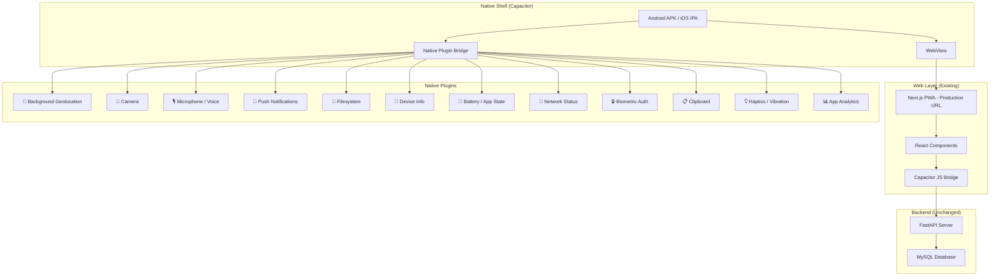
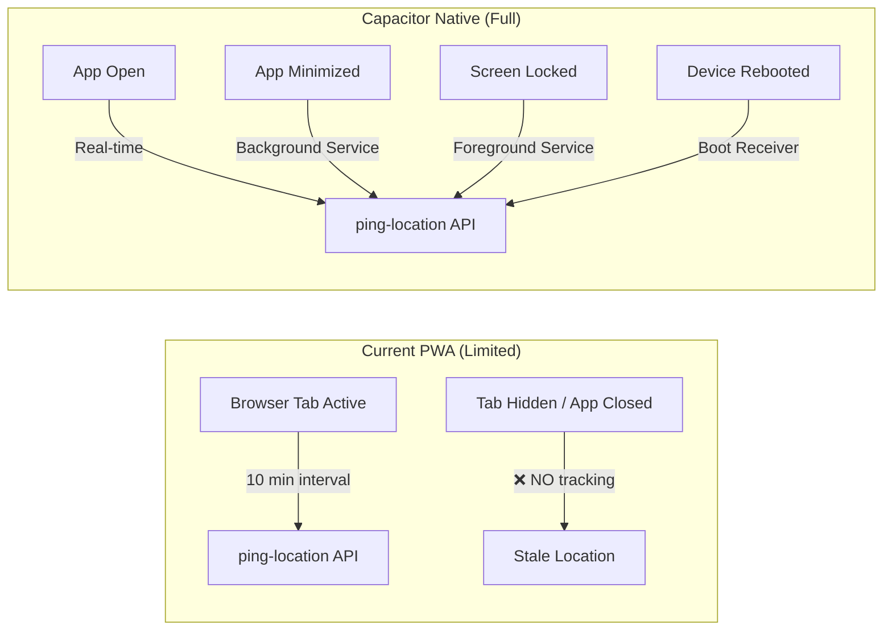
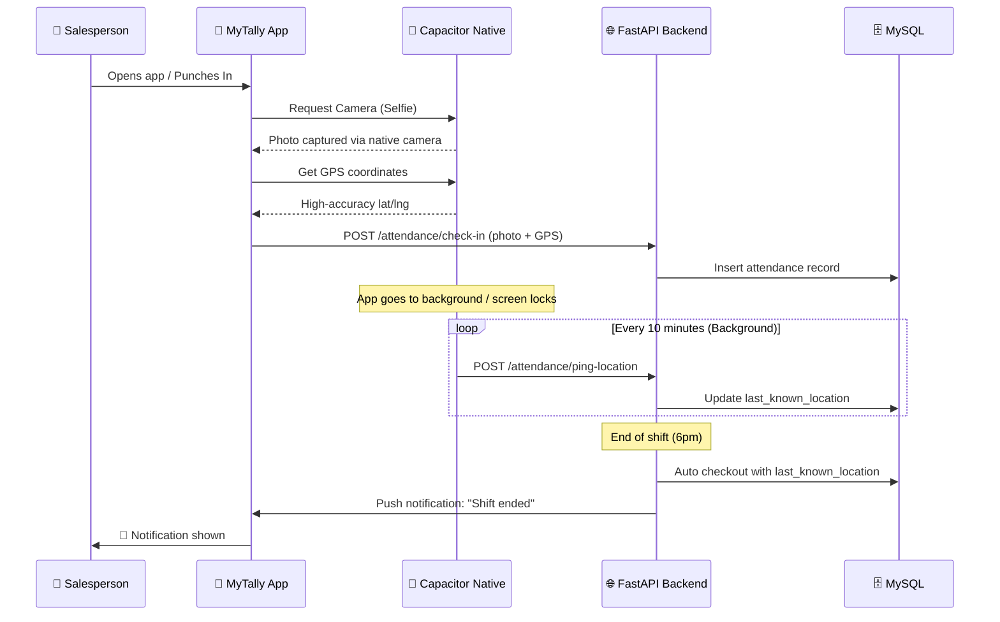

# 🚀 MyTally — Capacitor Native App Migration Plan

> **Goal:** Wrap the existing Next.js PWA (`frontend-nextjs`) inside a native Android/iOS shell using **Capacitor 7**, enabling true native permissions and background capabilities that browsers cannot provide.

---

## 📐 Architecture Overview



---

## 📋 Phase Breakdown

| Phase | Description | Effort |
|-------|-------------|--------|
| **Phase 1** | Project Scaffolding & Capacitor Init | ~2 hours |
| **Phase 2** | Android Permissions & Manifest | ~1 hour |
| **Phase 3** | iOS Permissions & Info.plist | ~1 hour |
| **Phase 4** | Native Plugin Integration | ~4 hours |
| **Phase 5** | Background Geolocation (Critical) | ~3 hours |
| **Phase 6** | Capacitor Bridge Layer in Frontend | ~3 hours |
| **Phase 7** | Build, Sign & Deploy | ~2 hours |
| **Total** | | **~16 hours** |

---

## 🔧 Phase 1: Project Scaffolding

### 1.1 Co-located Architecture in `frontend-nextjs` (Recommended)

Installing Capacitor directly inside `frontend-nextjs` is the standard and most streamlined architecture:
- **Direct Imports:** Next.js components (`AttendanceLocationTracker.tsx`, camera triggers, etc.) can directly import `@capacitor/core` and plugins without symlinks or monorepo tools.
- **Unified TypeScript:** Full type-checking works immediately in the existing Next.js build.
- **Single Source of Truth:** One `package.json`, one node_modules, one git repository subfolder.

```
MyTally/
├── backend/                    # Existing FastAPI
└── frontend-nextjs/            # Next.js App + Capacitor Native
    ├── capacitor.config.ts     # ← Capacitor configuration
    ├── package.json            # Contains both Next.js & @capacitor/*
    ├── android/                # Auto-generated native Android project
    ├── ios/                    # Auto-generated native iOS project
    ├── src/
    │   ├── components/         # AttendanceLocationTracker, etc.
    │   └── lib/                # capacitor.ts bridge & bg-geo helpers
    └── public/
```

### 1.2 Install Capacitor Dependencies

```bash
cd frontend-nextjs

# Core Capacitor and Android platform
npm install @capacitor/core @capacitor/cli @capacitor/android @capacitor/ios

# Initialize Capacitor project
npx cap init MyTally com.snehdistributors.mytally --web-dir=public
```

### 1.3 Capacitor Config (`capacitor.config.ts`)

```typescript
import type { CapacitorConfig } from '@capacitor/cli';

const config: CapacitorConfig = {
  appId: 'com.snehdistributors.mytally',
  appName: 'MyTally',
  
  // KEY: Load the production web app URL directly (no local build needed)
  server: {
    url: 'https://your-production-url.vercel.app',
    cleartext: true,               // Allow HTTP for dev
    allowNavigation: ['*'],        // Allow all navigation
  },

  // Android-specific
  android: {
    allowMixedContent: true,
    captureInput: true,
    webContentsDebuggingEnabled: true, // Disable in production
    backgroundColor: '#0f172a',
    buildOptions: {
      keystorePath: undefined,     // Set during release signing
      keystoreAlias: undefined,
    },
  },

  // iOS-specific
  ios: {
    contentInset: 'automatic',
    backgroundColor: '#0f172a',
    scheme: 'MyTally',
    preferredContentMode: 'mobile',
  },

  // Plugin configs
  plugins: {
    PushNotifications: {
      presentationOptions: ['badge', 'sound', 'alert'],
    },
    SplashScreen: {
      launchShowDuration: 2000,
      backgroundColor: '#0f172a',
      androidScaleType: 'CENTER_CROP',
      showSpinner: true,
      spinnerColor: '#10b981',
    },
    Keyboard: {
      resize: 'body',
      resizeOnFullScreen: true,
    },
  },
};

export default config;
```

### 1.4 Add Native Platforms

```bash
npx cap add android
npx cap add ios
```

---

## 🤖 Phase 2: Android Permissions & Manifest

### 2.1 Complete Permission List (`AndroidManifest.xml`)

Every possible permission MyTally could ever need:

```xml
<manifest xmlns:android="http://schemas.android.com/apk/res/android"
    package="com.snehdistributors.mytally">

    <!-- ═══════════════════════════════════════════ -->
    <!--  📍 LOCATION (Critical for Attendance)      -->
    <!-- ═══════════════════════════════════════════ -->
    <uses-permission android:name="android.permission.ACCESS_FINE_LOCATION" />
    <uses-permission android:name="android.permission.ACCESS_COARSE_LOCATION" />
    <uses-permission android:name="android.permission.ACCESS_BACKGROUND_LOCATION" />

    <!-- ═══════════════════════════════════════════ -->
    <!--  📸 CAMERA (Selfie Punch, Shop Photos)      -->
    <!-- ═══════════════════════════════════════════ -->
    <uses-permission android:name="android.permission.CAMERA" />
    <uses-feature android:name="android.hardware.camera" android:required="false" />
    <uses-feature android:name="android.hardware.camera.autofocus" android:required="false" />
    <uses-feature android:name="android.hardware.camera.front" android:required="false" />

    <!-- ═══════════════════════════════════════════ -->
    <!--  🎙️ MICROPHONE / VOICE RECORDING            -->
    <!-- ═══════════════════════════════════════════ -->
    <uses-permission android:name="android.permission.RECORD_AUDIO" />
    <uses-permission android:name="android.permission.MODIFY_AUDIO_SETTINGS" />

    <!-- ═══════════════════════════════════════════ -->
    <!--  📁 STORAGE & FILE ACCESS                   -->
    <!-- ═══════════════════════════════════════════ -->
    <uses-permission android:name="android.permission.READ_EXTERNAL_STORAGE" 
        android:maxSdkVersion="32" />
    <uses-permission android:name="android.permission.WRITE_EXTERNAL_STORAGE" 
        android:maxSdkVersion="29" />
    <uses-permission android:name="android.permission.READ_MEDIA_IMAGES" />  <!-- API 33+ -->
    <uses-permission android:name="android.permission.READ_MEDIA_VIDEO" />   <!-- API 33+ -->
    <uses-permission android:name="android.permission.READ_MEDIA_AUDIO" />   <!-- API 33+ -->

    <!-- ═══════════════════════════════════════════ -->
    <!--  🔔 NOTIFICATIONS                           -->
    <!-- ═══════════════════════════════════════════ -->
    <uses-permission android:name="android.permission.POST_NOTIFICATIONS" />  <!-- API 33+ -->
    <uses-permission android:name="android.permission.VIBRATE" />
    <uses-permission android:name="android.permission.RECEIVE_BOOT_COMPLETED" />
    <uses-permission android:name="android.permission.SCHEDULE_EXACT_ALARM" />

    <!-- ═══════════════════════════════════════════ -->
    <!--  📶 NETWORK & CONNECTIVITY                  -->
    <!-- ═══════════════════════════════════════════ -->
    <uses-permission android:name="android.permission.INTERNET" />
    <uses-permission android:name="android.permission.ACCESS_NETWORK_STATE" />
    <uses-permission android:name="android.permission.ACCESS_WIFI_STATE" />
    <uses-permission android:name="android.permission.CHANGE_NETWORK_STATE" />

    <!-- ═══════════════════════════════════════════ -->
    <!--  🔋 BACKGROUND / FOREGROUND SERVICE         -->
    <!-- ═══════════════════════════════════════════ -->
    <uses-permission android:name="android.permission.FOREGROUND_SERVICE" />
    <uses-permission android:name="android.permission.FOREGROUND_SERVICE_LOCATION" />
    <uses-permission android:name="android.permission.WAKE_LOCK" />
    <uses-permission android:name="android.permission.REQUEST_IGNORE_BATTERY_OPTIMIZATIONS" />

    <!-- ═══════════════════════════════════════════ -->
    <!--  🔒 BIOMETRIC / SECURITY                    -->
    <!-- ═══════════════════════════════════════════ -->
    <uses-permission android:name="android.permission.USE_BIOMETRIC" />
    <uses-permission android:name="android.permission.USE_FINGERPRINT" />

    <!-- ═══════════════════════════════════════════ -->
    <!--  📞 PHONE / DEVICE STATE                    -->
    <!-- ═══════════════════════════════════════════ -->
    <uses-permission android:name="android.permission.READ_PHONE_STATE" />
    <uses-permission android:name="android.permission.CALL_PHONE" />

    <!-- ═══════════════════════════════════════════ -->
    <!--  📲 MISC / SYSTEM                           -->
    <!-- ═══════════════════════════════════════════ -->
    <uses-permission android:name="android.permission.FLASHLIGHT" />
    <uses-permission android:name="android.permission.NFC" />
    <uses-permission android:name="android.permission.BLUETOOTH" />
    <uses-permission android:name="android.permission.BLUETOOTH_CONNECT" />
    <uses-permission android:name="android.permission.BLUETOOTH_SCAN" />

    <application
        android:allowBackup="true"
        android:icon="@mipmap/ic_launcher"
        android:label="@string/app_name"
        android:roundIcon="@mipmap/ic_launcher_round"
        android:supportsRtl="true"
        android:theme="@style/AppTheme"
        android:usesCleartextTraffic="true"
        android:requestLegacyExternalStorage="true"
        android:networkSecurityConfig="@xml/network_security_config">

        <!-- Main Activity -->
        <activity
            android:name=".MainActivity"
            android:exported="true"
            android:launchMode="singleTask"
            android:configChanges="orientation|keyboardHidden|keyboard|screenSize|locale|smallestScreenSize|screenLayout|uiMode"
            android:theme="@style/AppTheme.NoActionBar">
            <intent-filter>
                <action android:name="android.intent.action.MAIN" />
                <category android:name="android.intent.category.LAUNCHER" />
            </intent-filter>
            <!-- Deep link support -->
            <intent-filter>
                <action android:name="android.intent.action.VIEW" />
                <category android:name="android.intent.category.DEFAULT" />
                <category android:name="android.intent.category.BROWSABLE" />
                <data android:scheme="mytally" />
            </intent-filter>
        </activity>

        <!-- Background Location Foreground Service -->
        <service
            android:name="com.marianhello.bgloc.service.LocationServiceImpl"
            android:enabled="true"
            android:exported="false"
            android:foregroundServiceType="location" />

        <!-- Boot Receiver (restart tracking after reboot) -->
        <receiver
            android:name="com.snehdistributors.mytally.BootReceiver"
            android:enabled="true"
            android:exported="false">
            <intent-filter>
                <action android:name="android.intent.action.BOOT_COMPLETED" />
            </intent-filter>
        </receiver>
    </application>
</manifest>
```

### 2.2 Network Security Config (`res/xml/network_security_config.xml`)

```xml
<?xml version="1.0" encoding="utf-8"?>
<network-security-config>
    <base-config cleartextTrafficPermitted="true">
        <trust-anchors>
            <certificates src="system" />
        </trust-anchors>
    </base-config>
    <!-- Allow local dev server -->
    <domain-config cleartextTrafficPermitted="true">
        <domain includeSubdomains="true">127.0.0.1</domain>
        <domain includeSubdomains="true">10.0.2.2</domain>
        <domain includeSubdomains="true">localhost</domain>
    </domain-config>
</network-security-config>
```

---

## 🍎 Phase 3: iOS Permissions (`Info.plist`)

```xml
<!-- ═══════ Location ═══════ -->
<key>NSLocationWhenInUseUsageDescription</key>
<string>MyTally needs your location to record attendance check-in/out coordinates and verify shop visits.</string>
<key>NSLocationAlwaysUsageDescription</key>
<string>MyTally tracks your location in the background to keep your attendance position updated for auto-checkout accuracy.</string>
<key>NSLocationAlwaysAndWhenInUseUsageDescription</key>
<string>MyTally needs background location access to continuously track attendance and provide accurate auto-checkout locations.</string>
<key>UIBackgroundModes</key>
<array>
    <string>location</string>
    <string>fetch</string>
    <string>remote-notification</string>
    <string>audio</string>
</array>

<!-- ═══════ Camera ═══════ -->
<key>NSCameraUsageDescription</key>
<string>MyTally needs camera access to capture attendance selfies, shop visit photos, and expense receipts.</string>

<!-- ═══════ Microphone ═══════ -->
<key>NSMicrophoneUsageDescription</key>
<string>MyTally needs microphone access for voice recordings and audio notes during field visits.</string>

<!-- ═══════ Photo Library ═══════ -->
<key>NSPhotoLibraryUsageDescription</key>
<string>MyTally needs photo library access to upload existing photos for shop visits, expense receipts, and customer images.</string>
<key>NSPhotoLibraryAddUsageDescription</key>
<string>MyTally saves stamped photos to your library for offline access and records.</string>

<!-- ═══════ Contacts ═══════ -->
<key>NSContactsUsageDescription</key>
<string>MyTally can access contacts for quick customer lookups and phone number matching.</string>

<!-- ═══════ Face ID / Biometrics ═══════ -->
<key>NSFaceIDUsageDescription</key>
<string>MyTally uses Face ID for secure, quick login authentication.</string>

<!-- ═══════ Bluetooth ═══════ -->
<key>NSBluetoothAlwaysUsageDescription</key>
<string>MyTally uses Bluetooth for nearby device pairing and POS connectivity.</string>

<!-- ═══════ Calendars ═══════ -->
<key>NSCalendarsUsageDescription</key>
<string>MyTally can add planner events and visit reminders to your calendar.</string>

<!-- ═══════ Motion (Pedometer) ═══════ -->
<key>NSMotionUsageDescription</key>
<string>MyTally uses motion sensors for step counting and activity detection during field visits.</string>
```

---

## 📦 Phase 4: Native Plugin Integration

### 4.1 Capacitor Plugins to Install

```bash
# ── Official Capacitor Plugins ──
npm install @capacitor/app                    # App lifecycle events
npm install @capacitor/camera                 # Camera capture
npm install @capacitor/filesystem             # File read/write
npm install @capacitor/geolocation            # Foreground GPS
npm install @capacitor/haptics                # Vibration feedback
npm install @capacitor/keyboard               # Keyboard events
npm install @capacitor/local-notifications    # Local alerts
npm install @capacitor/network                # Online/offline detection
npm install @capacitor/push-notifications     # Firebase/APNS push
npm install @capacitor/screen-reader          # Accessibility
npm install @capacitor/share                  # Native share sheet
npm install @capacitor/splash-screen          # Boot splash
npm install @capacitor/status-bar             # Status bar control
npm install @capacitor/device                 # Device info (model, OS)
npm install @capacitor/clipboard              # Copy/paste
npm install @capacitor/browser                # In-app browser
npm install @capacitor/preferences            # Key-value storage
npm install @capacitor/action-sheet           # Native action sheets
npm install @capacitor/dialog                 # Native confirm/alert
npm install @capacitor/toast                  # Native toast messages

# ── Community Plugins ──
npm install @capacitor-community/background-geolocation   # 🔥 TRUE background GPS
npm install @capacitor-community/barcode-scanner           # QR/Barcode scanning
npm install @capacitor-community/camera-preview            # Live camera preview
npm install @capacitor-community/contacts                  # Address book access
npm install @capacitor-community/media                     # Save to gallery
npm install @capacitor-community/keep-awake                # Prevent screen sleep
npm install @capacitor-community/screen-brightness         # Control brightness
npm install @capacitor-community/native-audio              # Audio playback
npm install @capacitor-community/speech-recognition        # Voice-to-text
npm install capacitor-voice-recorder                       # Audio recording

# ── Sync native projects ──
npx cap sync
```

### 4.2 Full Permission ↔ Plugin ↔ Feature Mapping

| Permission | Plugin | MyTally Feature |
|-----------|--------|-----------------|
| `ACCESS_FINE_LOCATION` | `@capacitor/geolocation` | Check-in/out GPS coords |
| `ACCESS_BACKGROUND_LOCATION` | `@capacitor-community/background-geolocation` | **True background tracking for auto-checkout** |
| `CAMERA` | `@capacitor/camera` | Attendance selfies, shop photos |
| `RECORD_AUDIO` | `capacitor-voice-recorder` | Voice notes during visits |
| `READ_MEDIA_IMAGES` | `@capacitor/filesystem` | Upload existing photos |
| `POST_NOTIFICATIONS` | `@capacitor/push-notifications` | Order alerts, shift reminders |
| `VIBRATE` | `@capacitor/haptics` | Tactile feedback on actions |
| `INTERNET` | Built-in | API communication |
| `ACCESS_NETWORK_STATE` | `@capacitor/network` | Offline detection / queue |
| `FOREGROUND_SERVICE` | Background geo plugin | Persistent location service |
| `WAKE_LOCK` | `@capacitor-community/keep-awake` | Prevent doze during tracking |
| `REQUEST_IGNORE_BATTERY_OPTIMIZATIONS` | Custom native code | Bypass OEM battery killers |
| `USE_BIOMETRIC` | Native biometric plugin | Secure login |
| `CALL_PHONE` | `@capacitor/browser` | Quick-call customer |
| `BLUETOOTH` | Native Bluetooth plugin | POS printer connectivity |
| `NFC` | Native NFC plugin | Future: NFC attendance taps |
| `READ_PHONE_STATE` | `@capacitor/device` | Device ID for audit trail |
| `RECEIVE_BOOT_COMPLETED` | Background geo plugin | Restart tracking on reboot |

---

## 📍 Phase 5: Background Geolocation (The Critical Feature)

This is the **#1 reason** for moving to Capacitor — true background GPS tracking that works even when the app is minimized, screen is locked, or device is rebooted.

### 5.1 How It Replaces the Current System



### 5.2 Bridge Implementation (`src/plugins/background-geolocation.ts`)

```typescript
import { registerPlugin } from '@capacitor/core';
import { Capacitor } from '@capacitor/core';

// Type definitions for the background geolocation plugin
interface BackgroundGeolocationConfig {
  desiredAccuracy: number;          // 0 = HIGH, 10 = MEDIUM, 100 = LOW
  stationaryRadius: number;         // Meters before triggering movement
  distanceFilter: number;           // Min meters between location updates
  stopOnTerminate: boolean;         // Keep tracking when app killed
  startOnBoot: boolean;             // Restart after device reboot
  interval: number;                 // Milliseconds between updates
  fastestInterval: number;          // Fastest update interval
  activitiesInterval: number;       // Activity recognition interval
  notificationTitle: string;        // Foreground service notification
  notificationText: string;
  notificationIconColor: string;
  debug: boolean;                   // Sound/visual on location events
  url: string;                      // Auto-POST location to server
  httpHeaders: Record<string, string>;
  postTemplate: Record<string, string>;
}

const API_BASE = process.env.NEXT_PUBLIC_API_BASE || 'https://your-api.com';

export async function startBackgroundTracking(authToken: string): Promise<void> {
  if (!Capacitor.isNativePlatform()) {
    console.log('[BG-Geo] Not a native platform, using web fallback');
    return;
  }

  const BackgroundGeolocation = registerPlugin('BackgroundGeolocation');

  const config: BackgroundGeolocationConfig = {
    desiredAccuracy: 0,              // HIGH_ACCURACY
    stationaryRadius: 25,            // 25m stationary radius
    distanceFilter: 50,              // Update every 50m movement
    stopOnTerminate: false,          // ✅ Keep running when app killed
    startOnBoot: true,               // ✅ Restart after reboot
    interval: 10 * 60 * 1000,       // 10 minutes (matches current)
    fastestInterval: 5 * 60 * 1000, // 5 minutes minimum
    activitiesInterval: 10000,
    notificationTitle: 'MyTally Active',
    notificationText: 'Tracking your field location',
    notificationIconColor: '#10b981',
    debug: false,
    url: `${API_BASE}/attendance/ping-location`,
    httpHeaders: {
      'Authorization': `Bearer ${authToken}`,
      'Content-Type': 'application/json',
    },
    postTemplate: {
      latitude: '@latitude',
      longitude: '@longitude',
      accuracyMeters: '@accuracy',
    },
  };

  await (BackgroundGeolocation as any).configure({ config });
  await (BackgroundGeolocation as any).start();
  
  console.log('[BG-Geo] ✅ Background geolocation started');
}

export async function stopBackgroundTracking(): Promise<void> {
  if (!Capacitor.isNativePlatform()) return;
  
  const BackgroundGeolocation = registerPlugin('BackgroundGeolocation');
  await (BackgroundGeolocation as any).stop();
  console.log('[BG-Geo] ⏹ Background geolocation stopped');
}
```

### 5.3 OEM Battery Killer Protection

Chinese OEM phones (Xiaomi, Vivo, Oppo, Realme, Samsung) aggressively kill background services. The app will:

1. **Request `REQUEST_IGNORE_BATTERY_OPTIMIZATIONS`** on first launch
2. **Show a guided settings flow** directing users to:
   - Xiaomi: Settings → Battery → App battery saver → MyTally → No restrictions
   - Samsung: Settings → Battery → App power management → Unmonitored apps → Add MyTally
   - Vivo/Oppo: Settings → Battery → High power consumption → Allow MyTally
3. **Use a persistent foreground notification** (Android requirement for background services)

---

## 🌉 Phase 6: Capacitor Bridge Layer in Frontend

### 6.1 Platform Detection Utility

Add to [`src/lib/capacitor.ts`](file:///Users/akashkansal/Documents/Github/MyTally/frontend-nextjs/src/lib/capacitor.ts) (new file in the existing frontend):

```typescript
/**
 * Capacitor platform detection and native bridge utilities.
 * This file is imported by the existing Next.js frontend and provides
 * graceful fallbacks when running in a regular browser.
 */

export function isNativePlatform(): boolean {
  return typeof (window as any)?.Capacitor !== 'undefined' 
    && (window as any).Capacitor.isNativePlatform();
}

export function getPlatform(): 'android' | 'ios' | 'web' {
  if (!isNativePlatform()) return 'web';
  return (window as any).Capacitor.getPlatform();
}

/**
 * Execute a callback only on native platforms.
 * Falls back to the web callback if provided.
 */
export async function onNative<T>(
  nativeCallback: () => Promise<T>,
  webFallback?: () => Promise<T>
): Promise<T | undefined> {
  if (isNativePlatform()) {
    return nativeCallback();
  }
  if (webFallback) {
    return webFallback();
  }
  return undefined;
}
```

### 6.2 Modified `AttendanceLocationTracker.tsx`

The existing component gets enhanced to use native background GPS when available:

```typescript
// In the existing AttendanceLocationTracker.tsx, add at the top:
import { isNativePlatform } from '@/lib/capacitor';

// Inside the component, modify the useEffect:
useEffect(() => {
  if (!isAuthenticated || !token) return;

  if (isNativePlatform()) {
    // 🟢 NATIVE: Use true background geolocation
    import('@/lib/capacitor-bg-geo').then(({ startBackgroundTracking }) => {
      startBackgroundTracking(token);
    });

    return () => {
      import('@/lib/capacitor-bg-geo').then(({ stopBackgroundTracking }) => {
        stopBackgroundTracking();
      });
    };
  }

  // 🟡 WEB FALLBACK: Use existing browser-based ping (unchanged)
  const initialTimer = setTimeout(() => sendPing(), 4000);
  const intervalId = setInterval(() => sendPing(), PING_INTERVAL_MS);
  // ... rest of existing code
}, [isAuthenticated, token]);
```

### 6.3 Camera Bridge Enhancement

Enhance camera usage in attendance/check-in pages to prefer Capacitor's native camera:

```typescript
import { isNativePlatform } from '@/lib/capacitor';

async function capturePhoto(): Promise<string> {
  if (isNativePlatform()) {
    // Use Capacitor Camera plugin for higher quality + GPS EXIF
    const { Camera, CameraResultType, CameraSource } = await import('@capacitor/camera');
    const photo = await Camera.getPhoto({
      quality: 90,
      allowEditing: false,
      resultType: CameraResultType.Base64,
      source: CameraSource.Camera,
      correctOrientation: true,
      width: 1800,
      saveToGallery: false,
    });
    return `data:image/jpeg;base64,${photo.base64String}`;
  }
  
  // Web fallback: use existing <input type="file" capture="user">
  return triggerFileInputCapture();
}
```

---

## 📱 Phase 7: Build, Sign & Deploy

### 7.1 Android Build

```bash
cd frontend-nextjs

# Sync web assets + plugins
npx cap sync android

# Open in Android Studio
npx cap open android

# OR build from CLI
cd android
./gradlew assembleDebug     # Debug APK
./gradlew assembleRelease   # Release APK (needs signing)
```

### 7.2 APK Signing for Distribution

```bash
# Generate a signing keystore (one-time)
keytool -genkey -v \
  -keystore mytally-release.keystore \
  -alias mytally \
  -keyalg RSA -keysize 2048 \
  -validity 10000

# Configure in android/app/build.gradle:
# signingConfigs {
#     release {
#         storeFile file('mytally-release.keystore')
#         storePassword 'YOUR_PASSWORD'
#         keyAlias 'mytally'
#         keyPassword 'YOUR_PASSWORD'
#     }
# }
```

### 7.3 Distribution Options

| Method | Pros | Cons |
|--------|------|------|
| **Direct APK Sideload** | Instant, no review process | Manual updates, security warnings |
| **Google Play Store** | Auto-updates, trust | Review process, Play policies |
| **Firebase App Distribution** | Great for internal testing | Requires Firebase setup |
| **Play Internal Testing** | Play Store infra, limited audience | Still needs Play Console |

> [!TIP]
> For a field force app like MyTally, **Direct APK sideload** or **Firebase App Distribution** is the fastest path. You can move to Play Store later.

---

## 🛡️ Complete Permission Summary

### Android (`AndroidManifest.xml`) — 30 Permissions

| # | Permission | Category | Runtime? |
|---|-----------|----------|----------|
| 1 | `ACCESS_FINE_LOCATION` | Location | ✅ Yes |
| 2 | `ACCESS_COARSE_LOCATION` | Location | ✅ Yes |
| 3 | `ACCESS_BACKGROUND_LOCATION` | Location | ✅ Yes (separate) |
| 4 | `CAMERA` | Camera | ✅ Yes |
| 5 | `RECORD_AUDIO` | Microphone | ✅ Yes |
| 6 | `MODIFY_AUDIO_SETTINGS` | Audio | No |
| 7 | `READ_EXTERNAL_STORAGE` | Storage | ✅ Yes (≤API 32) |
| 8 | `WRITE_EXTERNAL_STORAGE` | Storage | ✅ Yes (≤API 29) |
| 9 | `READ_MEDIA_IMAGES` | Media | ✅ Yes (API 33+) |
| 10 | `READ_MEDIA_VIDEO` | Media | ✅ Yes (API 33+) |
| 11 | `READ_MEDIA_AUDIO` | Media | ✅ Yes (API 33+) |
| 12 | `POST_NOTIFICATIONS` | Notifications | ✅ Yes (API 33+) |
| 13 | `VIBRATE` | Hardware | No |
| 14 | `RECEIVE_BOOT_COMPLETED` | System | No |
| 15 | `SCHEDULE_EXACT_ALARM` | Alarms | No |
| 16 | `INTERNET` | Network | No |
| 17 | `ACCESS_NETWORK_STATE` | Network | No |
| 18 | `ACCESS_WIFI_STATE` | Network | No |
| 19 | `CHANGE_NETWORK_STATE` | Network | No |
| 20 | `FOREGROUND_SERVICE` | Background | No |
| 21 | `FOREGROUND_SERVICE_LOCATION` | Background | No |
| 22 | `WAKE_LOCK` | Power | No |
| 23 | `REQUEST_IGNORE_BATTERY_OPTIMIZATIONS` | Power | Special |
| 24 | `USE_BIOMETRIC` | Security | No |
| 25 | `USE_FINGERPRINT` | Security | No |
| 26 | `READ_PHONE_STATE` | Phone | ✅ Yes |
| 27 | `CALL_PHONE` | Phone | ✅ Yes |
| 28 | `NFC` | Hardware | No |
| 29 | `BLUETOOTH_CONNECT` | Bluetooth | ✅ Yes (API 31+) |
| 30 | `BLUETOOTH_SCAN` | Bluetooth | ✅ Yes (API 31+) |

### iOS (`Info.plist`) — 12 Permission Descriptions

| # | Key | Category |
|---|-----|----------|
| 1 | `NSLocationWhenInUseUsageDescription` | Location |
| 2 | `NSLocationAlwaysUsageDescription` | Background Location |
| 3 | `NSLocationAlwaysAndWhenInUseUsageDescription` | Background Location |
| 4 | `NSCameraUsageDescription` | Camera |
| 5 | `NSMicrophoneUsageDescription` | Microphone |
| 6 | `NSPhotoLibraryUsageDescription` | Photos Read |
| 7 | `NSPhotoLibraryAddUsageDescription` | Photos Write |
| 8 | `NSContactsUsageDescription` | Contacts |
| 9 | `NSFaceIDUsageDescription` | Biometrics |
| 10 | `NSBluetoothAlwaysUsageDescription` | Bluetooth |
| 11 | `NSCalendarsUsageDescription` | Calendar |
| 12 | `NSMotionUsageDescription` | Motion Sensors |

---

## 🔄 How It All Fits Together



---

## ✅ Execution Checklist

- [ ] **Phase 1:** Init Capacitor in `frontend-nextjs`, configure `capacitor.config.ts`, add Android platform
- [ ] **Phase 2:** Configure `AndroidManifest.xml` with all 30 permissions
- [ ] **Phase 3:** Configure `Info.plist` with all 12 iOS permission descriptions
- [ ] **Phase 4:** Install all 25+ Capacitor plugins
- [ ] **Phase 5:** Implement background geolocation bridge with OEM battery protection
- [ ] **Phase 6:** Add `capacitor.ts` bridge to existing frontend, modify `AttendanceLocationTracker`
- [ ] **Phase 7:** Build debug APK, test on real Android device
- [ ] **Phase 7b:** Test background tracking survives: app minimize, screen lock, device reboot
- [ ] **Phase 7c:** Sign release APK for distribution

> [!IMPORTANT]
> The existing PWA continues to work unchanged in browsers. Capacitor adds a **native superset** — if the app detects it's running inside the Capacitor shell, it activates native plugins. Otherwise, it falls back to the existing browser APIs. **Zero breaking changes.**
