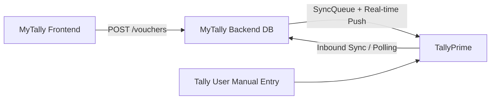

# Sync Failure Scenarios, Collision Analysis & Traceback Strategy

This document analyzes every edge case where the MyTally DB and TallyPrime can get out of sync, what currently happens, and what needs to be fixed.

---

## Current Architecture Overview

**Two sync directions exist:**
1. **Outbound** (MyTally → Tally): Via `SyncQueue` + real-time push on Create/Alter/Delete
2. **Inbound** (Tally → MyTally): Via periodic polling or manual `/sync/inbound` endpoint

---

## Scenario Matrix

### Scenario 1: Created in DB, Real-time Push Failed (Tally Offline)
| Aspect | Detail |
|---|---|
| **What Happens** | Voucher saved in MyTally DB. `SyncQueue` entry created with `is_processed=False`. Real-time push times out. |
| **Current Handling** | ⚠️ **Partially Handled**. SyncQueue item stays `is_processed=False` with `attempts` incremented. The desktop sync agent's outbound phase picks up unprocessed items on next sync cycle. |
| **Gap** | No automatic retry mechanism. Relies on next manual sync cycle or desktop agent polling. No user-facing notification that a voucher is "pending sync". |
| **Proposed Fix** | Add a background retry worker that retries failed SyncQueue items (max 3 attempts, exponential backoff). Show sync status badge in the UI (🟢 Synced / 🟡 Pending / 🔴 Failed). |

---

### Scenario 2: Created in Both DB and Tally Independently (Collision)
| Aspect | Detail |
|---|---|
| **What Happens** | User creates voucher via MyTally API (gets `MYTALLY-VCH-127`). Separately, another user creates a voucher directly in Tally (gets Tally's own GUID `f0347998-...`). Both exist with different GUIDs. |
| **Current Handling** | ✅ **No Collision**. They are treated as separate vouchers. When inbound sync runs, Tally's voucher is imported with its own GUID. MyTally's voucher has `MYTALLY-VCH-127`. They coexist as independent records. |
| **Gap** | If both vouchers happen to have the same voucher number (e.g., both are `Purchase #27`), Tally's auto-numbering may shift one. On inbound sync, the DB may end up with two records for the "same" logical voucher number but different GUIDs. |
| **Proposed Fix** | On inbound sync, after importing, run a reconciliation check: flag vouchers where `voucher_number` + `voucher_type` + `voucher_date` match but `tally_guid` differs. Surface these as "potential duplicates" in an admin dashboard. |

---

### Scenario 3: Deleted in DB, Not Yet Synced → Then Deleted Manually in Tally Too
| Aspect | Detail |
|---|---|
| **What Happens** | User deletes voucher in MyTally. `SyncQueue` entry created with `action=Delete`. Before sync runs, the Tally operator also manually deletes the same voucher in TallyPrime. |
| **Current Handling** | ⚠️ **Partially Handled**. When the outbound sync fires, Tally returns `<LINEERROR>Voucher does not exist!</LINEERROR>` with `<ERRORS>1</ERRORS>`. The SyncQueue item stays `is_processed=False`. |
| **Gap** | The SyncQueue item will keep retrying forever and never succeed. No logic to detect "already deleted in Tally" and mark as resolved. |
| **Proposed Fix** | In `try_push_voucher_realtime`, when action is `Delete` and Tally responds with `Voucher does not exist!`, treat it as **success** (mark `is_processed=True`). The desired end state (voucher gone from both) is already achieved. |

---

### Scenario 4: Altered in DB, But Voucher Was Altered in Tally Since Last Sync
| Aspect | Detail |
|---|---|
| **What Happens** | MyTally user edits a voucher (changes amount). Meanwhile, Tally operator also edited the same voucher in Tally. MyTally pushes its version with `ACTION="Alter"`. |
| **Current Handling** | ⚠️ **Last Writer Wins**. Whoever pushes last overwrites the other's changes. No conflict detection. |
| **Gap** | No `tally_alter_id` comparison before outbound push. No conflict resolution UI. |
| **Proposed Fix** | Before pushing an `Alter`, export the voucher from Tally and compare `alter_id`. If Tally's `alter_id` > MyTally's stored `tally_alter_id`, flag as a conflict and present both versions to the user. |

---

### Scenario 5: Inbound Sync Imports a Voucher That Was Already Deleted in DB
| Aspect | Detail |
|---|---|
| **What Happens** | Voucher existed in both systems. User deleted it in MyTally. Before outbound delete sync fires, inbound sync runs and re-imports the voucher from Tally (because it still exists there). |
| **Current Handling** | ❌ **Not Handled**. The inbound importer checks by `tally_guid`. Since the record was deleted from DB, it creates a brand new DB record for the same Tally voucher. The pending outbound `Delete` SyncQueue item then fires and tries to delete the old (now non-existent) voucher ID. |
| **Gap** | Zombie resurrection: deleted vouchers come back on next inbound sync. |
| **Proposed Fix** | Maintain a `deleted_guids` table or soft-delete flag. During inbound sync, skip any voucher whose GUID is in the recently-deleted list. Clear entries from `deleted_guids` after successful outbound delete confirmation. |

---

### Scenario 6: Tally Returns `exceptions: 1` on Create (Partial Failure)
| Aspect | Detail |
|---|---|
| **What Happens** | MyTally pushes a new voucher to Tally. Tally creates it but flags an exception (e.g., auto-numbering conflict, missing sub-allocation). Response: `<CREATED>0</CREATED><EXCEPTIONS>1</EXCEPTIONS>`. |
| **Current Handling** | ⚠️ **Partially Handled**. Since `<CREATED>1</CREATED>` is not in the response, the SyncQueue item stays `is_processed=False`. But Tally may have actually created the voucher with a different number. |
| **Gap** | No parsing of `<VCHNUMBER>` from exception responses. No reconciliation to check if Tally actually created it under a different number. |
| **Proposed Fix** | Parse the full `<IMPORTRESULT>` response. If `<EXCEPTIONS>1</EXCEPTIONS>` but `<VCHNUMBER>` is present, export that voucher from Tally to verify its state. Log exception details for admin review. |

---

### Scenario 7: Network Timeout Mid-Push (Ambiguous State)
| Aspect | Detail |
|---|---|
| **What Happens** | MyTally sends the XML payload. The network drops mid-transmission. MyTally sees a timeout error. But Tally may have received and processed the full payload successfully. |
| **Current Handling** | ❌ **Not Handled**. SyncQueue stays `is_processed=False`. Next retry creates a duplicate voucher in Tally (since the first one succeeded silently). |
| **Gap** | No idempotency key on outbound pushes. No post-timeout verification. |
| **Proposed Fix** | After a timeout, before retrying, export vouchers from Tally filtered by `REMOTEID="MYTALLY-VCH-{id}"`. If found, mark as synced. If not found, safe to retry. The `REMOTEID` we now embed acts as an idempotency key — Tally will `ALTER` (not duplicate) if the same `REMOTEID` is pushed again. |

---

### Scenario 8: Exception Tracing — How to Find What Went Wrong
| Aspect | Detail |
|---|---|
| **Current Tracing** | Console logs show `📤 OUTBOUND` and `📥 RESPONSE` with full XML payloads. `SyncQueue.error_message` stores first 500 chars of failed response. |
| **Gap** | No structured exception log table. No admin UI to review failed syncs. No way to filter "all vouchers that failed sync in the last 24h". |
| **Proposed Fix** | Create a `sync_error_log` table: `(error_id, sync_id, record_type, record_id, action, error_type, tally_response, created_at)`. Parse Tally's `<LINEERROR>` messages into structured fields. Build an admin "Sync Health" dashboard showing pending/failed/succeeded counts. |

---

## Summary: What's Handled vs What's Not

| # | Scenario | Status | Risk Level |
|---|---|---|---|
| 1 | DB created, Tally push failed | ⚠️ Partial | 🟡 Medium |
| 2 | Independent creation collision | ✅ Handled | 🟢 Low |
| 3 | Both sides deleted independently | ⚠️ Partial | 🟡 Medium |
| 4 | Concurrent edits (alter conflict) | ⚠️ Last-write-wins | 🟠 High |
| 5 | Deleted in DB, re-imported from Tally | ❌ Not Handled | 🔴 Critical |
| 6 | Tally exception on create | ⚠️ Partial | 🟡 Medium |
| 7 | Network timeout ambiguity | ❌ Not Handled | 🔴 Critical |
| 8 | Exception tracing/debugging | ⚠️ Logs only | 🟡 Medium |

---

## Proposed Implementation Priority

### Phase 1: Critical — Implement Now
1. **Scenario 3 Fix**: Treat `Voucher does not exist!` as success for Delete actions
2. **Scenario 7 Fix**: Post-timeout REMOTEID verification before retry (already partially solved — our `REMOTEID` binding means re-push does `ALTER` not duplicate)
3. **Scenario 5 Fix**: Soft-delete tracking to prevent zombie resurrection

### Phase 2: High — Implement Next Sprint
4. **Scenario 8 Fix**: `sync_error_log` table + admin dashboard
5. **Scenario 1 Fix**: Background retry worker with exponential backoff
6. **Scenario 6 Fix**: Parse full `<IMPORTRESULT>` including `<VCHNUMBER>` on exceptions

### Phase 3: Medium — Future Enhancement
7. **Scenario 4 Fix**: `alter_id` conflict detection + resolution UI
8. **Scenario 2 Fix**: Duplicate voucher number reconciliation flagging
