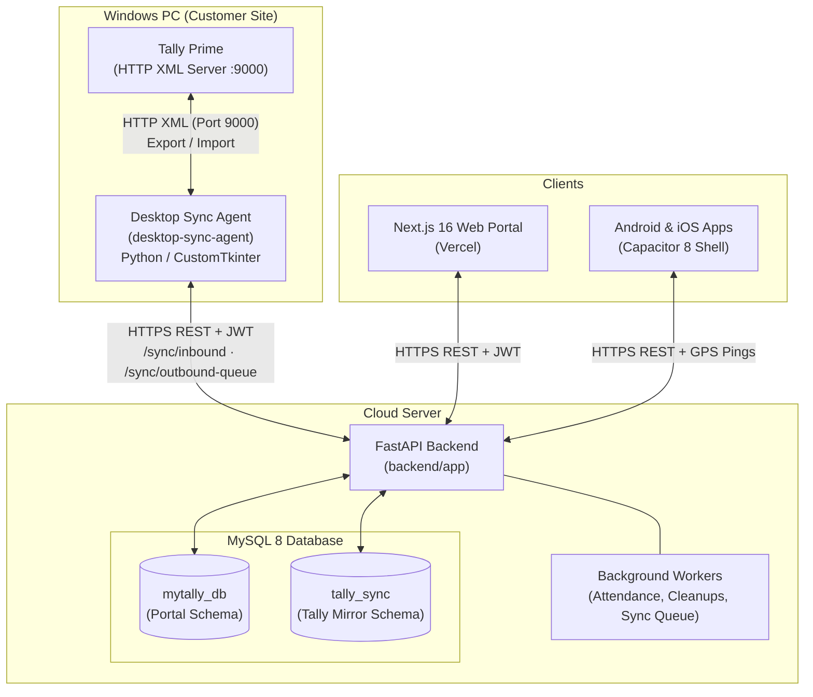
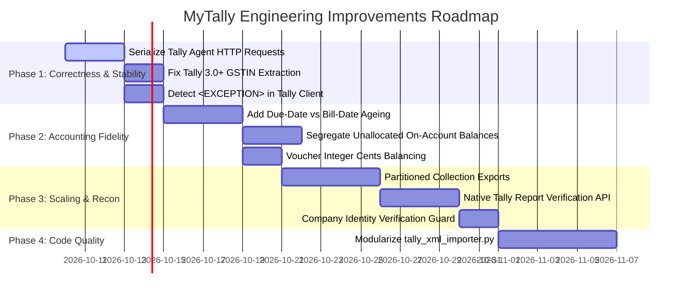
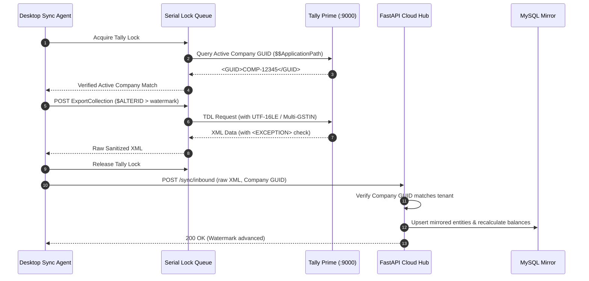

# Deep Repository Analysis: Extracting Engineering Patterns & Tally Capabilities from Reference Implementations

**Target Repository:** MyTally (`/Users/akashkansal/Documents/Github/MyTally`)  
**Analyzed Reference Repositories:**
1. `ComplyEaze/bridge` (Rust + Tauri + TypeScript)
2. `dhananjay1405/tally-mcp-server` (Node.js / TypeScript)
3. `learnwithcc/tally-mcp` (TypeScript / Cloudflare Worker / Axios)
4. `anshveerturna/tally-mcp` (Node.js / TypeScript)
5. `vaijaaaaa/Tally-MCP-Server` (Node.js / TypeScript)

---

## 1. Executive Summary

This study analyzes **MyTally** alongside five open-source Tally integration reference repositories to reverse-engineer underlying Tally Prime communication mechanisms, XML/TDL query patterns, data models, error handling, reliability safeguards, and architectural patterns.

### Key Insights & Findings
1. **Repository Identity & Core Architectural Contrast:**
   - **MyTally** uses a **hub-and-spoke asynchronous mirror architecture**. A Windows desktop client (`desktop-sync-agent`) polls a local Tally Prime instance over HTTP `:9000`, streams altered records incrementally (`$ALTERID > watermark`) to a central cloud backend (FastAPI + MySQL), and dequeues cloud-created transactions back to Tally.
   - The reference repositories (except `learnwithcc/tally-mcp`, which integrates with the SaaS form builder `Tally.so`) are **direct, synchronous Tally clients** that send on-demand TDL/XML requests to a locally accessible Tally Prime HTTP interface.
   - **Crucial Clarification on `learnwithcc/tally-mcp`:** `learnwithcc/tally-mcp` connects to the `tally.so` online form builder API, *not* Tally Prime accounting software. However, its HTTP client architecture—specifically its token rotation, exponential backoff with jitter, and circuit breaker patterns—provides high-value engineering patterns for remote API clients.

2. **Major Tally Integration Discoveries from Reference Implementations:**
   - **Single-Threaded Tally Concurrency Hazard (`anshveerturna` & `complyeaze`):** Tally Prime's internal XML/HTTP server is strictly single-threaded. Concurrent HTTP requests cause socket hangs, packet interleaving, and UI freezing. `anshveerturna` solves this with an in-process promise serialization queue (`enqueue()`). MyTally's desktop agent has retries but lacks explicit request serialization during concurrent manual syncs or background pulls.
   - **TDL Precision & GST 3.0+ Registration Schema (`dhananjay1405`):** In Tally Prime 3.0+, party GST numbers were moved to the sub-collection `LEDGSTREGDETAILS.LIST`. Querying `$PartyGSTIN` alone yields stale or empty values for multi-GST ledgers. The expression `if $$IsEmpty:$PartyGSTIN then $LedGSTRegDetails[Last].GSTIN else $PartyGSTIN` solves this.
   - **Native Tally Reports vs. Custom SQL Emulation (`vaijaaaaa` & `anshveerturna`):** MyTally currently computes Balance Sheet, Profit & Loss, and Trial Balance by executing complex SQL queries on its MySQL mirror tables (`tally_sync`). In contrast, `vaijaaaaa` and `anshveerturna` can request Tally's native reports directly (`Balance Sheet`, `Profit and Loss A/c`, `Trial Balance`, `Bills Receivable`) using `<REPORTNAME>`. While MyTally's cloud mirror allows offline access, having the ability to fetch official Tally balance sheets on-demand provides an invaluable verification tool for accounting reconciliation.
   - **Data Census & Parent Partitioning for High-Volume Books (`complyeaze`):** For enterprise clients with 50,000+ ledgers or 200,000+ vouchers, exporting an entire collection in a single HTTP request causes memory exhaustion and XML socket timeouts. `complyeaze` implements a two-phase protocol: (1) Census phase to count records per parent group, followed by (2) Parent-partitioned queries (`ParentPartition`) that stream chunks by ledger group.

---

## 2. My Repository Architecture

MyTally consists of four coordinated subsystems:



### 2.1 Services & Modules
- **`backend/app/`**:
  - `core/`: Application settings, async database engine (`aiomysql`), session management, multi-level in-memory response caches with write-invalidation (`cache.py`, `cache_invalidation.py`, `master_cache.py`), RBAC permissions (`permissions.py`).
  - `models/`: Two database schemas:
    - `portal_core.py`: Portal entities (`User`, `Company`, `CustomerProfile`, `SyncQueue`, `SyncTrafficLog`, `ApprovalRule`, `ReminderSchedule`, `CompanyBranding`).
    - `tally_core.py`: Mirrored Tally entities (`MstLedger`, `TrnVoucher`, `TrnAccounting`, `MstStockItem`, `TrnInventory`, `TrnBill`, `Batch`).
  - `routers/`: 25 API routers covering auth, customers, vouchers, ledgers, inventory, reports, GST, approvals, payments, reminders, and sync.
  - `services/`:
    - `tally_xml_importer.py` (2,572 lines): Inbound XML parser with character sanitization and incremental upserts.
    - `tally_xml_builder.py` (85 lines) & `tally_schema_validator.py`: Outbound schema-aware XML serializer validated against 513 Tally schema definitions.
    - `einvoicing.py`, `gsp.py`, `gst_documents.py`: e-Way bill and e-Invoicing engine.
    - `reminders.py`: Automated multi-channel payment reminders.
- **`desktop-sync-agent/`**:
  - `agent.py`: Background worker that coordinates bidirectional sync cycles.
  - `tally_client.py`: Raw HTTP XML client communicating with `http://127.0.0.1:9000`.
  - `cloud_client.py`: Authenticated HTTPS REST client communicating with the FastAPI cloud hub.
  - `gui_app.py`: CustomTkinter desktop interface for configuration and live sync logs.
- **`frontend-nextjs/`**:
  - 45+ Next.js App Router pages and modals for accounting, field sales, attendance tracking, invoicing, and reporting.

---

## 3. My Repository Feature Inventory

| Module | Features Implemented | Current Implementation Mechanism |
| :--- | :--- | :--- |
| **Authentication & RBAC** | JWT login, session revocation, device binding, role permissions with overrides, data scoping. | `backend/app/core/permissions.py`, `backend/app/core/sessions.py` |
| **Inbound Sync** | Incremental extraction of altered masters & vouchers from Tally Prime using `$ALTERID > watermark`. | `desktop-sync-agent/tally_client.py` (`export_full_collections`), `backend/app/services/tally_xml_importer.py` |
| **Outbound Sync** | Queue-based export of portal vouchers & masters to Tally with conflict detection and audit logging. | `backend/app/models/portal_core.py` (`SyncQueue`), `backend/app/routers/sync.py` |
| **Financial Reports** | Daybook, Ledger statements, Group summaries, Trial Balance, Profit & Loss, Balance sheet. | SQL aggregations on `tally_sync` MySQL mirror with in-memory caching (`routers/reports.py`, `routers/books.py`). |
| **Outstandings** | Receivables, Payables, Bill ageing buckets, Customer collection statements. | SQL calculations on `TrnBill` and `TrnAccounting` (`routers/reports.py`, `routers/customers.py`). |
| **GST & Compliance** | GSTR-1, GSTR-3B summaries, e-Way bills, e-Invoicing with IRP QR codes. | `routers/gst.py`, `routers/edocs.py`, `services/gst_documents.py` |
| **Field Sales & CRM** | Beat plans, geo-fenced check-ins, attendance tracking, customer profiles with coordinates & pin codes. | `routers/attendance.py`, `routers/visits.py`, `routers/customers.py` |
| **Automation** | Automated multi-channel payment reminders, voucher approval workflows (Maker-Checker). | `routers/reminders.py`, `routers/approvals.py`, `services/reminders.py` |

---

## 4. Reference Repository Analysis

### 4.1 ComplyEaze/bridge
- **Architecture:** Local desktop application built in Rust (Tauri) with TypeScript/React.
- **Tally Communication:** Direct HTTP connection to `http://localhost:9000` via a dedicated Rust transport (`TallyHttpTransport`, `WireGateConfig`).
- **Key Capabilities:**
  - **Census & Partitioning (`ParentPartition`):** Uses a two-step query pattern. First queries counts (`LedgerCensus`), then chunks requests by parent groups (`Sundry Debtors`, `Sundry Creditors`) to prevent OOM errors on large databases.
  - **Company Identity Verification:** Validates `company_guid` on every response to prevent cross-company data leakage if a user switches the active company in Tally.
  - **Advanced Outstandings (`agent_outstandings.rs`):** Computes ageing on both `"bill_date"` and `"due_date"` anchors. Explicitly segregates open bills from unallocated on-account party balances.

### 4.2 dhananjay1405/tally-mcp-server
- **Architecture:** Node.js / TypeScript service.
- **Tally Communication:** Native Node.js `http` client executing Nunjucks XML templates against Tally `:9000`.
- **Key Capabilities:**
  - **Dynamic TDL Field Computations (`definition.mts`):**
    - GSTIN fallback: `if $$IsEmpty:$PartyGSTIN then $LedGSTRegDetails[Last].GSTIN else $PartyGSTIN`
    - Full address list concatenation: `if $$IsEmpty:$Address then "" else $$FullList:Address:$Address`
    - ISD-prefixed mobile number: `if NOT $$IsEmpty:$LedgerMobile then $$Sprintf:"%s %s":$LedgerCountryISDCode:$LedgerMobile else ""`
  - **Debit/Credit Balancing Validation:** Enforces voucher balance mathematically using integer arithmetic (`Math.round(entry.amount * 100)`) to eliminate floating-point precision errors before sending XML to Tally.
  - **Native Ledger & Stock Item Statements:** Generates single-ledger running statements with opening balances and vouchers in one TDL query.

### 4.3 learnwithcc/tally-mcp
- **Architecture:** TypeScript server built on Axios and Cloudflare Workers.
- **Underlying Target:** **Tally.so online form builder**, *not* Tally Prime accounting software.
- **Key Reusable Engineering Patterns:**
  - **Resilient HTTP Engine (`TallyApiClient.ts`):** Exponential backoff with random jitter (`baseDelayMs`, `maxDelayMs`, `jitterFactor`) to eliminate thundering herd problems.
  - **Circuit Breaker:** Automatically trips during continuous downstream outages to prevent saturating offline endpoints.
  - **Runtime Schema Validation:** Employs Zod schemas (`TallyFormSchema`, `TallySubmissionSchema`) to validate external JSON payloads before consumption.

### 4.4 anshveerturna/tally-mcp
- **Architecture:** Node.js / TypeScript service.
- **Tally Communication:** Node `http` client using UTF-16LE encoding.
- **Key Capabilities:**
  - **Single-Threaded Request Queue (`client.ts`):** Serializes all HTTP calls via a sequential Promise chain (`requestQueue = task.then(...)`), preventing concurrent access crashes in Tally's single-threaded XML engine.
  - **Exhaustive Error Detection (`xml-parser.ts`):** Checks `<EXCEPTION>`, `<LINEERROR>`, `<STATUS>0</STATUS>`, and `<ERRORS>`.
  - **Broad Tally Capability Coverage:** Covers Banking reconciliation, Manufacturing BOM, Payroll, TDS/TCS, and budgets.
  - **Array Normalization:** Uses `fast-xml-parser` configured with `isArray: (tag) => tag.endsWith('.LIST') || FORCE_ARRAY_TAGS.has(tag)` to eliminate the common bug where Tally returns a single object instead of a list.

### 4.5 vaijaaaaa/Tally-MCP-Server
- **Architecture:** TypeScript server using Nunjucks XML templates and SQLite for local caching.
- **Tally Communication:** Native HTTP client sending XML queries.
- **Key Capabilities:**
  - **Native Report Invocation:** Directly executes Tally's standard reports (`Profit and Loss A/c`, `Balance Sheet`, `Trial Balance`, `Stock Summary`, `Bills Receivable`, `Bills Payable`) via `<EXPORTDATA><REQUESTDESC><REPORTNAME>...</REPORTNAME>`.
  - **TDL Form vs Report Distinction:** Documents that `Company` is a TDL Form (not an exportable report) and must be queried as a `Collection` to avoid TDL runtime syntax errors.

---

## 5. Cross-Repository Feature Matrix

| Feature / Capability | MyTally | ComplyEaze/bridge | dhananjay1405 | learnwithcc | anshveerturna | vaijaaaaa | Recommendation for MyTally |
| :--- | :---: | :---: | :---: | :---: | :---: | :---: | :--- |
| **Asynchronous Cloud Mirroring** | **✓** | ✗ | ✗ | ✗ | ✗ | ✗ | **Preserve** (Core differentiator) |
| **Incremental AlterID Sync** | **✓** | **✓** | ✗ | ✗ | ✗ | ✗ | **Improve** (Add fallback detection) |
| **Single-Threaded Request Queue** | ✗ | **✓** | ✗ | ✗ | **✓** | ✗ | **Add (P0)** (Add to sync agent) |
| **Tally Prime 3.0+ Multi-GSTIN TDL** | ✗ | **✓** | **✓** | ✗ | ✗ | ✗ | **Add (P0)** (Fix party GST resolution) |
| **Native Report Querying (BS/PL/TB)** | ✗ | **✓** | ✗ | ✗ | **✓** | **✓** | **Add (P1)** (Reconciliation tool) |
| **Parent-Group Partitioned Queries** | ✗ | **✓** | ✗ | ✗ | ✗ | ✗ | **Add (P1)** (Avoid OOM on large books) |
| **Voucher Dr/Cr Integer Balancing** | **✓** | **✓** | **✓** | ✗ | **✓** | ✗ | **Improve** (Use integer cents) |
| **XML Array Normalization (`.LIST`)**| **✓** | **✓** | **✓** | ✗ | **✓** | **✓** | **Improve** (Standardize array logic) |
| **Circuit Breaker & Jitter Backoff** | ✗ | ✗ | ✗ | **✓** | ✗ | ✗ | **Add (P2)** (In cloud REST clients) |
| **Direct Banking Reconciliation** | **✓** | ✗ | ✗ | ✗ | **✓** | ✗ | **Improve** (Incorporate cheque regs) |
| **Manufacturing BOM Sync** | **✓** | ✗ | ✗ | ✗ | **✓** | ✗ | **Improve** (Add multi-level BOMs) |

---

## 6. Tally Capability Matrix

| Tally Capability | MyTally | ComplyEaze | dhananjay1405 | anshveerturna | vaijaaaaa | Reference Mechanism |
| :--- | :---: | :---: | :---: | :---: | :---: | :--- |
| **Active Company Discovery** | **✓** | **✓** | **✓** | **✓** | **✓** | `ExportCollection: Company` / `$$IsEqual:$Name:##SVCurrentCompany` |
| **System Info ($$ApplicationPath, $$Release)** | **✓** | **✓** | ✗ | ✗ | ✗ | TDL `$$ApplicationPath`, `$$Release` in `tally_client.py` |
| **Ledgers & Multi-Mailing Addresses** | **✓** | **✓** | **✓** | **✓** | **✓** | `LEDMAILINGDETAILS.LIST`, `$$FullList:Address:$Address` |
| **GSTIN Registration History** | ✗ | **✓** | **✓** | ✗ | ✗ | `$LedGSTRegDetails[Last].GSTIN` |
| **Stock Items & Batch Allocations** | **✓** | **✓** | **✓** | **✓** | **✓** | `BATCHALLOCATIONS.LIST`, `OpeningBalance`, `ClosingBalance` |
| **Bill-by-Bill Outstanding Receivables** | **✓** | **✓** | **✓** | **✓** | **✓** | Native `Bills Receivable` report vs Collection `Bill` |
| **Due-Date vs Bill-Date Ageing** | ✗ | **✓** | ✗ | ✗ | ✗ | Computed against `BillDate` or `DueDate` |
| **Unallocated On-Account Exposure** | ✗ | **✓** | ✗ | ✗ | ✗ | Difference between ledger closing balance & open bills sum |
| **Balance Sheet (Direct from Tally)** | ✗ | **✓** | ✗ | **✓** | **✓** | `<REPORTNAME>Balance Sheet</REPORTNAME>` |
| **Profit & Loss (Direct from Tally)** | ✗ | **✓** | ✗ | **✓** | **✓** | `<REPORTNAME>Profit and Loss A/c</REPORTNAME>` |
| **Trial Balance (Direct from Tally)** | ✗ | **✓** | ✗ | **✓** | **✓** | `<REPORTNAME>Trial Balance</REPORTNAME>` |
| **Bank Reconciliation Master/Vouchers** | **✓** | ✗ | ✗ | **✓** | ✗ | `BANKALLOCATIONS.LIST`, instrument date, clearing date |

---

## 7. My Repository vs Reference Repositories

### Detailed Comparison Across Key Functional Areas

#### 7.1 Tally HTTP Transport & Connection Management
- **MyTally Current Implementation:**
  - `desktop-sync-agent/tally_client.py` uses Python's standard `urllib.request` with a basic retry loop (`max_retries = 2`, `time.sleep(1)`).
  - Outbound sync calls from the cloud backend (`try_push_*_realtime`) execute via `asyncio.to_thread` using a 10-second timeout.
- **Reference Implementations:**
  - `anshveerturna`: Wraps all HTTP requests in a Promise queue (`enqueue()`). Because Tally's internal server is single-threaded, sending concurrent requests causes connection reset errors or corrupted responses.
  - `complyeaze`: Implements `WireGateConfig` with configurable connection pooling and strict socket reuse rules.
- **Assessment:** MyTally's desktop agent is vulnerable to Tally freezes if multiple export or import requests fire simultaneously. Adopting request serialization will immediately eliminate intermittent Tally timeouts.

#### 7.2 XML Generation & TDL Querying
- **MyTally Current Implementation:**
  - `backend/app/services/tally_xml_builder.py` provides `SchemaXmlBuilder` with manual tag escaping and schema validation against JSON schemas.
  - Queries in `desktop-sync-agent/tally_client.py` use multiline f-strings.
- **Reference Implementations:**
  - `dhananjay1405` & `vaijaaaaa`: Use Nunjucks templating (`.njk`) with template filters for dates, numbers, and escaping.
  - `dhananjay1405`: Uses sophisticated TDL expressions (`$$FullList`, `$$Sprintf`, `$$StringFindAndReplace`).
- **Assessment:** While MyTally's schema validator is comprehensive, its TDL query definitions in `tally_client.py` miss crucial TallyPrime 3.0+ fields (such as multi-registration GSTINs and multi-line addresses).

#### 7.3 Response Parsing & Error Detection
- **MyTally Current Implementation:**
  - `backend/app/services/tally_xml_importer.py` parses XML using Python's `xml.etree.ElementTree`.
  - Error detection in `sync.py` uses regex searching for `<LINEERROR>`, `<ERROR>`, and response counts (`<CREATED>`, `<ALTERED>`).
- **Reference Implementations:**
  - `anshveerturna`: Normalizes tags ending in `.LIST` to arrays automatically via `fast-xml-parser`. Inspects `<EXCEPTION>`, `<LINEERROR>`, `<STATUS>0</STATUS>`, and `<ERRORS>`.
  - `dhananjay1405`: Renames XML attributes and parses datatypes via explicit collection schemas.
- **Assessment:** MyTally's XML sanitization (`sanitize_xml`) is robust against control characters and invalid XML 1.0 glyphs. However, its error detection in `tally_client.py` only inspects `<LINEERROR>` and `<ERRORS>`, missing critical `<EXCEPTION>` top-level wrappers returned when Tally fails internally.

---

## 8. Bugs / Correctness Issues Identified

### Issue 1: Missing TallyPrime 3.0+ Multi-GSTIN Support
- **Location:** [`backend/app/services/tally_xml_importer.py`](file:///Users/akashkansal/Documents/Github/MyTally/backend/app/services/tally_xml_importer.py#L765), [`desktop-sync-agent/tally_client.py`](file:///Users/akashkansal/Documents/Github/MyTally/desktop-sync-agent/tally_client.py#L205)
- **Problem:** TallyPrime 3.0+ introduced multi-GST registrations for companies and party ledgers. In these versions, `$PARTYGSTIN` is frequently empty or deprecated; the valid active GSTIN is stored inside `LEDGSTREGDETAILS.LIST -> GSTIN`.
- **Evidence:** `dhananjay1405` explicitly handles this in `definition.mts`:
  ```tdl
  if $$IsEmpty:$PartyGSTIN then $LedGSTRegDetails[Last].GSTIN else $PartyGSTIN
  ```
- **Impact:** Customers using TallyPrime 3.0 or 4.0 may have blank GSTINs in MyTally for newly created or updated party ledgers.

### Issue 2: Silent Omission of Critical `<EXCEPTION>` Blocks in Tally Client
- **Location:** [`desktop-sync-agent/tally_client.py`](file:///Users/akashkansal/Documents/Github/MyTally/desktop-sync-agent/tally_client.py#L335-L345)
- **Problem:** When Tally encounters a fatal internal error (e.g., license expiration, damaged company file, or invalid collection definition), it does not return `<LINEERROR>` or `<ERRORS>`. Instead, it wraps the entire response in `<EXCEPTION>Error description</EXCEPTION>`.
- **Evidence:** `tally_client.py` checks:
  ```python
  has_error = "<LINEERROR>" in resp_str or "<ERRORS>0</ERRORS>" not in resp_str and "<ERRORS>" in resp_str
  ```
  If `<EXCEPTION>` is returned, `has_error` evaluates to `False`, and the request may be marked as successful or ignored.
- **Fix:** Add `"<EXCEPTION>" in resp_str` to the error detection condition.

---

## 9. Reliability Issues Identified

### Issue 1: Concurrency Freezing on Tally's Single-Threaded HTTP Server
- **Location:** [`desktop-sync-agent/agent.py`](file:///Users/akashkansal/Documents/Github/MyTally/desktop-sync-agent/agent.py), [`backend/app/routers/sync.py`](file:///Users/akashkansal/Documents/Github/MyTally/backend/app/routers/sync.py)
- **Problem:** Tally's XML server cannot process concurrent HTTP connections. If the Desktop Agent is exporting a large collection (which can take 10-30 seconds) and the backend initiates a real-time push (`try_push_voucher_realtime`), Tally either drops the connection or locks up.
- **Solution:** Serialize all requests to Tally through an internal lock or FIFO request queue, as implemented in `anshveerturna/src/tally/client.ts`.

### Issue 2: Large Collection Memory Spikes & HTTP Timeouts
- **Location:** [`desktop-sync-agent/tally_client.py`](file:///Users/akashkansal/Documents/Github/MyTally/desktop-sync-agent/tally_client.py#L210)
- **Problem:** `export_full_collections` requests all vouchers (`ExportVouchers`) in a single query across the entire date range (`20000101` to `20991231`). In companies with over 100,000 vouchers, this produces an XML payload exceeding 150 MB, causing socket timeouts in `urllib.request` or memory spikes in the agent.
- **Solution:** Adopt the partition pattern from `ComplyEaze/bridge`: split full exports into yearly or monthly chunks, or partition by voucher type.

---

## 10. Performance Issues Identified

### Issue 1: Repeated Unnecessary Export of Unaltered Collections
- **Location:** [`desktop-sync-agent/tally_client.py`](file:///Users/akashkansal/Documents/Github/MyTally/desktop-sync-agent/tally_client.py#L216-L220)
- **Observation:** In `collections`, `UOMs` and `Godowns` have `supports_alter_filter = False`. Consequently, during incremental syncs, they are skipped entirely. However, if a user adds a new Godown or Unit of Measure, it is never synchronized until a full resync is performed.
- **Solution:** Query `$Name` with a lightweight collection fetch, or use `$$ModifiedTime` / internal alteration markers for masters that lack `$ALTERID`.

### Issue 2: Full String XML Sanitization on Large Inbound Payloads
- **Location:** [`backend/app/services/tally_xml_importer.py`](file:///Users/akashkansal/Documents/Github/MyTally/backend/app/services/tally_xml_importer.py#L139-L171)
- **Problem:** `sanitize_xml()` runs three separate regex passes on the entire XML string in memory before parsing with `ET.fromstring()`. On a 50 MB XML payload, this creates multiple full string copies in memory, triggering Python garbage collection pauses.
- **Solution:** Use an incremental stream sanitizer or an iterative `xml.etree.ElementTree.iterparse` parser with character translation.

---

## 11. Security Issues Identified

### Issue 1: Missing Company GUID Verification During Synchronization
- **Location:** [`desktop-sync-agent/agent.py`](file:///Users/akashkansal/Documents/Github/MyTally/desktop-sync-agent/agent.py), [`backend/app/services/tally_xml_importer.py`](file:///Users/akashkansal/Documents/Github/MyTally/backend/app/services/tally_xml_importer.py#L498-L515)
- **Vulnerability:** If an accountant opens a different company in Tally Prime while the sync agent is running, and the agent's configured company name happens to match or fallback logic kicks in, data from the wrong company could be posted to the cloud mirror.
- **Solution:** Adopt `ComplyEaze/bridge`'s `VerifiedCompanyIdentity` pattern: query `Company` GUID first, verify it matches `Company.tally_guid`, and abort the sync pass if the active company in Tally differs.

---

## 12. Architecture & Maintainability Issues Identified

### Issue 1: Monolithic XML Importer (`tally_xml_importer.py`)
- **Location:** [`backend/app/services/tally_xml_importer.py`](file:///Users/akashkansal/Documents/Github/MyTally/backend/app/services/tally_xml_importer.py) (2,572 lines)
- **Problem:** A single function `import_tally_xml()` handles parsing, entity resolution, deduplication, database transactions, balance recalculations, and error handling for 12 different object types.
- **Solution:** Decompose into specialized handlers using a registry pattern:
  - `MasterImporter` (Ledgers, Groups, Items, Units, Godowns)
  - `VoucherImporter` (Vouchers, Ledger Entries, Inventory Entries, Allocations)
  - `BalanceCalculator` (Running ledger balance recomputations)

---

## 13. Reusable Tally Integration Patterns

### Pattern 1: TDL Dynamic Field Computations (from `dhananjay1405`)
To retrieve clean, transformed data directly from Tally Prime without post-processing:

```xml
<COLLECTION NAME="CleanLedgers">
  <TYPE>Ledger</TYPE>
  <!-- Full multiline address joined as a single string -->
  <COMPUTE>AddressText : if $$IsEmpty:$Address then "" else $$FullList:Address:$Address</COMPUTE>
  <!-- Active company flag -->
  <COMPUTE>IsActive : $$IsEqual:$Name:##SVCurrentCompany</COMPUTE>
  <!-- Standardized international mobile number -->
  <COMPUTE>FullMobile : if NOT $$IsEmpty:$LedgerMobile then $$Sprintf:"%s %s":$LedgerCountryISDCode:$LedgerMobile else ""</COMPUTE>
  <!-- Robust GSTIN supporting TallyPrime 3.0+ multi-registrations -->
  <COMPUTE>ActiveGSTIN : if $$IsEmpty:$PartyGSTIN then $LedGSTRegDetails[Last].GSTIN else $PartyGSTIN</COMPUTE>
  <FETCH>Name,Parent,ClosingBalance,AddressText,FullMobile,ActiveGSTIN</FETCH>
</COLLECTION>
```

### Pattern 2: Single-Threaded Promise / Lock Queue (from `anshveerturna`)
To prevent concurrent requests from crashing Tally Prime:

```python
# In desktop-sync-agent/tally_client.py
import threading

class TallyClient:
    def __init__(self, tally_url="http://127.0.0.1:9000"):
        self.tally_url = tally_url
        self._lock = threading.Lock()  # Serialize all HTTP requests to Tally

    def send_xml(self, xml_payload: str):
        with self._lock:  # Guarantees strictly serial execution
            return self._send_xml_internal(xml_payload)
```

### Pattern 3: Direct Native Financial Report Extraction (from `vaijaaaaa`)
To pull official Tally balance sheets and P&L statements directly for reconciliation:

```xml
<ENVELOPE>
  <HEADER>
    <TALLYREQUEST>Export Data</TALLYREQUEST>
  </HEADER>
  <BODY>
    <EXPORTDATA>
      <REQUESTDESC>
        <REPORTNAME>Balance Sheet</REPORTNAME>
        <STATICVARIABLES>
          <SVEXPORTFORMAT>$$SysName:XML</SVEXPORTFORMAT>
          <SVFROMDATE>20240401</SVFROMDATE>
          <SVTODATE>20250331</SVTODATE>
          <SVCURRENTCOMPANY>Acme Enterprises</SVCURRENTCOMPANY>
        </STATICVARIABLES>
      </REQUESTDESC>
    </EXPORTDATA>
  </BODY>
</ENVELOPE>
```

---

## 14. Capabilities Missing From My Project

| Missing Capability | Business Value | Implementation Complexity | Priority |
| :--- | :---: | :---: | :---: |
| **1. Native Financial Report Extraction (BS, P&L, TB)** | High | Low | **P1 (Implement First)** |
| **2. Tally Single-Thread Request Serializer** | High | Low | **P0 (Critical)** |
| **3. TallyPrime 3.0+ Multi-GSTIN Extraction** | High | Low | **P0 (Critical)** |
| **4. On-Account vs. Bill-Wise Outstandings Segregation** | High | Medium | **P1 (Plan)** |
| **5. Due-Date vs. Bill-Date Ageing Anchor Selector** | Medium | Low | **P1 (Plan)** |
| **6. Parent-Group Chunking for Large Exports** | High | Medium | **P1 (Plan)** |
| **7. Resilient Circuit Breaker & Jitter Backoff** | Medium | Medium | **P2 (Useful)** |
| **8. Direct Cheque Register & Bank Recon Extraction** | Medium | Medium | **P2 (Useful)** |

---

## 15. Existing Features That Should Be Improved

| Feature | Current Implementation | Problem | Reference Solution | Recommended Change |
| :--- | :--- | :--- | :--- | :--- |
| **Tally Error Handling** | Regex for `<LINEERROR>` and `<ERRORS>`. | Misses `<EXCEPTION>` wrappers. | `anshveerturna/xml-parser.ts` | Add `<EXCEPTION>` and `<STATUS>0</STATUS>` detection to `tally_client.py`. |
| **Voucher Balancing** | Float comparison in `vouchers.py`. | Floating-point precision rounding errors. | `dhananjay1405/tally.mts` | Convert all debit/credit amounts to integer paise (`round(amt * 100)`) for exact zero-sum checks. |
| **Outstandings Ageing** | Computes ageing strictly from bill creation date. | Commercial credit periods run from due date. | `ComplyEaze/agent_outstandings.rs` | Provide user toggle for Ageing Basis: `Bill Date` vs. `Due Date`. |
| **Voucher Export Chunking** | Single unpartitioned query for all vouchers. | Socket timeouts and OOM on 100k+ voucher books. | `ComplyEaze/parent_partition.rs` | Chunk voucher exports by financial quarter or voucher type during initial full sync. |

---

## 16. Refactoring Opportunities

### 1. Extract Dedicated Error Normalizer in `desktop-sync-agent/tally_client.py`
Currently, error detection logic is embedded inside `send_xml()`. Extract an independent `TallyResponseInspector`:

```python
class TallyResponseInspector:
    @staticmethod
    def inspect(resp_str: str) -> Tuple[bool, str]:
        if not resp_str or not resp_str.strip():
            return False, "Empty response from Tally"
        if "<EXCEPTION>" in resp_str:
            match = re.search(r'<EXCEPTION>(.*?)</EXCEPTION>', resp_str, re.DOTALL)
            msg = match.group(1).strip() if match else "Unknown Tally Exception"
            return False, f"Tally Critical Exception: {msg}"
        if "<LINEERROR>" in resp_str:
            errors = re.findall(r'<LINEERROR>(.*?)</LINEERROR>', resp_str)
            return False, " | ".join(errors)
        if "<STATUS>0</STATUS>" in resp_str and "<CREATED>1</CREATED>" not in resp_str:
            return False, "Tally rejected request (Status 0)"
        return True, "Success"
```

### 2. Modularize `tally_xml_importer.py`
Split the 2,572-line importer file into modular processors:
- `backend/app/services/importer/masters.py`: Ledgers, groups, stock items, units, godowns.
- `backend/app/services/importer/vouchers.py`: Vouchers, entries, allocations.
- `backend/app/services/importer/reconciler.py`: Running balance updates.

---

## 17. Recommended New Features

### Feature A: On-Demand Native Tally Reconciliation Endpoint
- **Description:** Expose `POST /sync/reconcile-native-reports` to fetch Tally's official Balance Sheet and Profit & Loss numbers via the Desktop Agent, comparing them against the MySQL mirror aggregates.
- **Value:** Instantly detects any desynchronization between Tally and the cloud portal.

### Feature B: Bill Due-Date vs. Invoice-Date Ageing Analysis
- **Description:** Allow finance teams to switch receivable ageing views between `Invoice Date` (calendar age) and `Due Date` (credit period overrun).
- **Value:** Matches standard Indian commercial payment compliance practices.

---

## 18. Priority Matrix

```
High Value  │  [P0] Request Serialization       [P1] Native Report Recon
            │  [P0] Tally 3.0+ Multi-GSTIN       [P1] Due-Date Ageing
            │  [P0] <EXCEPTION> Error Detection  [P1] Partitioned Exports
────────────┼───────────────────────────────────────────────────────────
Low Value   │  [P3] TDL Custom Action Hooks      [P2] Circuit Breakers
            │  [P3] SQLite Offline Agent Cache   [P2] Multi-UOM Hierarchies
            └───────────────────────────────────────────────────────────
                 Low Complexity                      High Complexity
```

---

## 19. Top 10 Recommended Changes

### #1. Add Request Serialization Queue to Desktop Sync Agent
- **Problem:** Tally's single-threaded XML engine crashes or hangs when concurrent requests are made.
- **Evidence:** `anshveerturna-tally-mcp/src/tally/client.ts` (`requestQueue = task.then(...)`).
- **Solution:** Add a `threading.Lock()` in `desktop-sync-agent/tally_client.py` around all HTTP operations.
- **Priority:** **P0** | **Complexity:** Low

### #2. Fix TallyPrime 3.0+ Party GSTIN Extraction
- **Problem:** `$PARTYGSTIN` is blank for multi-GST ledgers in modern TallyPrime installations.
- **Evidence:** `dhananjay1405-tally-mcp/src/definition.mts` (`$LedGSTRegDetails[Last].GSTIN`).
- **Solution:** Update TDL query in `tally_client.py` and parser in `tally_xml_importer.py`.
- **Priority:** **P0** | **Complexity:** Low

### #3. Detect `<EXCEPTION>` and `<STATUS>0</STATUS>` Tags in Tally Responses
- **Problem:** Critical Tally errors without `<LINEERROR>` are currently reported as successes.
- **Evidence:** `anshveerturna-tally-mcp/src/tally/xml-parser.ts` lines 88–97.
- **Solution:** Add `<EXCEPTION>` and `<STATUS>0</STATUS>` inspection to `tally_client.py` and `sync.py`.
- **Priority:** **P0** | **Complexity:** Low

### #4. Segregate Open Bills from Unallocated On-Account Exposure
- **Problem:** Advance receipts not tagged to a specific bill skew bill-wise receivable calculations.
- **Evidence:** `ComplyEaze/bridge/src-tauri/src/agent_outstandings.rs` lines 64–75.
- **Solution:** Separate `unallocated_cash_balance` from open bill sums in `routers/reports.py`.
- **Priority:** **P1** | **Complexity:** Medium

### #5. Implement Ageing Anchor Selection (`Due Date` vs. `Bill Date`)
- **Problem:** Customers with 60-day credit terms appear overdue immediately when using invoice date.
- **Evidence:** `ComplyEaze/bridge/src-tauri/src/agent_outstandings.rs` lines 27–31.
- **Solution:** Add `ageing_anchor: "bill_date" | "due_date"` query parameter in reports API and UI.
- **Priority:** **P1** | **Complexity:** Low

### #6. Implement Partitioned Exports for Initial Full Sync
- **Problem:** Querying all vouchers from 2000 to 2099 causes timeouts on 50k+ voucher ledgers.
- **Evidence:** `ComplyEaze/bridge/src-tauri/src/tally/connection.rs` (`ParentPartition`).
- **Solution:** Chunk full exports by financial year or voucher type.
- **Priority:** **P1** | **Complexity:** Medium

### #7. Switch Voucher Balance Verification to Integer Math
- **Problem:** Floating-point imprecision can cause valid balanced entries to fail validation.
- **Evidence:** `dhananjay1405-tally-mcp/src/tally.mts` lines 67–75.
- **Solution:** Use integer cents/paise (`round(amount * 100)`) in `backend/app/routers/vouchers.py`.
- **Priority:** **P1** | **Complexity:** Low

### #8. Implement Native Tally Financial Report Comparison
- **Problem:** No automated way to verify if cloud mirror reports match Tally's official calculations.
- **Evidence:** `vaijaaaaa/Tally-MCP-Server/src/tools.ts` lines 410–425.
- **Solution:** Add a native report extraction query in `backup_module` or `desktop-sync-agent`.
- **Priority:** **P1** | **Complexity:** Low

### #9. Company Identity Verification Guard on Every Inbound Pass
- **Problem:** Risk of cross-company data pollution if active company changes in Tally GUI.
- **Evidence:** `ComplyEaze/bridge/src-tauri/src/tally/connection.rs` (`VerifiedCompanyIdentity`).
- **Solution:** Validate `Company.tally_guid` against Tally's active GUID before processing payload.
- **Priority:** **P1** | **Complexity:** Low

### #10. Streamlined TDL Form vs. Collection Architecture
- **Problem:** Querying forms (like `Company`) via `REPORTNAME` causes TDL runtime crashes.
- **Evidence:** `vaijaaaaa/Tally-MCP-Server/src/tools.ts` lines 391–394.
- **Solution:** Standardize all metadata queries to use `Collection` queries instead of `Report` queries.
- **Priority:** **P2** | **Complexity:** Low

---

## 20. Features NOT Worth Implementing

| Feature in Reference Repositories | Why Exclude from MyTally |
| :--- | :--- |
| **MCP Protocol / Tool Definitions** | MyTally is a full accounting & ERP portal with web and mobile interfaces. MCP tool wrapping adds unnecessary abstraction overhead without user benefit. |
| **Cloudflare Worker Deployments (`learnwithcc`)** | MyTally requires persistent TCP connections to MySQL and long-running sync workers, which do not fit serverless edge constraints. |
| **Local SQLite Duplication (`vaijaaaaa`)** | MyTally already maintains an enterprise MySQL mirror database (`tally_sync`). Adding local SQLite creates redundant multi-database sync issues. |
| **Form Builder Operations (`learnwithcc`)** | Irrelevant domain; `learnwithcc` integrates with `tally.so` web forms rather than accounting software. |

---

## 21. Implementation Roadmap



---

## 22. Testing Strategy

1. **Unit Tests:**
   - Test `TallyResponseInspector` with synthetic `<EXCEPTION>`, `<LINEERROR>`, and `<ERRORS>0</ERRORS>` XML fixtures.
   - Test integer cents voucher balancing with edge cases (e.g., three entries of ₹33.33 + ₹33.33 + ₹33.34).
2. **Integration Tests with Mock Tally Server:**
   - Spin up a mock HTTP server on `:9000` returning Tally Prime 3.0+ multi-GST XML to verify parser extraction.
   - Simulate concurrent HTTP requests to verify the agent's serialization lock prevents socket interleaving.
3. **Reconciliation Tests:**
   - Execute a native Balance Sheet query against a live Tally test company and compare totals with MySQL mirror reports.

---

## 23. Mermaid Architecture Diagrams

### 23.1 High-Fidelity Inbound Sync with Serialization & Company Guard



---

## 24. Final Conclusions

### Direct Answer to the Core Question:
> *"If I were the developer maintaining my current repository, what should I change, fix, refactor, and add after studying these five repositories, and why?"*

1. **Fix Immediately (P0):**
   - **Tally Concurrency Lock:** Wrap all Tally HTTP calls in `desktop-sync-agent/tally_client.py` in a threading lock. Tally Prime's XML engine is single-threaded; concurrent requests will corrupt buffers or cause silent socket drops.
   - **TallyPrime 3.0+ GSTIN Extraction:** Adopt the `$LedGSTRegDetails[Last].GSTIN` fallback from `dhananjay1405` in both the agent's export queries and `tally_xml_importer.py`.
   - **Top-Level `<EXCEPTION>` Handling:** Update `tally_client.py` and `sync.py` to inspect `<EXCEPTION>` tags, preventing failed imports from being treated as successes.

2. **Enhance for Product Value (P1):**
   - **Due-Date Ageing & On-Account Balances:** Implement the ageing anchor toggle (`Bill Date` vs. `Due Date`) and unallocated cash segregation from `ComplyEaze`.
   - **Integer Cents Balancing:** Replace floating-point summation with integer paise calculations in `vouchers.py`.
   - **Native Report Comparison:** Add an endpoint to request Tally's native `Balance Sheet` and `Profit and Loss A/c` reports on demand, allowing instant verification of cloud mirror accuracy.

3. **Refactor for Architecture (P2):**
   - **Decompose `tally_xml_importer.py`:** Split the 2,572-line monolithic importer into modular handlers for masters, vouchers, and balance recomputations.
